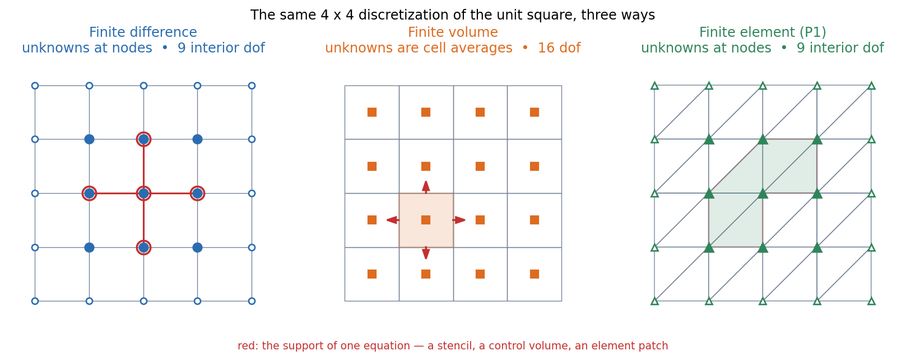
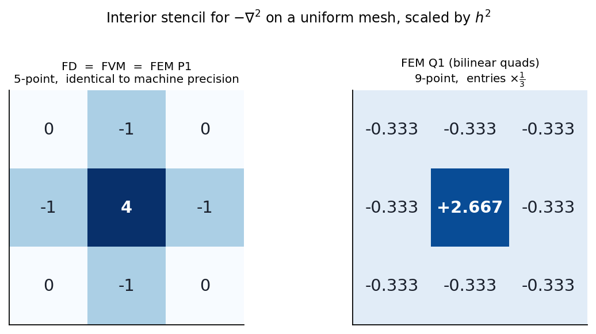
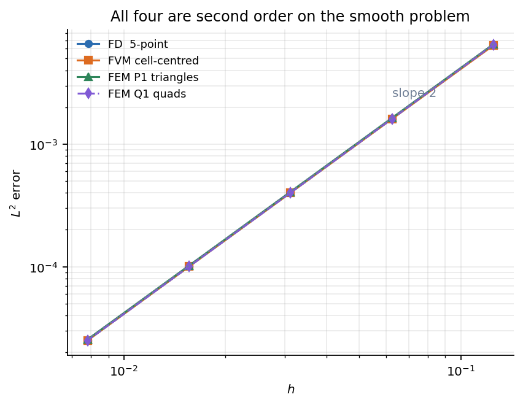
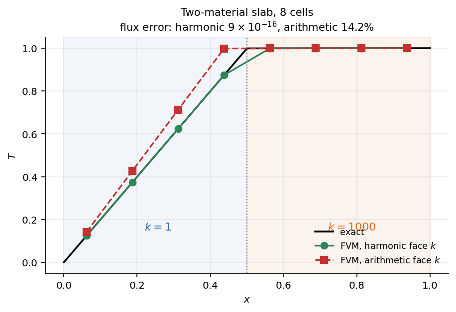
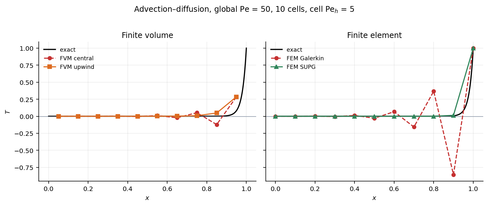

# Discretization — three ways to turn a PDE into a matrix

**One 2D domain, one equation, three methods, worked end to end. What each one actually asserts, where they coincide, and the four tests that separate them.**

---

> **Companion to `COMPUTATIONAL.md`.** That document says *which* method each field uses and why — §2.1 for finite elements in structural mechanics, §4.1 for finite volumes in fluid dynamics. It does not say what each method *does*, because a map should not contain a derivation. This document is the derivation, and it exists for the reason `fusion`'s `pde_character.md` exists: both sections need it and neither owns it.
>
> **Everything numerical here was computed, not recalled.** The scripts are in `code/` and §9 is the run table. Any number in the text can be traced to a script and re-run. Where a claim could not be tested, it is marked **[unverified]** and collected in §11.
>
> **Scope.** Finite difference, finite volume, and finite element, on a scalar second-order problem in two dimensions. Spectral, discontinuous Galerkin and meshfree methods are named in §8 and not developed.

---

# 0. The problem

The same domain throughout: the **unit square** $\Omega = (0,1)^2$, and steady heat conduction,

$$-\nabla\cdot\left(k\,\nabla T\right) = f \quad\text{in }\Omega$$

with $T$ prescribed on the boundary. This is the Poisson equation when $k$ is constant, it is **elliptic** (`COMPUTATIONAL.md` §0.3), and it is the simplest problem on which all three methods apply without qualification or special pleading.

**Why this problem and not something more interesting.** Because the differences between the methods are invisible on it, and that is the point. §3 shows that on a uniform mesh with constant $k$ the three produce *literally the same matrix*. Everything that distinguishes them appears only when one assumption is removed at a time, which is what §4 does — one test per assumption, each isolating one difference.

**The manufactured solution**, used for every convergence measurement in §3:

$$T(x,y) = \sin(\pi x)\sin(\pi y), \qquad f(x,y) = 2\pi^2\sin(\pi x)\sin(\pi y), \qquad T = 0 \text{ on } \partial\Omega$$

Substituting confirms it: $-\nabla^2 T = 2\pi^2\sin\sin = f$. A manufactured solution means the error is known exactly at every point, so an observed order of convergence is a measurement rather than an estimate.

---

# 1. What each method actually asserts

**This is the whole conceptual content of the comparison, and everything else is consequence.** The three methods do not differ in accuracy, or in which equation they solve. They differ in **which form of the same conservation statement they take as primitive**, and therefore in what the discrete unknowns mean and what is satisfied exactly.

| | **Finite difference** | **Finite volume** | **Finite element** |
|---|---|---|---|
| **Starts from** | the **differential** form, at points | the **integral** form, over cells | the **weak** form, against test functions |
| **The statement made** | $-\nabla^2T = f$ holds at each node, with derivatives replaced by difference quotients | $\oint_{\partial V}(-k\nabla T)\cdot\mathbf{n}\,\mathrm{d}S = \int_V f$ holds **exactly** on each cell | $\int_\Omega k\nabla T\cdot\nabla v = \int_\Omega fv$ holds for every $v$ in a finite space |
| **The unknown is** | a **point value** $T_{ij} \approx T(x_i,y_j)$ | a **cell average** $\bar T_i \approx \frac{1}{\|V_i\|}\int_{V_i}T$ | a **basis coefficient**; $T_h = \sum_j T_j\varphi_j$ is a function defined everywhere |
| **Exactly satisfied** | nothing — it is a truncation | **the balance on every cell**, and hence on every union of cells | orthogonality of the residual to the trial space (Galerkin) |
| **The approximation is in** | the difference quotient | the **face flux** — and nowhere else | the finiteness of the space |
| **Needs** | a structured grid, or a mapping to one | a partition into cells, any shape | a mesh and a basis, any shape |

**Read the fourth row again.** Finite volume does not approximate the divergence theorem — it *uses* it. The volume integral of a divergence becomes a sum of surface integrals identically, so the only thing left to approximate is the flux through each face. That single structural fact is the origin of every property finite volumes are prized for, and §5 measures it.

**And the third row.** The three unknowns are different objects. A point value and a cell average of the same function differ by $O(h^2)$, so on a smooth problem this is invisible in the convergence rate — but it is not invisible in what "the error" means, and §3 has to define it separately for each method before it can be measured.

---

# 2. The three, worked on a $4\times4$ mesh



Same domain, same resolution, three different sets of unknowns. The red markings show the support of one equation in each case — the five nodes of a stencil, the four faces of a control volume, the six triangles surrounding a node.

Note the degree-of-freedom counts already differ: **9 for finite difference and finite element** (the interior nodes of a $5\times5$ grid; the 16 boundary nodes are prescribed) against **16 for finite volume** (every cell is an unknown; there are no boundary cells to prescribe, only boundary *faces*). That asymmetry never goes away and is a recurring source of confusion when comparing "the same mesh" between codes.

## 2.1 Finite difference

Take Taylor expansions about the node $(x_i, y_j)$ with uniform spacing $h$:

$$T_{i+1,j} = T_{ij} + h\,\partial_xT + \frac{h^2}{2}\partial_x^2T + \frac{h^3}{6}\partial_x^3T + O(h^4)$$

Adding the expansion for $T_{i-1,j}$ cancels every odd derivative:

$$T_{i+1,j} + T_{i-1,j} = 2T_{ij} + h^2\,\partial_x^2T + O(h^4) \quad\Longrightarrow\quad \partial_x^2 T = \frac{T_{i+1,j} - 2T_{ij} + T_{i-1,j}}{h^2} + O(h^2)$$

**The second-order accuracy comes from the cancellation of the odd terms**, which requires the stencil to be symmetric and the spacing uniform. Both of those will be revisited: symmetry fails for advection (§4.4), and uniformity fails on a stretched grid (§5).

Doing the same in $y$ and substituting gives the **5-point stencil**:

$$\frac{4T_{ij} - T_{i+1,j} - T_{i-1,j} - T_{i,j+1} - T_{i,j-1}}{h^2} = f(x_i, y_j)$$

One equation per interior node, 9 of them on the $4\times4$ mesh. Nodes adjacent to the boundary reference a prescribed value, which moves to the right-hand side.

**The right-hand side is the point value of $f$.** Remember that; it is one of the three things that still differ after §3 proves the matrices identical.

## 2.2 Finite volume

Integrate the equation over one cell $V_{ij} = [x_i, x_{i+1}]\times[y_j,y_{j+1}]$ and apply the divergence theorem:

$$\int_{V_{ij}} -\nabla\cdot(k\nabla T)\,\mathrm{d}V = \oint_{\partial V_{ij}} (-k\nabla T)\cdot\mathbf{n}\,\mathrm{d}S = \int_{V_{ij}} f\,\mathrm{d}V$$

**Nothing has been approximated yet.** This is an exact statement about the exact solution, and it is an exact statement about *any* cell, of any shape. The four faces give

$$\underbrace{q_E + q_W + q_N + q_S}_{\text{outward fluxes}} = \int_{V_{ij}} f\,\mathrm{d}V$$

Now the single approximation: the flux through the east face, of area $h$ (in 2D, a length), evaluated from the two adjacent cell averages,

$$q_E = -k\left.\frac{\partial T}{\partial x}\right|_{E}\cdot h \;\approx\; -k\,\frac{\bar T_{i+1,j} - \bar T_{ij}}{h}\cdot h = -k\left(\bar T_{i+1,j} - \bar T_{ij}\right)$$

Summing the four and dividing by $h^2$ recovers the same five coefficients as §2.1. But **the right-hand side is now $\int_V f$, the cell integral**, not a point value.

**Two properties follow immediately and neither depends on the flux approximation being good.** The flux leaving cell $i$ through a face is, by construction, **the same number** that enters its neighbour, with the opposite sign. So summing the discrete balance over any set of cells makes every interior face cancel, leaving only the fluxes through the outer boundary of that set. Conservation holds on every cell, on every patch, and on the whole domain — exactly, at any resolution, on any mesh. §5 measures it.

## 2.3 Finite element

Multiply by a test function $v$ vanishing where $T$ is prescribed, integrate over $\Omega$, and integrate by parts:

$$\int_\Omega -\nabla\cdot(k\nabla T)\,v\,\mathrm{d}\Omega = \int_\Omega k\,\nabla T\cdot\nabla v\,\mathrm{d}\Omega - \oint_{\partial\Omega}\left(k\frac{\partial T}{\partial n}\right)v\,\mathrm{d}S$$

giving the **weak form**: find $T$ such that

$$\int_\Omega k\,\nabla T\cdot\nabla v\,\mathrm{d}\Omega = \int_\Omega f\,v\,\mathrm{d}\Omega + \oint_{\partial\Omega}\left(k\frac{\partial T}{\partial n}\right)v\,\mathrm{d}S \qquad\text{for all admissible } v$$

**Two things happened in that one line, and both are load-bearing.**

**One derivative moved from $T$ to $v$.** The strong form needs $T$ twice differentiable; the weak form needs it once. That is what allows piecewise-linear basis functions, whose second derivative does not exist.

**The boundary term is the flux.** A prescribed heat flux — a Neumann condition — enters as a known term on the right-hand side and requires nothing further. It is a **natural** boundary condition. In finite differences the same condition requires ghost nodes or one-sided differences; here it falls out of the integration by parts. §4.2 returns to this.

**Discretizing.** Choose $T_h = \sum_j T_j\varphi_j$ with $\varphi_j$ the piecewise-linear "hat" function that is 1 at node $j$ and 0 at every other node, and take $v = \varphi_i$ in turn (**Galerkin**: the test space equals the trial space). The result is $\mathbf{K}\mathbf{T} = \mathbf{F}$ with

$$K_{ij} = \int_\Omega k\,\nabla\varphi_i\cdot\nabla\varphi_j\,\mathrm{d}\Omega, \qquad F_i = \int_\Omega f\,\varphi_i\,\mathrm{d}\Omega$$

Computed element by element and **assembled**: each triangle contributes a $3\times3$ block to the rows and columns of its own three nodes. For a linear (P1) triangle of area $A$ with vertices $(x_a,y_a)$, the gradients of the shape functions are constant, and

$$K^e_{ab} = \frac{k}{4A}\left(\beta_a\beta_b + \gamma_a\gamma_b\right), \qquad \beta_a = y_b - y_c,\quad \gamma_a = x_c - x_b$$

with $(a,b,c)$ cyclic. **$\mathbf{K}$ is symmetric by inspection** — it is symmetric in $i$ and $j$ because the integrand is — which is the algebraic trace of the operator being self-adjoint, and the reason `COMPUTATIONAL.md` §2.6 can reach for Cholesky.

**The right-hand side is $\int f\varphi_i$**, a weighted integral. Three methods, three different right-hand sides: a point value, a cell integral, a weighted integral.

---

# 3. First result: on a uniform mesh they are the same operator

Assemble all three on the unit square with $k$ constant and a uniform mesh, and extract one interior row of each, scaled so that each approximates $-\nabla^2$:



Measured directly from the assembled matrices at $n=8$:

| Comparison | max difference over the interior row |
|---|---|
| finite difference against finite volume | **0.0** |
| finite difference against FEM P1 (right triangles) | **0.0** |
| finite difference against FEM Q1 (bilinear quads) | 1.333 |

**Not "similar" — identical, to the last bit.** On a uniform mesh with constant coefficients, the 5-point finite-difference Laplacian, the cell-centred finite-volume Laplacian, and the P1 finite-element stiffness matrix on the diagonal triangulation are the same matrix. Three derivations from three different starting points converge on one operator.

**Bilinear quadrilaterals do not**, and this is worth seeing because it shows the equivalence is a coincidence of the *element*, not a law. Q1 gives the 9-point stencil

$$\frac{1}{3}\begin{pmatrix} -1 & -1 & -1 \\ -1 & 8 & -1 \\ -1 & -1 & -1\end{pmatrix}$$

which is also a second-order Laplacian, with a wider support, more nonzeros per row, and a different constant in its error.

## 3.1 What still differs, even here

Three things, and each matters somewhere.

**1. The right-hand side.** Point value, cell integral, weighted integral. Identical to $O(h^2)$ for smooth $f$; not identical when $f$ has a peak, a source term, or a discontinuity. The finite-volume and finite-element right-hand sides both *integrate* $f$ and are therefore insensitive to where a point sample happens to land; the finite-difference one is not.

**2. The mass matrix — which is where they part company in any transient problem.** For $\partial_t T = \nabla^2 T$, the semi-discrete system is $\mathbf{M}\dot{\mathbf{T}} + \mathbf{K}\mathbf{T} = \mathbf{F}$. Finite difference and cell-centred finite volume give $\mathbf{M} = h^2\mathbf{I}$, diagonal. Galerkin finite elements give the **consistent mass matrix** $M_{ij} = \int\varphi_i\varphi_j$, which is not diagonal — so an "explicit" FEM time step still requires a solve unless the mass is **lumped**. `COMPUTATIONAL.md` §2.2 records that lumping is what makes explicit structural dynamics matrix-free; this is where that requirement comes from. **Equal stiffness matrices do not imply equal transient behaviour.**

**3. What the unknown means.** A point value, a cell average, a basis coefficient. To measure an error one must first decide what to compare against, and the honest comparison for a cell-centred method is against the exact **cell average**, not the exact point value at the centre — those differ by $O(h^2)$, the same order as the error being measured.

## 3.2 Convergence

With the error defined per method as above:



$L^2$ errors on the manufactured solution, from `code/disc.py`:

| $n$ | $h$ | FD | FVM | FEM P1 | FEM Q1 |
|---|---|---|---|---|---|
| 8 | 0.1250 | 6.4754e-03 | 6.3926e-03 | 6.5378e-03 | 6.4749e-03 |
| 16 | 0.0625 | 1.6095e-03 | 1.6043e-03 | 1.6340e-03 | 1.6095e-03 |
| 32 | 0.0312 | 4.0179e-04 | 4.0147e-04 | 4.0846e-04 | 4.0179e-04 |
| 64 | 0.0156 | 1.0041e-04 | 1.0039e-04 | 1.0211e-04 | 1.0041e-04 |
| 128 | 0.0078 | 2.5100e-05 | 2.5099e-05 | 2.5528e-05 | 2.5100e-05 |
| **observed order** | | **2.00** | **2.00** | **2.00** | **2.00** |

**All four are second order, and the constants agree to within 2%.** On a smooth problem, on a uniform mesh, with constant coefficients, **the choice of method does not matter**. Anyone claiming a large accuracy advantage for one of these three on this class of problem is comparing implementations, not methods.

Note also that Q1 nodal errors match FD to five digits (6.4749e-03 against 6.4754e-03) despite a completely different stencil. That is **nodal superconvergence**: the finite-element solution is more accurate *at the nodes* than its own global order would suggest.

**So the interesting question is not which is more accurate. It is which assumptions each one needs**, and what happens when they fail.

---

# 4. Where they diverge — four tests

Each test removes one assumption from §3 and nothing else.

## 4.1 Geometry — remove the structured grid

| | On an unstructured or non-rectangular mesh |
|---|---|
| **Finite difference** | **The method largely does not apply.** It needs a logically rectangular grid, so the options are a body-fitted curvilinear mapping (which introduces metric terms and coordinate singularities), an immersed or cut-cell boundary treatment, or overset grids. Each is a substantial complication and each degrades accuracy at the boundary |
| **Finite volume** | **Applies unchanged.** Cells may be arbitrary polygons or polyhedra. The only requirement is that each face has an area and a normal. Skewness and non-orthogonality degrade the *flux approximation* and require correction terms, but the conservation property is untouched |
| **Finite element** | **Applies unchanged, and is the most comfortable.** Elements are mapped from a reference element by an isoparametric map, so curved boundaries are represented by curved elements; the entire apparatus of mesh generation was built for it |

**This alone decides the matter for most engineering geometry**, and it is the reason finite differences survive mainly where the geometry is a box: direct numerical simulation of turbulence in periodic domains, seismic wave propagation, and academic test problems. `COMPUTATIONAL.md` §4.1 lists that usage.

## 4.2 Boundary conditions — remove pure Dirichlet

| Condition | Finite difference | Finite volume | Finite element |
|---|---|---|---|
| **Dirichlet**, $T = g$ | direct: eliminate the node, or set the row to identity | face value is $g$, at a half-cell distance $h/2$ — a slight asymmetry in the stencil | **essential**: constrain the coefficient, and lift the known value to the right-hand side |
| **Neumann**, $-k\partial_nT = q$ | **awkward**: needs a ghost node and a mirrored expansion, or a one-sided difference that loses an order | **the most natural of the three**: the face flux is simply set to $q$ and no gradient is ever needed | **natural**: it *is* the boundary term of the weak form, added to $\mathbf{F}$, requiring nothing else |
| **Robin**, $-k\partial_nT = h_c(T-T_\infty)$ | ghost node plus an algebraic elimination | face flux written in terms of the cell value; contributes to both the diagonal and the right-hand side | boundary term contributes to both $\mathbf{K}$ and $\mathbf{F}$ |

**The pattern is worth naming.** In finite volume and finite element, a flux condition is *the thing the method already works with* — a face flux in one case, a boundary integral in the other. In finite difference it is a foreign object, because the method is built on point values of the solution and a flux is a derivative of it.

Conversely, Dirichlet is cleanest in finite difference and finite element (both carry nodal values, and a node can sit exactly on the boundary) and slightly awkward in cell-centred finite volume, where nothing sits on the boundary and the half-cell distance breaks the stencil's symmetry.

## 4.3 Discontinuous coefficients — remove constant $k$

Two materials, $k_1 = 1$ on the left half and $k_2 = 1000$ on the right, with $T=0$ at $x=0$, $T=1$ at $x=1$, and insulated top and bottom. The exact solution is piecewise linear with a **uniform flux**

$$q = \frac{\Delta T}{L_1/k_1 + L_2/k_2} = \frac{1}{0.5/1 + 0.5/1000} = 1.998001998\ldots$$



**The question is what conductivity to use on the face between two cells of different material.** Two candidates, and the difference is not cosmetic. From `code/disc2.py`, with the interface landing exactly on a cell face:

| $n$ | harmonic mean face $k$ | arithmetic mean face $k$ |
|---|---|---|
| 8 | rel. flux error **8.9e-16** | rel. flux error **14.2%** |
| 16 | **1.3e-15** | **6.6%** |
| 32 | **4.4e-16** | **3.2%** |

**The harmonic mean is exact at every resolution**, including a mesh of eight cells. The arithmetic mean is first-order convergent and badly wrong on a coarse mesh — and note that it converges, so a mesh-refinement study would eventually hide the error while never revealing that a better choice existed.

**Why the harmonic mean.** The face sits between a half-cell of $k_P$ and a half-cell of $k_E$, and heat must pass through both. Thermal resistances in series **add**:

$$R = \frac{h/2}{k_P} + \frac{h/2}{k_E} \quad\Longrightarrow\quad q = \frac{T_P - T_E}{R} = \frac{T_P - T_E}{h}\cdot\underbrace{\frac{2k_Pk_E}{k_P + k_E}}_{k_{\text{face}}}$$

which is the harmonic mean. **The arithmetic mean averages the wrong quantity** — it averages conductances where the physics adds resistances, and with $k_2/k_1 = 1000$ it is dominated by the conductor and effectively ignores the insulator that is actually controlling the flux.

**Finite element on an interface-aligned mesh is also exact**, and for the same reason expressed differently: the stiffness integral $\int k\nabla\varphi_i\cdot\nabla\varphi_j$ is evaluated element by element with each element's own $k$, which reproduces the series-resistance arithmetic automatically. Measured, via the nodal reaction at the $x=1$ boundary:

| $n$ | 8 | 16 | 32 |
|---|---|---|---|
| FEM P1 flux, relative error | 2.8e-13 | 2.0e-12 | 2.4e-12 |

**Naive finite difference has no good answer here at all.** The interface passes through a node, at which $k$ is undefined; sampling $k$ at nodes and differencing $k\,\partial_x T$ gives the arithmetic-mean answer or worse. The standard repair is to write the scheme in flux form with a harmonic face conductivity — **which is to say, to stop doing finite differences and start doing finite volumes.**

**The general lesson generalises past this problem.** A discontinuity in a coefficient is not a small perturbation to be resolved by refinement. It is a place where the *form* in which the method is written decides whether the answer is right, and the integral form is the one that gets it right.

## 4.4 Advection — remove self-adjointness

Add a uniform velocity: $U\,\partial_x T = \alpha\,\partial_x^2 T$ with $T(0)=0$, $T(1)=1$, at global Péclet number $UL/\alpha = 50$. The exact solution is a boundary layer at $x=1$:

$$T(x) = \frac{e^{\mathrm{Pe}\,x} - 1}{e^{\mathrm{Pe}} - 1}$$

The operator is no longer self-adjoint, and every guarantee of §3 is void.



With 10 cells, so **cell Péclet number** $\mathrm{Pe}_h = Uh/\alpha = 5$:

| Scheme | min $T$ | behaviour |
|---|---|---|
| FVM, central face value | $-0.1224$ | **oscillates** |
| FVM, upwind face value | $0.0$ | monotone, but heavily over-diffused |
| FEM, Galerkin P1 | $-0.8577$ | **oscillates violently** |
| FEM, SUPG | $0.0$ | monotone, and nodally near-exact |

**Galerkin finite elements and central finite volumes fail in the same way**, and they fail together because they are the same scheme in this respect: linear Galerkin on pure advection reduces to a central difference. The optimality result that makes Galerkin the best possible choice for §3's elliptic problem (`COMPUTATIONAL.md` §2.1, Céa's lemma) requires the operator to be self-adjoint. Advection is not, and the guarantee evaporates precisely where it would be most useful.

### The threshold is exactly 2, and it can be derived

For the central scheme the coefficient multiplying the downstream neighbour is

$$a_E = \underbrace{\frac{\alpha}{h}}_{\text{diffusion}} - \underbrace{\frac{U}{2}}_{\text{advection}}, \qquad a_E < 0 \iff \frac{Uh}{\alpha} > 2$$

A positive off-diagonal (after moving to the standard form) destroys the **M-matrix** property, and with it the discrete maximum principle that guarantees the solution stays between its boundary values. Measured, by bisection over $n$:

| $n$ | $\mathrm{Pe}_h$ | $\min T$ | |
|---|---|---|---|
| 24 | 2.083 | $-9.996\times10^{-3}$ | oscillates |
| **25** | **2.000** | $0.0$ | **monotone** |
| 26 | 1.923 | $5\times10^{-44}$ | monotone |

**The predicted threshold and the measured one agree exactly.** This is the sharpest single result in the document: a stability limit derived from the sign of one matrix entry, confirmed to the resolution of the bisection.

### What upwinding costs

Upwind takes the face value from the upstream cell, giving $a_E = \alpha/h$ — never negative, monotone at any $\mathrm{Pe}_h$. The price is visible in the figure and is quantifiable exactly:

$$a_E^{\text{upwind}} - a_E^{\text{central}} = \frac{U}{2} \quad\Longleftrightarrow\quad \alpha_{\text{effective}} = \alpha + \frac{Uh}{2}$$

**First-order upwinding is central differencing plus an artificial diffusivity of $Uh/2$.** At $\mathrm{Pe}_h = 5$ that is 2.5 times the physical diffusivity — the scheme contributes more diffusion than the physics does. The measured error at the last cell centre is 2.04e-01 at $n=10$, 1.58e-01 at $n=20$, 6.0e-02 at $n=50$: converging, slowly, and by brute force.

**This is exactly the situation `COMPUTATIONAL.md` §4.2 describes**, and Godunov's theorem is why there is no linear escape from it: a linear monotone scheme is at most first order. Flux limiters, MUSCL and WENO are the nonlinear escape.

### SUPG is the finite-element answer

Streamline-upwind Petrov–Galerkin modifies the *test* function rather than the flux, weighting it along the streamline:

$$v \;\longrightarrow\; v + \tau\,(\mathbf{u}\cdot\nabla v), \qquad \tau = \frac{h}{2U}\left(\coth\frac{\mathrm{Pe}_h}{2} - \frac{2}{\mathrm{Pe}_h}\right)$$

Test space no longer equals trial space, so it is Petrov–Galerkin rather than Galerkin. In one dimension with this $\tau$ the scheme is **nodally exact at any $\mathrm{Pe}_h$**, which the figure shows. That exactness is a one-dimensional accident and does not survive in 2D — but the stabilisation does, and it is why finite elements are usable in fluid dynamics at all.

**The deeper point.** Upwind finite volume and SUPG finite element are the same idea reached from different directions: **respect the direction information travels**. One does it by choosing which cell supplies the face value, the other by tilting the test function upstream. Both are the discrete form of the domain-of-dependence argument in `COMPUTATIONAL.md` §0.3.

---

# 5. Conservation, precisely

"Finite volume is conservative" is repeated so often that it has stopped carrying information. The precise statements are worth separating, because two of the three are true and one of them is commonly overstated.

## 5.1 What is exactly true of finite volume

Summing the discrete balance over any set of cells makes every interior face appear twice, with opposite signs, and cancel. What remains is the flux through the outer boundary of that set, equated to the source integrated over it. **This holds on any mesh, at any resolution, to machine precision, whether or not the solution is accurate.**

Measured on the two-material slab of §4.3 at $n=32$, where the exact answer is a flux that is the same through every vertical plane:

| | |
|---|---|
| flux through each of the 31 interior planes | min $-1.998001998008$, max $-1.998001997987$ |
| **spread** | $2.1\times10^{-11}$ |
| exact | $1.998001998\ldots$ |

**The spread is roundoff.** The conservation statement is not converging to true — it is true, and the residual is the condition number of the solve times machine epsilon.

**Why this matters and where it does not.** For a shock, it decides whether the shock travels at the right speed (`COMPUTATIONAL.md` §4.1, the Lax–Wendroff theorem). For a long transient, it decides whether mass slowly disappears. For a steady linear elliptic problem solved to convergence, it buys much less than its reputation suggests, and the equivalence of §3 is the proof — on a uniform mesh the finite-difference scheme *is* the finite-volume scheme and is therefore equally conservative.

## 5.2 Where finite difference stops being conservative

The equivalence of §3 required a **uniform** mesh. On a stretched or non-uniform grid, a finite-difference scheme written by Taylor expansion about each node does not generally telescope: the coefficient with which a node's equation references its neighbour is not the negative of the coefficient with which the neighbour references it, so summing over a patch leaves interior residue. There is no flux to cancel because the method never constructed one.

**The repair is to write the scheme in flux form** — compute a face quantity, then difference it — at which point one is doing finite volumes and may as well say so. This is the same conclusion §4.3 reached from the interface problem, by a different route.

## 5.3 What is true of finite element

More subtle, and usually stated too weakly or too strongly.

**Too strong:** "the finite-element solution is locally conservative." Taking $-k\nabla T_h$ from the computed solution and integrating it around a patch does **not** generally give the source integral exactly.

**Too weak:** "finite elements are not conservative." They are, in the sense that matters, but the conservative flux has to be extracted rather than read off. The **consistent nodal flux** — the reaction $\mathbf{r} = \mathbf{K}\mathbf{T} - \mathbf{F}$ at constrained nodes — satisfies the balance exactly, and this follows from the weak form: taking $v \equiv 1$ on a patch makes the weak statement *be* the conservation statement on that patch.

**And it is measurable.** The §4.3 finite-element flux was computed exactly this way, as the summed reaction along the $x=1$ boundary, and it reproduced the exact flux to $2.8\times10^{-13}$ on an 8-element mesh with a 1000:1 conductivity jump. **The information is there; it is in the reactions, not in the gradient of the solution.** This result is due to Hughes and co-workers and it is the correct answer to the question. **[unverified]** — the attribution is recalled, not checked.

---

# 6. What each method costs and gives

| | Finite difference | Finite volume | Finite element |
|---|---|---|---|
| **Implementation effort, simplest case** | **lowest** — a stencil loop | moderate — face loops, geometry | **highest** — shape functions, quadrature, assembly, mapping |
| **Arbitrary geometry** | poor | good | **excellent** |
| **Local conservation** | on uniform grids only | **exact, always** | exact in the consistent-flux sense |
| **Natural handling of flux BCs** | poor | **excellent** | **excellent** |
| **Discontinuous coefficients** | poor | **good** (harmonic face values) | **good** (interface-aligned mesh) |
| **High order** | **easy** — widen the stencil | hard — reconstruction over cell averages, and hardest on unstructured meshes | **easy** — raise the polynomial degree, $p$-refinement |
| **Advection without extra work** | no | no (needs upwinding) | no (needs SUPG) |
| **Rigorous error theory** | Taylor / maximum principle | weaker in general | **strongest** — Céa, best approximation, a posteriori estimators |
| **Adaptivity** | poor | good | **excellent** — $h$-, $p$-, and $hp$-refinement, with computable error indicators |
| **Matrix** | banded, structured | sparse, one row per cell | sparse, symmetric when the operator is |
| **Where it dominates** | DNS in boxes, seismic, finance | industrial CFD, compressible flow | structural mechanics, electromagnetics, anything with geometry |

**Two of these rows deserve a sentence.**

**High order.** Finite differences and finite elements raise order by a mechanism they already have — a wider stencil, a higher polynomial. Finite volume must *reconstruct* a high-order profile from cell averages, which on an unstructured mesh requires a least-squares stencil that is expensive, and is why high-order unstructured CFD drifted toward discontinuous Galerkin instead (§8).

**Error theory.** The finite-element framework yields computable **a posteriori** error estimators — quantities assembled from the solution itself that bound the error — and those estimators are what drive automatic mesh adaptation. Nothing of comparable strength exists for the other two, and it is a large part of why finite elements dominate where a certified answer is wanted.

---

# 7. Choosing

| If the problem has | Reach for |
|---|---|
| a rectangular domain and a smooth solution | **finite difference** — simplest thing that works, and easiest to make high order |
| complex geometry and a stress or displacement field | **finite element** |
| shocks, or a long transient where mass must not drift | **finite volume** |
| discontinuous material properties | **finite volume** with harmonic face values, or **finite element** with an interface-aligned mesh |
| flux boundary conditions as the primary data | **finite volume** or **finite element** |
| advection dominance | either, **with the appropriate stabilisation** — this is not a differentiator |
| an energy or variational principle | **finite element** — it is the discretization of the principle itself |
| a requirement for a certified error bound and adaptive refinement | **finite element** |

**This is the substance behind `COMPUTATIONAL.md` §2.1 and §4.1.** Structural mechanics reaches for finite elements because it has geometry, a variational principle, and no shocks. Fluid dynamics reaches for finite volumes because it has conservation laws, discontinuous solutions, and a modest need for geometric fidelity in the interior. **Neither choice is about accuracy**, and §3 is the evidence: on the problem where both apply cleanly, they give the same answer to within 2%.

---

# 8. The fourth family, in passing

Named because each one dissolves part of the comparison above rather than sitting inside it.

**Discontinuous Galerkin** is the interesting case. It carries a polynomial basis within each cell (finite element) and couples cells only through numerical fluxes computed by a Riemann solver (finite volume). It is **locally conservative like finite volume and arbitrarily high order like finite element**, on unstructured meshes, which is precisely the combination §6 said was hard. The cost is many more degrees of freedom for a given mesh — the solution is duplicated at every interface — and a restrictive explicit time step that scales as $h/p^2$. **[unverified]** — the $p^2$ scaling is recalled from the literature and not checked.

**Spectral and spectral-element methods** replace piecewise polynomials with global or high-degree local expansions, converging exponentially for analytic solutions. This is why direct numerical simulation of turbulence uses them: at a fixed error, they need far fewer points, which is decisive when the point count scales as $\mathrm{Re}^{9/4}$.

**Meshfree and particle methods** — SPH, material point, radial basis functions — abandon the mesh. They are natural where the domain fragments or deforms beyond what a mesh survives, and they pay for it with difficulty imposing boundary conditions and enforcing conservation.

**Lattice Boltzmann** does not discretize the Navier–Stokes equations at all. It evolves a discrete kinetic equation whose macroscopic limit is Navier–Stokes, on a fixed lattice, with an entirely local update.

---

# 9. Runs

Provenance for every number quoted above, following the convention in `fusion`'s `CLAUDE.md`: a number that cannot be traced to the invocation that produced it is not a result.

| Script | Section | What it computes | Key output |
|---|---|---|---|
| `code/disc.py` | §3 | assembles FD, FVM, FEM P1 and FEM Q1 on the manufactured solution; extracts interior stencils; refinement study at $n = 8,16,32,64,128$ | FD $=$ FVM $=$ P1 to 0.0; all four second order |
| `code/disc2.py` | §4.3, §4.4, §5.1 | two-material slab with harmonic and arithmetic face conductivity; FEM P1 reaction flux; advection–diffusion with central, upwind, Galerkin and SUPG; bisection on the monotonicity threshold | harmonic exact to 9e-16; arithmetic 14.2% at $n=8$; threshold at $\mathrm{Pe}_h = 2$ exactly |
| `code/figs.py` | all | the five figures in `figs/`, from the JSON dumped by the two scripts above | — |

```bash
cd code && python3 disc.py && python3 disc2.py && python3 figs.py
```

Dependencies are NumPy, SciPy and Matplotlib only, all already pinned in the repository's `pyproject.toml`; run with `uv run python disc.py` from `code/` to use the project environment. The numbers above were produced with NumPy 2.4.4, SciPy 1.17.1 and Matplotlib 3.10.8. Every problem here is small enough for a sparse direct factorization, so nothing depends on the solver.

---

# 10. Caveats

Stated while fresh, per `COMPUTATIONAL.md`'s own standard. None of these invalidates a result above; each limits what it may be quoted for.

**The §4.3 and §4.4 tests are one-dimensional in $x$.** Both problems are posed on the 2D square with insulated top and bottom, so the exact solution is $y$-invariant and the discrete problem reduces exactly to its $x$-line. That is a genuine reduction, not an approximation — but it means neither test exercises mesh skewness, cross-diffusion, or a flow oblique to the grid, which is where multidimensional upwinding actually becomes difficult. **A 2D test with the velocity at 45° to the mesh would show far worse behaviour from every scheme here**, and would be the natural next experiment.

**The FD/FVM/FEM-P1 equivalence of §3 is specific.** It requires a uniform mesh, constant $k$, and the *diagonal* triangulation (each square split by one diagonal). A criss-cross triangulation, a non-uniform mesh, or a variable coefficient breaks it. The result should be read as "these methods coincide in the simplest case", not as a general identity.

**Second-order convergence was measured on one smooth manufactured solution.** Solutions with corner singularities — the re-entrant corner of an L-shaped domain is the standard example — converge more slowly for every method, and the *relative* ranking on such problems has not been tested here.

**The SUPG $\tau$ is the one-dimensional nodally-exact formula.** Its exactness is a 1D accident. Multidimensional $\tau$ definitions are numerous, are not equivalent, and the choice matters; nothing here bears on that.

**The advection tests use a Dirichlet outflow.** The face there takes the upwind value convectively and the wall value diffusively. Other consistent treatments exist and would shift the last cell's value; the oscillation threshold of §4.4 is an interior property and is unaffected.

**Nothing here is a performance measurement.** All timings would be dominated by the fact that these are Python assembly loops on very small problems. The cost rows of §6 are qualitative and are not backed by measurement in this document.

---

# 11. Unverified claims

1. **§5.3** — attribution of the consistent-nodal-flux result to Hughes and co-workers. The *result* is demonstrated numerically here to 2.8e-13; only the attribution is unverified.
2. **§8** — the $h/p^2$ explicit time-step restriction for discontinuous Galerkin. Recalled, not checked.
3. **§4.1** — the characterisation of where finite differences remain dominant in practice (DNS, seismic, finance). General impression, not surveyed.
4. **§6** — the row on a posteriori error estimation being materially stronger for finite elements than for the other two. This is the standard position and is believed correct, but no comparison of the finite-volume a posteriori literature was made.

**What would settle any of these:** one primary source each. None is load-bearing — every quantitative claim in this document rests on §9's scripts rather than on recall.

---

# 12. Sources

**General and comparative**

- Strikwerda J.C., *Finite Difference Schemes and Partial Differential Equations* — the Taylor/stability apparatus of §2.1
- LeVeque R.J., *Finite Difference Methods for Ordinary and Partial Differential Equations*
- Patankar S.V., *Numerical Heat Transfer and Fluid Flow* — the origin of the harmonic-mean face conductivity of §4.3 and of the cell-Péclet analysis of §4.4
- Versteeg H.K., Malalasekera W., *An Introduction to Computational Fluid Dynamics: The Finite Volume Method* — the clearest elementary treatment of §2.2 and §4.4
- Ferziger J.H., Perić M., Street R.L., *Computational Methods for Fluid Dynamics*
- Hughes T.J.R., *The Finite Element Method* — §2.3, the consistent flux of §5.3, and SUPG
- Brenner S., Scott L.R., *The Mathematical Theory of Finite Element Methods* — Céa's lemma and the approximation theory behind §3.2
- Eymard R., Gallouët T., Herbin R., "Finite Volume Methods," *Handbook of Numerical Analysis* VII — the rigorous finite-volume analysis that §6's "weaker in general" row refers to

**Specific results**

- Godunov S.K. (1959) — the barrier theorem invoked in §4.4
- Brooks A.N., Hughes T.J.R., "Streamline upwind/Petrov-Galerkin formulations…," *CMAME* **32**, 199 (1982) — SUPG and the $\tau$ of §4.4
- Cockburn B., Shu C.-W. — the Runge–Kutta discontinuous Galerkin series behind §8

**Companion documents**

- `COMPUTATIONAL.md` §0.3 — hyperbolic, parabolic and elliptic, and the domain-of-dependence argument §4.4 appeals to
- `COMPUTATIONAL.md` §2.1 — why structural mechanics reaches for finite elements; §7 above is the evidence
- `COMPUTATIONAL.md` §4.1–§4.2 — why fluid dynamics reaches for finite volumes, and Godunov's theorem
- `COMPUTATIONAL.md` §2.2 — lumped against consistent mass, whose origin is §3.1 above
