# Time integration — explicit against implicit

**Four model PDEs, one per character, with every claim measured. What each scheme costs, what it destroys, and why the honest comparison is almost never the one that gets made.**

---

> **Third document in `methods/`.** `COMPUTATIONAL.md` says which fields reach for which time integrator and why (§2.3, §2.4, §4.4). `DISCRETIZATION.md` handles the spatial question and holds it fixed. This one holds space fixed and varies time.
>
> **Every number below was computed.** The scripts are in `code/time_*.py` and §9 is the run table. Where a scheme's behaviour is predicted by analysis, the prediction and the measurement are printed side by side; §1.3, §2.1 and §4.2 are the places where they agree to four digits and that agreement is the result.
>
> **How to read §0.** It builds the vocabulary in order — what is being chosen (§0.2), what it costs (§0.3), what can go wrong (§0.5), how the methods compare (§0.6, §0.7) — and then §0.8 and §0.9 are the map: the three groups of factors that decide the choice, and the single inequality they combine into. If you want the destination first, read §0.9 and come back.
>
> **The thesis.** The explicit/implicit choice is not a preference and not a matter of solver sophistication. It is decided by one question — *is the fastest mode the mesh supports close to the physics you care about?* — and the four sections below are that question answered four times, with different answers.
>
> **A warning about the usual comparison.** Most treatments compare an explicit scheme at its stability limit against an implicit scheme at some larger step, and conclude that implicit wins. That comparison is rigged, because the two runs have different accuracy. §5.2b redoes it at equal accuracy and the conclusion reverses. Keep that in mind through §2 as well.

---

# 0. The choice being made

## 0.0 The plan — four equations, and what each one is for

Before any machinery, here is what this document does and why.

There are four worked equations. They are not four arbitrary examples: **each one is chosen to give a different answer to the same question**, and between them they cover the answers that occur in practice. Read in order they tell one story, because each overturns something the one before it established.

| | equation | in words | what it is here to teach |
|---|---|---|---|
| **§2** | $u_t = \alpha u_{xx}$ | heat spreading through a bar | **Implicit wins, decisively.** Refining the mesh creates a difficulty that was not in the physics, and implicit methods exist to escape it. Aggressively damping what you cannot resolve turns out to be a *virtue* |
| **§3** | $u_t + cu_x = 0$ | a pulse carried downstream by a flow | **Explicit wins, and the verdict inverts.** The stability limit is not a nuisance to be endured but the *best possible step* — the scheme is exactly right there and gets worse as the step shrinks. Damping, a virtue in §2, is now the enemy |
| **§4** | $u_{tt} = c^2u_{xx}$ | a string plucked and released | **The same physics as §3, run a hundred thousand steps.** Now what matters is not the error of one step but what a hundred thousand of them accumulate into. A scheme that conserves beats a scheme that is locally more accurate |
| **§5** | $u_t + cu_x = \alpha u_{xx} + R(u)$ | a chemical carried by a flow, spreading and reacting | **You do not have to choose one treatment for the whole equation.** Different terms can be handled differently in the same step — and the apparent gain from doing so mostly evaporates when the comparison is made honestly |

### The physical parameters

Four symbols carry the physics across all four equations. Each is a **constant** here — real problems have them varying in space, which smears the spectrum (§1.1) but changes nothing structural.

| symbol | name | what it means | units | value used |
|---|---|---|---|---|
| $\alpha$ | **diffusivity** | how fast a disturbance spreads out. Large $\alpha$ smooths quickly | length$^2$/time | $1$ in §2, $0.02$ in §5 |
| $c$ | **wave speed** | how fast a disturbance travels without changing shape — the flow speed in §3, the wave speed in §4 | length/time | $1$ in §3, §4, §5 |
| $K$ | **reaction rate** | how fast the source term drives $u$ toward its equilibrium. $1/K$ is the reaction's timescale | 1/time | $10$ in §5 |
| $u$ | the unknown | temperature in §2, a transported concentration in §3 and §5, a displacement in §4 | — | — |

**Where each one shows up in the spectrum**, which is the only thing about them that matters later: $\alpha$ scales diffusion's eigenvalues as $\alpha/\Delta x^2$, $c$ scales advection's as $c/\Delta x$, and $K$ contributes $-K$ with no $\Delta x$ at all (§1.1).

**The ordering is deliberate.** §2 establishes a verdict, §3 reverses it, §4 shows that reversal holds even more strongly over long runs, and §5 refuses the choice altogether.

### The same five questions, in the same order, every time

The complaint that a document like this becomes a pile of facts is answered by making every section answer the same questions in the same sequence. Each of §2 through §5:

1. **Where are the building blocks of this equation, and how do they change if I refine the mesh?**
2. **Where is the stability ceiling** — predicted from theory first, then measured, and do the two agree?
3. **What step does accuracy actually need**, measured rather than quoted?
4. **How far apart are those two**, and therefore what is the verdict?
5. **What does the scheme do to the parts it is not resolving** — and does that help or hurt?

Question 1 is the one that determines the rest. An equation, once discretized, decomposes into a set of independent **modes** — the building blocks — and essentially everything about how it should be integrated in time follows from where those modes sit. §1 is devoted to them.

**And the four equations differ in exactly that one respect.** Not in difficulty, not in importance: in where their modes sit. §1.1 draws the map, and §2 to §5 are four points on it.

### What is fixed and what varies

To make the four sections comparable, as much as possible is held constant. The same three schemes throughout — forward Euler, Crank–Nicolson, backward Euler, which §0.4 shows are one family — and the same two measurements throughout, both defined in §0.5. What varies is only the equation.

---

## 0.1 What is left after space is discretized

Discretize space by any method in `DISCRETIZATION.md` and what remains is a system of ordinary differential equations in time:

$$\frac{\mathrm{d}\mathbf{u}}{\mathrm{d}t} = \mathbf{L}\mathbf{u} + \mathbf{f}(t)$$

Discretizing space **only**, and leaving time continuous, is what is called the **method of lines**. Each unknown $u_j(t)$ is still a continuous function of time — a line in the $(x,t)$ plane at fixed $x_j$ — and the name comes from that picture. Having reduced the PDE to ODEs, any ODE integrator can now be applied to it.

It is worth doing for two reasons. All the spatial choices are now sealed inside $\mathbf{L}$, so the time question can be asked once rather than once per spatial method. And a century of ODE theory becomes available, which is where every stability result in this document comes from.

**It is a choice, not a necessity.** The alternative is to discretize space and time *together* from the start, treating $(x,t)$ as one domain: space–time finite elements do this, and so does the Lax–Wendroff scheme of §3, which is derived from a Taylor expansion in time with spatial derivatives substituted in, and therefore has no method-of-lines form at all. Everything between here and §3 assumes the split; §3 is where an exception shows up.

| symbol | what it is |
|---|---|
| $\mathbf{u}$ | the vector of unknowns — one per node, cell, or basis coefficient |
| $\mathbf{L}$ | the **discrete spatial operator**: the matrix left over after space is discretized. For $u_t = \alpha u_{xx}$ it is $\alpha$ times the discrete Laplacian; for $u_t = -cu_x$ it is $-c$ times a discrete $\partial_x$; in structural dynamics the same object is written $-\mathbf{M}^{-1}\mathbf{K}$ |
| $\mathbf{f}(t)$ | everything not depending on $\mathbf{u}$: sources, body forces, and the contribution of inhomogeneous boundary conditions |

The letter $\mathbf{L}$ follows the convention in which a linear differential operator is written $\mathcal{L}$.

## 0.2 The one decision: which side of the step to evaluate on

Replace the time derivative by the obvious difference,

$$\frac{\mathbf{u}^{n+1} - \mathbf{u}^{n}}{\Delta t} = \ (\text{the right-hand side})$$

and one question remains: **the right-hand side evaluated at which time?** It involves $\mathbf{u}$, and $\mathbf{u}$ is exactly what is not yet known at $t_{n+1}$. There are two obvious answers and they are the two schemes this document is about.

**Forward Euler** — evaluate at the old, known state. This is the **explicit** scheme:

$$\mathbf{u}^{n+1} = \mathbf{u}^{n} + \Delta t\left(\mathbf{L}\mathbf{u}^{n} + \mathbf{f}^{n}\right) = \left(\mathbf{I} + \Delta t\,\mathbf{L}\right)\mathbf{u}^{n} + \Delta t\,\mathbf{f}^{n}$$

Everything on the right is known. The new state is computed directly.

**Backward Euler** — evaluate at the new, unknown state. This is the **implicit** scheme:

$$\mathbf{u}^{n+1} = \mathbf{u}^{n} + \Delta t\left(\mathbf{L}\mathbf{u}^{n+1} + \mathbf{f}^{n+1}\right) \quad\Longrightarrow\quad \left(\mathbf{I} - \Delta t\,\mathbf{L}\right)\mathbf{u}^{n+1} = \mathbf{u}^{n} + \Delta t\,\mathbf{f}^{n+1}$$

The unknown appears on both sides, so it has to be gathered onto the left and solved for.

**That is the entire distinction.** Same operator, same shift by the identity, one sign apart, on opposite sides of the equation.

## 0.3 What it costs

| | applies | cost of one step |
|---|---|---|
| **Forward Euler** (explicit) | $(\mathbf{I} + \Delta t\mathbf{L})$ | a **multiply** — a few operations per unknown |
| **Backward Euler** (implicit) | $(\mathbf{I} - \Delta t\mathbf{L})^{-1}$ | a **solve** — a linear system, every step |

`COMPUTATIONAL.md` §0.5 puts it the same way: explicit multiplies, implicit solves. A solve is anywhere from a few times to many times more expensive than a multiply, depending on the problem and the solver (`COMPUTATIONAL.md` §2.6, §4.6).

**A caution about the notation.** $(\mathbf{I} + \Delta t\mathbf{L})$ is written as a matrix but is never built as one. An explicit step is a stencil sweep — a handful of multiply-adds per unknown, no assembly, no storage — and that is precisely why it is cheap. The matrix is a way of *reading* the scheme, not a description of the code. The implicit matrix, by contrast, usually does get assembled and factored.

## 0.4 Both are one family: the $\theta$-method

Nothing forces the choice to be all-or-nothing. Evaluate the right-hand side at a weighted average of the two times, with weight $\theta$ on the new state:

$$\mathbf{u}^{n+1} = \mathbf{u}^{n} + \Delta t\left[(1-\theta)\left(\mathbf{L}\mathbf{u}^{n} + \mathbf{f}^{n}\right) + \theta\left(\mathbf{L}\mathbf{u}^{n+1} + \mathbf{f}^{n+1}\right)\right]$$

or, gathered:

$$\left(\mathbf{I} - \theta\,\Delta t\,\mathbf{L}\right)\mathbf{u}^{n+1} = \left(\mathbf{I} + (1-\theta)\,\Delta t\,\mathbf{L}\right)\mathbf{u}^{n} + \Delta t\left[(1-\theta)\mathbf{f}^{n} + \theta\,\mathbf{f}^{n+1}\right]$$

| $\theta$ | name | explicit or implicit |
|---|---|---|
| $0$ | **forward Euler** | explicit — the left side is just $\mathbf{I}$, so there is nothing to solve |
| $1/2$ | **Crank–Nicolson** — the straight average of the two | implicit |
| $1$ | **backward Euler** | implicit |

**Anything with $\theta > 0$ is implicit**, even Crank–Nicolson, which evaluates half the right-hand side at the old state. Look at the first form above. The bracket has two summands:

$$\underbrace{(1-\theta)\left(\mathbf{L}\mathbf{u}^{n} + \mathbf{f}^{n}\right)}_{\text{known — built from } \mathbf{u}^{n}} \;+\; \underbrace{\theta\left(\mathbf{L}\mathbf{u}^{n+1} + \mathbf{f}^{n+1}\right)}_{\text{contains the unknown } \mathbf{u}^{n+1}}$$

**$\mathbf{u}^{n+1}$ appears on both sides of the equation** — on the left as the quantity being computed, and again on the right inside the *second* summand. That single occurrence is what makes the scheme implicit, and it is why the equation has to be rearranged into the gathered form before anything can be computed.

At $\theta = 0$ that second summand — and only that one — drops out. The first summand does not vanish; with $1-\theta = 1$ it becomes the entire right-hand side, and it is built purely from $\mathbf{u}^{n}$. The unknown is then left on the left alone, there is nothing to rearrange, and nothing to solve.

**Crank–Nicolson costs no more than backward Euler.** Every $\theta > 0$ requires the same solve — the same matrix structure, the same work per step — so the value of $\theta$ has no effect at all on cost. Once you have decided to be implicit, $\theta$ is yours to choose purely on accuracy grounds, and §0.7 works out which choice that favours. Against *forward* Euler it is of course not free: forward Euler has no solve to pay for.

All three appear throughout this document, and §2 implements them as one line of code with $\theta$ as a parameter.

## 0.5 The two things that can go wrong

### Where the error comes from

Nothing so far has been approximate except one line. In §0.2 the exact derivative was replaced by a difference quotient,

$$\frac{\mathrm{d}\mathbf{u}}{\mathrm{d}t} \;\longrightarrow\; \frac{\mathbf{u}^{n+1} - \mathbf{u}^{n}}{\Delta t}$$

**and those two are not equal.** A derivative is the limit as $\Delta t \to 0$; a difference quotient uses a finite $\Delta t$. That gap is the origin of every error in this document. Everything else — stability, order, damping — is a statement about what happens to it.

### The definition

Write $y(t_n)$ for the **exact** solution at time $t_n$ and $y^{n}$ for the number the scheme **computed** there. The error is the difference:

$$\boxed{\;E_n \;=\; y(t_n) \;-\; y^{n}\;}$$

**A note on the subscripts.** Everywhere else in this document a superscript is a time index — $\mathbf{u}^{n}$, $y^{n+1}$. Errors get **subscripts** instead, purely so that $E_n$ cannot be misread as $E$ raised to the power $n$; in an example whose exact solution is $e^{-t}$, writing the error as $e^{n}$ would be indefensible. $E_n$ and $\ell_n$ are values at step $n$, not powers.

This is the **global error** — what is left over at time $t_n$ after $n$ steps, with all the per-step mistakes accumulated and propagated. It is the quantity every error table in this document reports.

It is worth separating from the mistake made by a *single* step. Starting a step from exact data and taking one forward Euler step gives the **local error**

$$\ell_{n+1} \;=\; y(t_{n+1}) \;-\; \Big[\,y(t_n) + \Delta t\,f\big(y(t_n)\big)\Big]$$

which is the error the scheme introduces fresh, before anything has had a chance to accumulate. The two are different sizes and behave differently, and the next two tables show both.

**For a system rather than a scalar**, $E_n$ is a vector — one component per unknown — so "the error" means a norm of it, either the largest component $\|E_n\|_\infty$ or the root-mean-square $\|E_n\|_2$. Both appear later; §2 reports the max norm and `DISCRETIZATION.md` reports $L^2$.

### A concrete case

Everything in this subsection uses the same scalar problem,

$$y' = \lambda y, \qquad y(0) = 1, \qquad \text{exact solution } y(t) = e^{\lambda t}$$

with $\lambda$ a constant. This is the general form — §1 will need it that way, because $\lambda$ is where the physics enters — but **for the rest of §0.5 take $\lambda = -1$**, giving $y' = -y$ and $y(t) = e^{-t}$, so that every number below comes from one problem.

Forward Euler from §0.2 applied to it reads

$$y^{n+1} = y^{n} + \Delta t\,\lambda y^{n} = (1 + \lambda\Delta t)\,y^{n} \qquad\xrightarrow{\ \lambda = -1\ }\qquad y^{n+1} = (1 - \Delta t)\,y^{n}$$

so one step from $y^0 = 1$ gives $y^1 = 1 - \Delta t$. Compare the two after one step — this is $\ell_1$, the local error. Each row halves $\Delta t$, and the last column is the **shrink factor**: the previous row's error divided by this row's, that is, how many times smaller the error got when the step was halved.

| $\Delta t$ | exact, $e^{-\Delta t}$ | forward Euler, $1 - \Delta t$ | $\vert\ell_1\vert$ | shrink factor |
|---|---|---|---|---|
| 0.200 | 0.818731 | 0.800000 | 0.018731 | — |
| 0.100 | 0.904837 | 0.900000 | 0.004837 | $0.018731/0.004837 = 3.87$ |
| 0.050 | 0.951229 | 0.950000 | 0.001229 | $0.004837/0.001229 = 3.93$ |
| 0.025 | 0.975310 | 0.975000 | 0.000310 | $0.001229/0.000310 = 3.97$ |

That is the whole idea of an error: **0.9 instead of 0.904837.** No mystery, and it shrinks as $\Delta t$ shrinks — here by a factor of very nearly 4 each time the step is halved.

**The shrink factor is the whole point of the column**, because it is what reveals the exponent. If error $\approx C\Delta t^{\,p}$, then halving $\Delta t$ divides the error by $2^{p}$ — so a shrink factor of 2 means $p=1$, of 4 means $p=2$, of 16 means $p=4$. Reading 3.87, 3.93, 3.97 off the table above says $p = 2$ for the local error, and says it without any algebra.

### Accuracy — how big is the error, and how fast does it shrink?

The table above is $\ell_1$, the error of **one** step. What you usually want instead is the global error $E_N$ at a fixed final time $T$ — and reaching $T$ takes

$$N = \frac{T}{\Delta t} \ \text{ steps, each contributing a local error of size } \ \ell \approx C_\ell\,\Delta t^{2}$$

**Halving $\Delta t$ therefore does two opposing things.** Each step's error drops by a factor of 4. But you now need twice as many steps to cover the same interval, so twice as many of those errors pile up. Multiplying the two:

$$|E_N| \ \sim \ N \times \ell \ = \ \frac{T}{\Delta t}\cdot C_\ell\Delta t^{2} \ = \ \underbrace{C_\ell\,T}_{\textstyle C}\;\Delta t$$

**One factor of $\Delta t$ cancels against the step count**, leaving $\Delta t^{1}$. That is the whole reason global order is one less than local order — and note what happened to the constant: **the global $C$ is an aggregate of the local $C_\ell$ over all $N$ steps**, not a new independent quantity.

### How the aggregation really works

$N \times \ell$ is only a rough count, because it assumes every local error survives to time $T$ unchanged. It does not. **An error made at step $k$ is then carried through the remaining $N-k$ steps by the scheme itself**, which multiplies it by $g = 1 + \lambda\Delta t$ each time — the amplification factor of the next subsection, appearing here first. The honest statement is a *weighted* sum:

$$E_N \;=\; \sum_{k=1}^{N} \underbrace{g^{\,N-k}}_{\text{propagation}} \; \ell_k$$

and it is not an approximation — for this problem it reproduces the measured global error exactly:

| $\Delta t$ | $N$ | naive $\sum_k \vert\ell_k\vert$ | weighted $\vert\sum_k g^{N-k}\ell_k\vert$ | measured $\vert E_N\vert$ |
|---|---|---|---|---|
| 0.200 | 5 | 0.065318 | **0.040199** | 0.040199 |
| 0.100 | 10 | 0.032133 | **0.019201** | 0.019201 |
| 0.050 | 20 | 0.015935 | **0.009394** | 0.009394 |
| 0.025 | 40 | 0.007934 | **0.004647** | 0.004647 |

The naive column overshoots by a consistent factor because here $|g| = 0.9 < 1$, so old errors are **damped** on their way to $T$. The weighted column is exact.

**And that formula is where the two properties of this section meet.** The local errors $\ell_k$ are the accuracy question — how big a mistake each step makes. The weights $g^{N-k}$ are the stability question — what happens to a mistake afterwards. If $|g| \le 1$ the weights stay bounded and the sum behaves like $N\ell$ or better. If $|g| > 1$ they grow geometrically, the oldest error gets the largest weight, and no amount of shrinking $\ell_k$ can save the sum. That is the next subsection.

| $\Delta t$ | steps to $T=1$ | exact, $e^{-1}$ | forward Euler | $\vert E_N\vert$ | shrink factor | $\vert E_N\vert / \Delta t$ |
|---|---|---|---|---|---|---|
| 0.200 | 5 | 0.367879 | 0.327680 | 0.040199 | — | 0.201 |
| 0.100 | 10 | 0.367879 | 0.348678 | 0.019201 | 2.09 | 0.192 |
| 0.050 | 20 | 0.367879 | 0.358486 | 0.009394 | 2.04 | 0.188 |
| 0.025 | 40 | 0.367879 | 0.363232 | 0.004647 | 2.02 | 0.186 |

**Shrink factor 2, not 4.** By the rule just stated that means $p = 1$: the global error of forward Euler is first order, one power worse than its local error. And the last column confirms it another way: error divided by $\Delta t$ is nearly the same number every row. That is what it means to say the error behaves like

$$\text{error} \;\approx\; C\,\Delta t^{\,p}$$

Two symbols, and they play completely different roles:

- **$p$ is the order** — the exponent, the thing you choose when you choose a scheme. Forward Euler has $p = 1$: the last column above is roughly constant, so error $\approx C\Delta t^1$. A second-order scheme would have error $\approx C\Delta t^2$, and its last column would only be constant after dividing by $\Delta t^2$.
- **$C$ is the error constant** — the leftover factor, here about $0.19$. It depends on the problem and the scheme, it is usually not known, and **you cannot do anything about it.** It is written down only so that $p$ can be talked about.

$p$ is what matters, because it is the **return you get for spending more steps**:

| order $p$ | halve the step, and the error is |
|---|---|
| 1 | halved |
| 2 | **quartered** |
| 4 | divided by **sixteen** |

On a smooth problem this compounds dramatically: going from first to second order turns a 100× increase in step count into a 10,000× reduction in error. Accuracy is a **continuous** property — a number, always finite, always improvable by taking smaller steps.

### There are two errors, not one — and both are always present

Everything above varies $\Delta t$ with the mesh held fixed, which makes it easy to read the time step as the only source of error. It is not. A discretized PDE carries **two** independent errors, from two independent choices:

$$\text{total error} \;\approx\; \underbrace{C_x\,\Delta x^{\,q}}_{\text{spatial}} \;+\; \underbrace{C_t\,\Delta t^{\,p}}_{\text{temporal}}$$

with $q$ the order of the spatial scheme and $p$ the order of the time scheme. **This document measures the second term and holds the first fixed** — but the first is always there, and it decides whether the second is worth reducing.

**The rule is to balance them.** Whichever term is larger determines the answer, so spending on the smaller one is waste. Worked in §2.3: at $n_x = 100$ the spatial error is $1.3\times10^{-5}$, so demanding $10^{-8}$ from the time stepper costs a thousandfold in steps and leaves the answer wrong at $1.3\times10^{-5}$ regardless. **Refine the two together**, not one at a time: here the spatial error falls as $\Delta x^2$, so halving the mesh means tightening the temporal tolerance fourfold.

**They are not always separable.** In §2 the two errors add and can be measured apart, which is what the semi-discrete reference of §2.0 is for. In §3 they **cancel** — upwind's spatial diffusion and forward Euler's temporal error annihilate exactly at Courant number 1, giving an error of $10^{-26}$ from two individually large contributions. There the question "how much of this is spatial" has no answer.

### How small do these errors get? Not machine precision

A reasonable question if you are used to linear solvers, where a relative residual of $10^{-14}$ is routine. **Discretization error is a different quantity and lives ten orders of magnitude higher.** Four distinct errors stack up in a real computation:

| | error | the gap between | typical size | reachable at $10^{-16}$? |
|---|---|---|---|---|
| 1 | **modelling** | **reality** and the PDE | $10^{-1}$–$10^{-2}$ | **no — no numerical method touches it** |
| 2 | **discretization** | the **PDE** and the discrete scheme | $10^{-2}$–$10^{-6}$ | **no**, see below |
| 3 | **algebraic** | the discrete scheme and the **numbers you computed** | your choice | yes, cheaply |
| 4 | **roundoff** | exact arithmetic and floating point | $10^{-16}$ per operation | — |

**The first two differ in what they are measured against**, and the distinction is easy to lose:

$$\underbrace{\text{reality}}_{\text{what happens}} \ \xrightarrow[\text{error 1}]{\ \text{modelling}\ } \ \underbrace{u_t = \alpha u_{xx}}_{\text{the PDE}} \ \xrightarrow[\text{error 2}]{\ \text{discretization}\ } \ \underbrace{\mathbf{u}^{n}}_{\text{what you compute}}$$

For §2's heat equation, the **modelling** error is everything assumed away in writing the equation down: that $\alpha$ is constant when it varies with temperature, that the bar is one-dimensional, that the ends are held at exactly zero, that radiation and convection do not exist, that Fourier's law holds. **Refining the mesh does nothing about any of it** — you converge beautifully to the answer of the wrong problem, and every convergence study looks perfect while you do it. The **discretization** error is the part this document measures: replacing $u_{xx}$ and $u_t$ by difference quotients.

**Each level only needs to beat the one above it.** Solving a linear system to $10^{-14}$ when the discretization error is $10^{-4}$ is ten orders of magnitude of wasted work — which is exactly the inexact-Newton argument in `COMPUTATIONAL.md` §4.6, arriving here from the other direction.

**And discretization error has a floor of its own.** Driving $\Delta t$ down multiplies the number of steps, and each step contributes roundoff, so the accumulated roundoff $\sim (T/\Delta t)\,\epsilon_{\text{mach}}$ eventually overtakes the falling $C_t\Delta t^p$. Crank–Nicolson on §2's problem, pushed far past the useful range:

| $\Delta t$ | steps | max error | shrink factor |
|---|---|---|---|
| 1.25e-03 | 16 | 2.055e-06 | 16.01 |
| 3.13e-04 | 64 | 1.284e-07 | 16.00 |
| 7.81e-05 | 256 | 8.026e-09 | 16.00 |
| 1.95e-05 | 1,024 | 5.017e-10 | 16.00 |
| 4.88e-06 | 4,096 | 3.145e-11 | 15.95 |
| 1.22e-06 | 16,384 | **2.956e-12** | 10.64 |
| 3.05e-07 | 65,536 | **1.896e-12** | 1.56 |
| 7.63e-08 | 262,144 | **1.570e-11** | **0.12** |

Perfect second order — a shrink factor of 16 per fourfold reduction — for five rows, then the factor collapses and **the error starts rising again.** The best achievable here is about $2\times10^{-12}$ at 65,536 steps, and any smaller step is both slower and worse.

**And level 1 sets the ceiling on all of it.** If $\alpha$ is known to 5%, computing to $10^{-8}$ is meaningless: the answer is wrong at 5% whatever the time stepper does. This is the most common way to waste computation, and it is invisible from inside the numerics. The sizes in the table are typical rather than universal — for a well-characterised linear-elastic structure the modelling error can be far smaller, and for a turbulence closure it can exceed everything below it combined. **The hierarchy is the point, not the numbers.**

**This document only ever addresses level 2.** The four equations are taken as given, and whether any of them describes a real situation is outside its scope entirely.

**So $10^{-4}$ is not a loose tolerance; it is a normal one.** Reaching $10^{-12}$ took a quarter of a million steps on a problem where $10^{-4}$ needed a hundred and sixty, and nothing below $10^{-12}$ is reachable at all.

### Stability — does the error stay put, or take over?

Here is the part the tables above do not show. **The error committed at step 1 does not stay at step 1.** It is baked into $\mathbf{u}^1$, which is then the input to step 2, and so on. So the question is what one step does to a quantity that is *already present*.

Look again at the update written out above: $y^{n+1} = (1 + \lambda\Delta t)\,y^{n}$. **One step multiplies whatever it is handed by a single number.** Call that number $g$:

$$y^{n+1} = g\,y^{n} \qquad\Longrightarrow\qquad \text{after } n \text{ steps, an error is multiplied by } g^{n}$$

**$g$ does not distinguish signal from error.** It multiplies both. So:

- **$|g| \le 1$** — errors stay put or decay. The computation is **stable**.
- **$|g| > 1$** — errors are amplified every step, and $g^n$ grows exponentially.

The second case is worse than it sounds, because the error does not need to be large to begin with. At $\lambda = -1$ the factor is $g = 1 - \Delta t$, so it crosses $|g| = 1$ at $\Delta t = 2$:

| $\Delta t$ | $g$ | what happens to a rounding error of $10^{-16}$ |
|---|---|---|
| 0.1 | $+0.90$ | decays — harmless |
| 1.0 | $0.00$ | annihilated |
| 2.5 | $-1.50$ | **reaches order 1 after 91 steps** |
| 3.0 | $-2.00$ | **reaches order 1 after 53 steps** |

At $\Delta t = 2.5$, a perfectly clean initial condition produces garbage within 91 steps, seeded by nothing but the last bit of a floating-point number. Stability is a **threshold** property — yes or no at a given $\Delta t$, with nothing in between.

### One object behind both: the amplification factor

$g$ was introduced above as $1 + \lambda\Delta t$, which is forward Euler's. Every scheme has its own. Apply any of them to $y' = \lambda y$ and the same collapse happens — the whole step reduces to multiplication by one number, a function of $z = \lambda\Delta t$ alone:

| scheme | $g(z)$ |
|---|---|
| forward Euler | $1+z$ |
| backward Euler | $\dfrac{1}{1-z}$ |
| Crank–Nicolson | $\dfrac{1+z/2}{1-z/2}$ |
| the $\theta$-method | $\dfrac{1+(1-\theta)z}{1-\theta z}$ |
| RK4 | $1+z+\dfrac{z^2}{2}+\dfrac{z^3}{6}+\dfrac{z^4}{24}$ |

**Explicit schemes give polynomials; implicit schemes give fractions**, and the denominator is precisely the matrix that has to be inverted. That is the algebra of §0.3 showing up in one symbol.

**What $g$ represents.** The exact solution advances one step by multiplying by $e^{z}$. The scheme multiplies by $g(z)$. So $g$ is **the scheme's imitation of the exponential**, and everything about the scheme is contained in how good the imitation is. Expanding both:

| scheme | $g(z)$ expanded | $e^{z} - g(z)$ | local order | global order |
|---|---|---|---|---|
| forward Euler | $1+z$ | $+\frac{1}{2}z^2$ | 2 | **1** |
| backward Euler | $1+z+z^2+z^3+\cdots$ | $-\frac{1}{2}z^2$ | 2 | **1** |
| Crank–Nicolson | $1+z+\frac{z^2}{2}+\frac{z^3}{4}+\cdots$ | $-\frac{1}{12}z^3$ | 3 | **2** |
| RK4 | $1+z+\frac{z^2}{2}+\frac{z^3}{6}+\frac{z^4}{24}$ | $+\frac{1}{120}z^5$ | 5 | **4** |

**This is where the order comes from.** $e^{z} = 1 + z + \frac{z^2}{2} + \frac{z^3}{6} + \cdots$, and the order is simply **how many terms of that series the scheme reproduces**. Crank–Nicolson matches through $z^2$; RK4 through $z^4$. No separate derivation is needed — and the $C$ of §0.5's error formula is right there as the coefficient of the first unmatched term.

**So both properties are questions about one function.** How closely does $g$ track $e^{z}$ near $z=0$? That is accuracy. Is $|g| \le 1$? That is stability. One object, two questions — which is why they can be varied independently.

**A detail that explains an earlier puzzle.** The two Euler schemes have leading errors $+\frac{1}{2}z^2$ and $-\frac{1}{2}z^2$: same size, opposite sign. That is why §1.4 finds them almost equally accurate, and it predicts that one undershoots while the other overshoots — which they do, giving 0.3487 and 0.3855 around an exact 0.3679.

### Why one scalar equation covers every linear PDE

$g$ is a function of $z = \lambda\Delta t$, and $\lambda$ came from a scalar test problem. The reason that is not a toy is the chain below, and it is worth setting out because the whole document rests on it.

| | step | what it needs |
|---|---|---|
| 1 | the PDE becomes $\mathrm{d}\mathbf{u}/\mathrm{d}t = \mathbf{L}\mathbf{u} + \mathbf{f}$ | the method of lines (§0.1) |
| 2 | $\mathbf{L}$ is diagonalized: $\mathbf{u} = \sum_k c_k\mathbf{v}_k$ with $\mathbf{L}\mathbf{v}_k = \lambda_k\mathbf{v}_k$ | $\mathbf{L}$ linear, constant in time, with a full set of eigenvectors |
| 3 | each coefficient obeys $\mathrm{d}c_k/\mathrm{d}t = \lambda_k c_k$ — **the scalar problem, once per mode** | step 2 |
| 4 | a **linear** scheme commutes with that change of basis, so applying it to the system *is* applying it to each scalar equation | the scheme being linear |
| 5 | the scheme is stable only if $\vert g(\lambda_k\Delta t)\vert \le 1$ for **every** $k$ | steps 3 and 4 |

**So yes: they all reduce to the same thing at mode level.** Diffusion, advection, waves, reaction — the schemes do not know which PDE they came from. All they see is a list of $\lambda_k$, and **the only thing that distinguishes one equation from another is where those numbers sit in the complex plane.** §1.1 is that map, and §2 to §5 are four points on it.

### Where the reduction stops being exact

Four conditions were used. Each can fail, and it is worth knowing which failures matter.

**Nonlinear equations, or coefficients that vary in space or time.** Linearize about a state and use the Jacobian's eigenvalues — "frozen coefficient" analysis. This is what everyone does, it is usually predictive, and it is **not a theorem**. §5's nonlinear reaction is handled this way.

**Nonlinear schemes.** Flux limiters, WENO, and every high-resolution scheme of `COMPUTATIONAL.md` §4.2 are nonlinear *by construction* — Godunov's theorem forces it. For those, $g$ does not exist, because the step is not a multiplication. They are analysed by TVD and monotonicity arguments instead.

**Boundary conditions.** The reduction as used here assumes periodicity or ignores the boundaries. Genuine boundary instabilities exist that mode analysis does not see, and the theory for those (GKS) is substantially harder.

**Non-normal operators — the failure worth actually remembering.** If $\mathbf{L}$'s eigenvectors are nearly parallel rather than orthogonal, the modes are independent in *amplitude* but not in *norm*, and the solution can grow substantially before it decays. A two-mode example with both $|g| < 1$:

| $n$ | $\Vert\mathbf{G}^n\Vert$ | what $\max\vert g\vert^n$ predicts |
|---|---|---|
| 0 | 1.00 | 1.00 |
| 5 | **23.50** | 0.59 |
| 10 | **24.29** | 0.35 |
| 20 | 13.25 | 0.12 |
| 40 | 2.13 | 0.015 |
| 60 | 0.28 | 0.002 |

Every mode is stable and every mode decays, and the solution still grows by a factor of 24 first. Strongly advective operators with non-periodic boundaries are the practical case where this bites. Eigenvalues are the right tool for the asymptotic question and **not** for the transient one; pseudospectra are the right tool for the transient.

### Why the distinction matters

**They fail differently, and that is the practical point.** An inaccurate but stable scheme gives you a wrong answer that looks like an answer — smooth, plausible, off by 20%. An unstable scheme gives you $10^{300}$ and then `NaN`. The second failure is loud and you cannot miss it; the first is quiet, and it is the one that gets published.

**And neither implies the other.** A scheme can be fourth-order accurate and violently unstable; another can be unconditionally stable and only first-order accurate. What you need is **both**, and that requirement has a name — the **Lax equivalence theorem**: for a well-posed linear problem, *consistency plus stability equals convergence*. Accuracy alone does not get you there, and stability alone certainly does not.

The division of labour is this. **Stability sets a ceiling on $\Delta t$** — beyond it, nothing works at all. **Accuracy tells you what $\Delta t$ you actually wanted.** The whole explicit/implicit argument is about whether the ceiling sits above or below that.

### The three are not equal: stability is a gate, accuracy is a target, speed is the score

It is worth being blunt about the ranking, because it is not symmetric.

**Stability is non-negotiable.** Not "preferred", not "usually better" — required. An unstable run produces no answer at all, at any cost, at any order. You can trade away some accuracy and you can trade away some speed. You cannot trade away stability, because there is nothing on the other side of that trade.

**Accuracy is a target, not a maximum.** This is the part most easily got wrong in the other direction. The aim is not the most accurate answer available; it is an answer inside the tolerance you actually need, obtained as cheaply as possible. Accuracy beyond the tolerance is waste — the same waste as over-solving a linear system inside a Newton iteration (`COMPUTATIONAL.md` §4.6). That is why §1.8's adaptive controller takes a *tolerance* as input and does not maximise anything.

**Speed is what is left to compete on**, once the gate is passed and the target is met.

### But stability is not free — it is bought, in one of two currencies

This is what makes the ranking a trade rather than a simple ordering. Both schemes obtain stability; they pay for it differently.

| | how it buys stability | what that costs |
|---|---|---|
| **explicit** | **step size** — keep $\Delta t$ below the ceiling | possibly an enormous number of steps |
| **implicit** | **cost per step** — solve a system every step | a factor $\rho$ on every one of them |

Putting the three properties together gives the arithmetic that the rest of the document measures:

$$\Delta t_{\text{used}} = \min\left(\Delta t_{\text{stab}},\; \Delta t_{\text{acc}}\right), \qquad\qquad \text{total cost} \;=\; \underbrace{(\text{cost per step})}_{\text{stability's price}} \times \underbrace{\frac{T}{\Delta t_{\text{used}}}}_{\text{how many steps}}$$

- **Explicit** makes $\Delta t_{\text{stab}}$ a finite number and the cost per step almost nothing.
- **Implicit** makes $\Delta t_{\text{stab}} = \infty$, so that the $\min$ collapses and $\Delta t_{\text{acc}}$ becomes the only constraint — and charges $\rho$ per step for the privilege.

**Neither is better in general.** Which wins depends entirely on whether $\Delta t_{\text{acc}}$ is far above $\Delta t_{\text{stab}}$ or roughly equal to it, and that is set by the equation and the mesh rather than by the scheme. §0.9 turns this into a single inequality; §2 through §5 measure both sides of it for four different PDEs and get different verdicts.

### One correction to "$\vert g\vert$ must not exceed 1"

Stated exactly, the stability requirement is

$$|g| \;\le\; 1 + K\Delta t \quad\text{for some constant } K \text{ independent of } \Delta t$$

not $|g| \le 1$. The allowance matters when the **true** solution grows — an unstable physical mode, a runaway reaction, an exponentially growing instability. Demanding $|g| \le 1$ there would forbid the scheme from reproducing growth that is genuinely in the problem. An $O(\Delta t)$ allowance permits exponential growth at a bounded rate while still forbidding the unbounded amplification of the 91-step example above, because $(1+K\Delta t)^{T/\Delta t} \to e^{KT}$, a finite number.

**Every problem in this document has true solutions that decay or hold steady**, so $|g| \le 1$ is the operative form throughout and the distinction never bites. It is recorded here so that the strict form is not mistaken for the general one.

## 0.6 How the two properties trade off across the methods

The $\theta$-method of §0.4 is one axis — explicit to implicit. Order is a second, independent axis. Together they give the map worth carrying into the rest of the document.

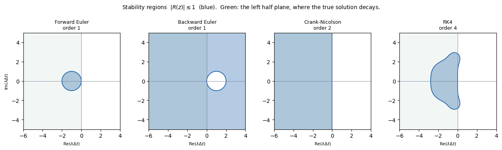

**The four regions above are the objects the rest of this document tests spectra against.** Each is the set of $z$ where $|g(z)| \le 1$ for one scheme — forward Euler's disc, backward Euler's and Crank–Nicolson's unbounded regions covering the whole left half-plane, and RK4's larger bounded region. The green shading is the left half-plane, where the true solution decays; a scheme is useful on a problem when its blue region covers where that problem's eigenvalues sit (§1.1).

### Going more implicit buys stability, not accuracy

| | order | stability |
|---|---|---|
| forward Euler, $\theta = 0$ | 1 | conditional: $\Delta t$ capped |
| Crank–Nicolson, $\theta = 1/2$ | **2** | unconditional |
| backward Euler, $\theta = 1$ | 1 | unconditional, and damps hard |

Moving from $\theta=0$ to $\theta=1$ removes the step cap and leaves the order exactly where it started. **Accuracy along this axis peaks in the middle**, at $\theta = 1/2$, for the reason given in §0.7.

### Going higher order buys accuracy — and, for explicit methods, buys stability too

This is the part most often gotten backwards. Higher-order explicit schemes are not more fragile; their stability regions are **larger**. Measured from the Runge–Kutta stability polynomials:

| explicit scheme | order | stable for real $z$ | stable for imaginary $z$ |
|---|---|---|---|
| RK1 = forward Euler | 1 | $[-2,\ 0]$ | **$\{0\}$ only** |
| RK2 (Heun, midpoint) | 2 | $[-2,\ 0]$ | **$\{0\}$ only** |
| RK3 | 3 | $[-2.51,\ 0]$ | $\vert\mathrm{Im}\,z\vert \le 1.732$ |
| RK4 | 4 | $[-2.79,\ 0]$ | $\vert\mathrm{Im}\,z\vert \le 2.828$ |

**Read the last column.** RK1 and RK2 are unstable on the imaginary axis at *every* step size — and §1.1 will show that the imaginary axis is exactly where waves live. RK3 and RK4 are not. **That single fact is why explicit wave and advection codes are built on RK3 or RK4 and essentially never on RK2.** Higher order here is not a refinement; it is what makes the method usable at all.

### The ceiling: you cannot have everything

For implicit methods there is a hard theoretical limit, **Dahlquist's second barrier**: no linear multistep method of order greater than 2 can be unconditionally stable, and among the second-order ones Crank–Nicolson has the smallest error constant. So:

| want | can have |
|---|---|
| unconditional stability, order $\le 2$ | yes — backward Euler, Crank–Nicolson, BDF2 |
| unconditional stability, order $> 2$, **multistep** | **impossible** — BDF3–6 give up part of the stability region |
| unconditional stability, order $> 2$, **implicit Runge–Kutta** | yes — Gauss–Legendre is order $2s$ with $s$ stages and A-stable at every order, at the cost of an $s$-times-larger solve |

### What to watch for while reading

Each of §2 to §5 is the same three measurements on a different PDE:

1. **Where is the stability ceiling**, and is it above or below the step accuracy needs?
2. **What is the order**, measured rather than quoted?
3. **What does the scheme do to the fast modes** it is not resolving — damp them, keep them, or amplify them?

The four PDEs give four different answers, and the differences are the substance of the document.

## 0.7 What to expect from each

Three claims, stated here as expectations and measured later.

**Accuracy: $\theta = 1/2$ is special, and the other two are not.** The difference quotient $(\mathbf{u}^{n+1}-\mathbf{u}^n)/\Delta t$ is a centred approximation to the derivative at the *midpoint* $t_{n+1/2}$, and centred differences are second order because their odd error terms cancel by symmetry. Evaluating the right-hand side at that same midpoint — which is what $\theta=1/2$ does — matches the two sides up and the leading error cancels. The local truncation error of the $\theta$-method is

$$\left(\theta - \frac{1}{2}\right)\Delta t\,\frac{\mathrm{d}^2u}{\mathrm{d}t^2} + O(\Delta t^2)$$

so it vanishes at $\theta = 1/2$ and at no other value. **Crank–Nicolson is second order; forward and backward Euler are both first order.** Measured in §1.4 and §2.2.

**Stability: $\theta \ge 1/2$ removes the step limit entirely.** For the heat equation with $r = \alpha\Delta t/\Delta x^2$, the $\theta$-method is stable when

$$\theta \ge \frac{1}{2}: \ \text{any } r \qquad\qquad \theta < \frac{1}{2}: \ r \le \frac{1}{2(1-2\theta)}$$

| $\theta$ | largest stable $r$ |
|---|---|
| 0 (forward Euler) | **0.5** |
| 0.25 | 1.0 |
| 0.40 | 2.5 |
| 0.49 | 25.0 |
| $\ge 0.5$ | **unlimited** |

The limit does not fall off a cliff at $\theta = 1/2$; it diverges smoothly as $\theta$ approaches it from below. Verified against the formula by bisection in §2.1.

**Damping: $\theta = 1$ is special, and $\theta = 1/2$ is the worst case.** A very fast decaying mode — one that should be gone within a single step — is handled differently by each. Backward Euler crushes it to nearly zero. Crank–Nicolson very nearly *keeps* it, flipping its sign each step instead of removing it. This does not show up in the order of accuracy and it does not show up in the stability limit, but it decides whether the answer has spurious oscillations in it. §1.5 isolates it and §2.3 shows what it does to a real solution.

### So which one

| | forward Euler | Crank–Nicolson | backward Euler |
|---|---|---|---|
| cost per step | **cheapest** — no solve | a solve | a solve |
| order in time | 1 | **2** | 1 |
| step limited by stability | **yes** | no | no |
| damps the fastest modes | — | **badly** | **strongly** |
| **wins when** | the step you need for accuracy is already below the stability limit | the data are smooth and accuracy is what you are paying for | the fast modes are junk you want removed, or the data are sharp |

**Note the trap in the middle column.** Backward Euler is first order — the *same* order as forward Euler. You pay for a solve every step and get no accuracy improvement at all in return. What you get is the freedom to take a bigger step, which is only worth something if the bigger step is still accurate enough. That is the stiffness gap of §0.9, and it is the whole argument.

## 0.8 The eight factors that decide the choice

Implicit removes the step limit. If that were the end of it nobody would use explicit, and yet the shock codes, the crash codes and the turbulence codes are all explicit. So the choice depends on more than stability. Here is everything it depends on.

The factors fall into three groups, and the grouping matters because **only the first group is a property of the mathematics.** The other two are yours.

---

### Group A — what the problem is (not your choice)

**1. The equation → the *direction* of the spectrum.** Diffusion puts eigenvalues on the negative real axis. Advection and waves put them on (or near) the imaginary axis. Reaction puts them on the real axis too, but with a magnitude that does not depend on the mesh. This decides *which* schemes are even admissible — RK2 is unusable for waves at any step size (§0.6).

**2. The spatial discretization → the *extent* of the spectrum.** $\Delta x$ sets $|\lambda_{\max}|$: $4\alpha/\Delta x^2$ for diffusion, $c/\Delta x$ for advection. But so do choices inside the discretization — upwind adds a real part that central differencing does not have, higher-order stencils reach further for the same $\Delta x$, and a finite-element mass matrix gives $\mathbf{M}^{-1}\mathbf{K}$ rather than a plain stencil. Two more things bite here: on a non-uniform mesh **the single smallest cell sets the step for the whole domain**, and in multiple dimensions cell aspect ratio does the same.

**3. Solution regularity.** Smooth solutions reward high order and tolerate Crank–Nicolson. Shocks, sharp fronts, discontinuous initial data and start-up transients reward L-stability and monotonicity instead, and high order buys nothing (Godunov). If the unknown must stay positive — a concentration, a density, $k$ and $\varepsilon$ — that is a hard constraint, not a preference.

---

### Group B — what you want (your choice, and the half most often forgotten)

**4. Which timescale you actually need resolved.** This is half of stiffness and it is not in the equations at all. Do you want the transient or only the steady state? Over what interval — 10 fast timescales or $10^8$? To 1% or to $10^{-8}$? Is the fast mode the *answer* (a wave) or junk (acoustics in low-Mach flow)? Decide you want to see the fast mode and the problem stops being stiff, because nothing is being wasted.

**5. Structure you want preserved.** Conservation of mass and momentum; symplecticity for long-time Hamiltonian problems; a discrete maximum principle; TVD. **These override order arguments.** An energy-conserving second-order scheme beats a dissipative fourth-order one over $10^6$ periods — that is §4.3.

---

### Group C — what it costs (your machine and your code)

**6. The solve-to-multiply ratio.** Not a constant. On a 1D banded system a solve is maybe 3× a multiply; on a 3D unstructured problem with AMG it can be 100×. And it matters whether $\mathbf{L}$ is constant (factor once, reuse forever) or changes every step (refactor every step), and whether nonlinearity forces several solves per step via Newton.

**7. Memory and parallelism.** Implicit needs the matrix stored and a preconditioner built; explicit needs neither. Explicit communication is nearest-neighbour, implicit needs global reductions inside Krylov and multigrid. **At high core counts this shifts the balance toward explicit**, which is why large-scale DNS and astrophysics codes are explicit even where a stiffness argument would say otherwise.

**8. Robustness.** Does Newton converge? With contact, plasticity or fracture it often does not, and a failed Newton stops the run — explicit never asks (`COMPUTATIONAL.md` §2.4). Do you have a preconditioner that works? Without one, implicit is not actually available, whatever the theory says.

---

### Where each one is measured

| factor | first appears | measured in |
|---|---|---|
| 1. the equation | §1.1 — the spectrum table | §2, §3, §4 (one PDE each) |
| 2. the spatial discretization | §1.1 — refinement manufactures stiffness | §1.1, §2.4 |
| 3. solution regularity | §0.7 — the damping row | §2.3, §3.2 |
| 4. which timescale you need | §1.6 — the definition of stiffness | §5.2b, where fixing accuracy changes the verdict |
| 5. structure preserved | §0.6 — order is not the only axis | §4.3, energy over 50,000 steps |
| 6. solve-to-multiply ratio | §0.3 | §2.4, §5.2 |
| 7. memory and parallelism | here only | not measured — see §10 |
| 8. robustness | here only | not measured — see §10 |

**The spectrum is the product of factors 1 and 2, not of either alone**, which is why the same equation is stiff on one mesh and not on another, and why two codes solving the same physics can reach opposite conclusions about time stepping.

## 0.9 The inequality that ties them together

Write $\Delta t_{\text{stab}}$ for the explicit stability ceiling (fixed by group A), $\Delta t_{\text{acc}}$ for the step accuracy actually needs (fixed by A3 and group B), and $\rho$ for the cost of one solve divided by the cost of one multiply (group C). Then implicit is worth paying for exactly when

$$\boxed{\ \rho \;<\; \frac{\Delta t_{\text{acc}}}{\Delta t_{\text{stab}}}\ }$$

The right-hand side is the **stiffness gap** — how much larger a step implicitness permits you to take. The left-hand side is what you pay for the privilege. Group A and group B set the numerator and denominator; group C sets $\rho$.

**Everything measured in §2 through §5 is one or another term of this inequality**, and the four PDEs give four different verdicts:

| | stiffness gap $\Delta t_{\text{acc}}/\Delta t_{\text{stab}}$ | measured $\rho$ | verdict | where |
|---|---|---|---|---|
| **diffusion**, $n_x = 800$ | **≈ 128** | ≈ 4.5 | **implicit wins**, by 28× | §2.4 |
| **diffusion**, $n_x = 50$ | ≈ 2 | ≈ 4.5 | **explicit wins** — same equation, coarser mesh | §2.4 |
| **advection** | **≈ 1** — upwind is *exact* at the stability limit | > 1 always | **explicit wins** | §3.1, §3.4 |
| **wave equation** | **≈ 1** — the wave *is* the fast mode | > 1 always | **explicit wins** | §4.3 |
| **advection–diffusion–reaction** | ≈ 1 at equal accuracy | 27 implicit, 0.7 IMEX | **explicit or IMEX** | §5.2b |

**Read the first two rows together.** Same equation, same scheme, opposite answers, and nothing changed but $\Delta x$. That is the sharpest demonstration that the question cannot be answered from the PDE alone.

**And read the last three.** For advection and waves the gap is close to 1 because accuracy demands the step that stability would have forced anyway — for upwind advection the stability limit is not merely acceptable but *optimal* (§3.1). When the gap is 1, no value of $\rho$ makes implicit worthwhile.

### What to watch for while reading

Each of §2 to §5 is the same three measurements on a different equation:

1. **Where is the stability ceiling?** §1.3 derives it from the spectrum; §2.1 and §4.2 measure it against the prediction.
2. **What step does accuracy need?** §1.4 and §2.2 measure order; §1.8 covers how that step is chosen in practice, which is harder for implicit than you might expect.
3. **How big is the gap, and what does the scheme do to the modes it is not resolving?** §1.6 defines the gap; §1.5 covers the damping question, which decides whether the answer merely loses accuracy or falls apart.

# 1. Modes, stability, and stiffness

§0 left three questions. This chapter answers all three on the simplest possible problem — one with no mesh in it at all — so that every statement is about the time integrator and nothing else. §2 through §5 then repeat the exercise on real PDEs.

## 1.1 A solution is a sum of independent modes

`code/time_modes.py`. Take the system from §0 with $\mathbf{f}=\mathbf{0}$ and look at the eigenvectors of $\mathbf{L}$. Writing $\mathbf{L}\mathbf{v}_k = \lambda_k\mathbf{v}_k$ and expanding the solution in that basis,

$$\mathbf{u}(t) = \sum_k c_k\,e^{\lambda_k t}\,\mathbf{v}_k$$

**Each term evolves entirely on its own**, at its own rate $\lambda_k$, with no reference to any other. That is the point of diagonalizing, and it is what lets a scheme be understood one mode at a time.

A **mode** is one eigenvector. Its $\lambda_k$ is its personal decay rate, and $1/|\lambda_k|$ is its lifetime. A mode is **fast** when $|\lambda_k|$ is large.

### What a fast mode looks like

For the discrete Laplacian the eigenvectors are sine waves, and the answer is concrete: **fast means wiggly.**

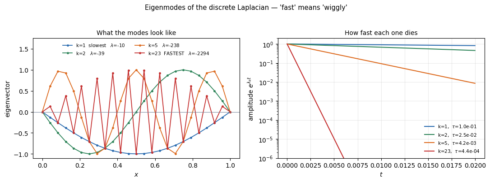

Computed at $n_x = 24$, $\alpha = 1$:

| mode $k$ | shape | $\lambda_k$ | lifetime $1/\vert\lambda_k\vert$ |
|---|---|---|---|
| 1 | one smooth half-sine | $-9.86$ | $1.0\times10^{-1}$ |
| 5 | 5 half-waves | $-238.06$ | $4.2\times10^{-3}$ |
| 12 | 12 half-waves | $-1152.00$ | $8.7\times10^{-4}$ |
| **23** | **sawtooth** — alternating sign at adjacent nodes | $\mathbf{-2294.14}$ | $\mathbf{4.4\times10^{-4}}$ |

Smooth modes are slow; wiggly modes are fast. The extreme is the **sawtooth**, the shortest wavelength the grid can represent, at $\lambda \approx -4\alpha/\Delta x^2$ — analytically $-2304$, measured $-2294$.

### Where the modes come from

`code/time_spectra.py`. For each model operator the eigenvalues can be written down in closed form, and doing so is worth the five minutes because **it is the whole of what distinguishes the four equations.**

**Notation first**, since several symbols are about to appear at once.

| symbol | meaning | range |
|---|---|---|
| $M$ | the **number of modes**, which is the number of unknowns in the system | — |
| $m$ | the **mode number**, an integer index over them | $m = 1,\dots,M$ |
| $k_m$ | the **wavenumber** of mode $m$ — its spatial frequency. Not an independent index: it is determined by $m$, as $k_m = m\pi$ for the Dirichlet problems here and $k_m = 2\pi m$ for the periodic ones | — |
| $\phi_m = k_m\Delta x$ | the **phase shift per cell** — how far around a full cycle mode $m$ advances from one grid point to the next. This is the only combination that appears in any formula below | $0 < \phi_m \le \pi$ |
| $\lambda_m$ | the eigenvalue of mode $m$ | — |

**Only $m$ iterates.** Everything else is a function of it: pick $m$, get $k_m$, get $\phi_m$, get $\lambda_m$. So there is one index, running $1$ to $M$, exactly as in §1.1's opening sum.

**$\phi$, not $\theta$.** $\theta$ is already the $\theta$-method parameter of §0.4 and means something entirely different; phase per cell is $\phi$ throughout this document.

**$\phi$ is the natural variable**, which is why every formula is written in it rather than in $k$ and $\Delta x$ separately. It runs from $\phi \to 0$ (a mode so smooth it barely changes between neighbours) up to $\phi = \pi$ (sign flip every point — the sawtooth of the figure above, the wiggliest thing representable). Anything beyond $\pi$ is aliased back onto a smaller $\phi$ and is not a separate mode.

**How many modes are there?** Exactly as many as there are unknowns — $M$ modes, $M$ eigenvalues counted with multiplicity — and this is where the vertex-versus-cell distinction bites. On $[0,1]$ split into $n$ cells there are $n+1$ vertices, but Dirichlet conditions fix the two end ones, leaving $M = n-1$ interior unknowns. A periodic problem fixes nothing and has $M = n$. The difference of one or two is not bookkeeping pedantry: it is why $\phi = \pi$ is approached but never quite attained on the Dirichlet problems, and hence why the measured $|\lambda|_{\max}$ above is $2294$ rather than the limiting $4\alpha/\Delta x^2 = 2304$.

**Two caveats about the count**, since "one eigenvalue per mode" is not quite universal.

**The wave equation carries two eigenvalues per spatial shape.** Written as a first-order system it has $2M$ unknowns — displacement and velocity at each of $M$ points — so each spatial shape $\phi_m$ contributes a *pair* $\pm\mathrm{i}\omega_m$, one travelling each way. That is why its row below has a $\pm$ and the others do not, and it is a property of the equation being second order in time, not of any multiplicity.

**Genuine multiplicity exists, though not in these examples.** Two distinct modes can share one eigenvalue — in two dimensions, $(k_x,k_y)$ and $(k_y,k_x)$ do exactly that on a square. When that happens the count of *distinct* eigenvalues falls below $M$ while the count *with multiplicity* stays at $M$, and it is the latter that matters here, because stability requires $|g(\lambda_m\Delta t)| \le 1$ for every mode whether or not the values repeat. In the 1D operators below all eigenvalues are simple apart from the wave equation's $\pm$ pairing.

Substituting the trial mode $v_j = e^{\mathrm{i}k_m x_j}$ into each discrete operator and reading off the factor it multiplies by:

| operator | discrete form | eigenvalue | where they sit |
|---|---|---|---|
| **scalar ODE** (§0.5) | $y' = \lambda y$ — no mesh at all | $\lambda$ itself | **one point**, wherever you choose to put it |
| **diffusion** | $\dfrac{\alpha}{\Delta x^2}(u_{j+1}-2u_j+u_{j-1})$ | $-\dfrac{4\alpha}{\Delta x^{2}}\sin^{2}\dfrac{\phi}{2}$ | **negative real axis**, over $[-4\alpha/\Delta x^2,\,0]$ |
| **advection, central** | $-\dfrac{c}{2\Delta x}(u_{j+1}-u_{j-1})$ | $-\mathrm{i}\,\dfrac{c}{\Delta x}\sin\phi$ | **the imaginary axis**, over $[-\mathrm{i}c/\Delta x,\ \mathrm{i}c/\Delta x]$ |
| **advection, upwind** | $-\dfrac{c}{\Delta x}(u_{j}-u_{j-1})$ | $-\dfrac{c}{\Delta x}\left(1-e^{-\mathrm{i}\phi}\right)$ | a **circle** of radius $c/\Delta x$ centred at $-c/\Delta x$ |
| **wave** | $u_{tt}=c^2u_{xx}$ as a first-order system | $\pm\,\mathrm{i}\,\dfrac{2c}{\Delta x}\sin\dfrac{\phi}{2}$ | **the imaginary axis, in $\pm$ pairs** |
| **reaction** | $-Ku$, with $K>0$ the reaction rate | $-K$ | a **single point**, and $\Delta x$ does not appear |

Each formula was checked against the eigenvalues of the assembled matrix at $n_x = 32$; they agree to $10^{-13}$ or better.

**The first row is there on purpose.** The scalar problem of §0.5 is a one-mode system: its "spectrum" is the single number $\lambda$, chosen rather than derived. Everything below it is the same picture with more points — which is why that example was worth doing first, and why §1.2 goes back to it.

**Central and upwind, since both appear above.** They are two ways to difference the same first derivative $\partial_x$. **Central** looks symmetrically both ways, $(u_{j+1}-u_{j-1})/2\Delta x$, and is second-order accurate. **Upwind** looks only in the direction the flow is coming *from* — for $c>0$ that is backwards, $(u_j - u_{j-1})/\Delta x$ — and is only first-order accurate. §3 covers why the asymmetric, less accurate one is nonetheless the one that works; the row above is the first hint, since it is the only one of the two whose eigenvalues leave the imaginary axis.

**Three things to take from this table.**

**Diffusion is real, advection and waves are imaginary.** That is not a detail of presentation — it is the difference between the two halves of this document. A real negative $\lambda$ means a mode that *decays*; a purely imaginary $\lambda$ means one that *oscillates without decaying*. §0.5 already showed that schemes behave completely differently on those two, and here is where the difference originates.

**Upwinding moves the spectrum off the axis.** Central and upwind differencing discretize the same derivative, yet one produces purely imaginary eigenvalues and the other a circle sitting in the left half-plane. The real part upwinding introduces is numerical dissipation — the $\alpha_{\text{num}} = c\Delta x(1-\nu)/2$ of §3.3, seen from the eigenvalue side. **The spatial discretization is not a passive supplier of $\lambda$; it chooses where they go.**

**Reaction is the odd one out**: its eigenvalue does not involve $\Delta x$ at all. Refining the mesh cannot make a reaction term stiff, and cannot cure it either.

### Refining the mesh: the exponent is what matters

Measured $|\lambda|_{\max}$ as the mesh is refined:

| $n_x$ | diffusion | ratio | advection | ratio | wave | ratio | reaction |
|---|---|---|---|---|---|---|---|
| 16 | 1,014 | | 32 | | 31.8 | | 10 |
| 32 | 4,086 | **4.03** | 64 | **2.00** | 63.9 | **2.01** | 10 |
| 64 | 16,374 | **4.01** | 128 | **2.00** | 128 | **2.00** | 10 |
| 128 | 65,526 | **4.00** | 256 | **2.00** | 256 | **2.00** | 10 |
| 256 | 262,134 | **4.00** | 512 | **2.00** | 512 | **2.00** | 10 |

$$\text{diffusion } \ |\lambda|_{\max}\sim\frac{1}{\Delta x^{2}}, \qquad \text{advection and waves } \ \sim\frac{1}{\Delta x}, \qquad \text{reaction } \ \sim 1$$

**This single difference in exponent is why diffusion becomes stiff under refinement and advection does not.** Double the mesh and diffusion's fastest mode quadruples while advection's merely doubles — but advection's *slowest interesting* timescale also halves, so the two track each other and the gap never opens. For diffusion it opens by a factor of two every refinement.

And the slow end, meanwhile, does not move at all:

| $n_x$ | $\vert\lambda_{\min}\vert$ (slow) | $\vert\lambda_{\max}\vert$ (fast) | ratio |
|---|---|---|---|
| 12 | 9.81 | 566 | 58 |
| 24 | 9.86 | 2,294 | 233 |
| 48 | 9.87 | 9,206 | 933 |
| 96 | 9.87 | 36,854 | 3,734 |
| 192 | 9.87 | 147,446 | **14,940** |

**The slow end is physics.** It converges to $\pi^2 = 9.87$, the fundamental of the domain — the thing you are trying to compute. **The fast end is a property of the grid.** Refining improves the answer by a little and worsens the arithmetic by a lot, and §1.6 is about what that costs.

### The one picture that decides stability

Everything above combines into a single geometric statement.

**One definition first.** The eigenvalues $\lambda_m$ have units of 1/time, so they cannot be compared with anything until they are scaled by the step. Write

$$\boxed{\;z_m \;=\; \lambda_m\,\Delta t\;}$$

for the **scaled eigenvalue** — dimensionless, and the only form in which an eigenvalue ever enters a stability statement. It bundles the two things that matter: $\lambda_m$ is what the equation and mesh give you, $\Delta t$ is what you choose. §1.2 works with $z$ throughout.

A scheme is then stable if and only if

$$\Delta t \times \{\text{the spectrum}\} \;=\; \{z_m\} \ \subset \ \{\text{the scheme's stability region}\}$$

— every scaled eigenvalue inside the region, no exceptions. The spectrum is fixed by the equation and the mesh; $\Delta t$ scales it; the region is fixed by the scheme. **Choosing a time step is choosing how far to inflate a shape until it no longer fits inside another shape.**

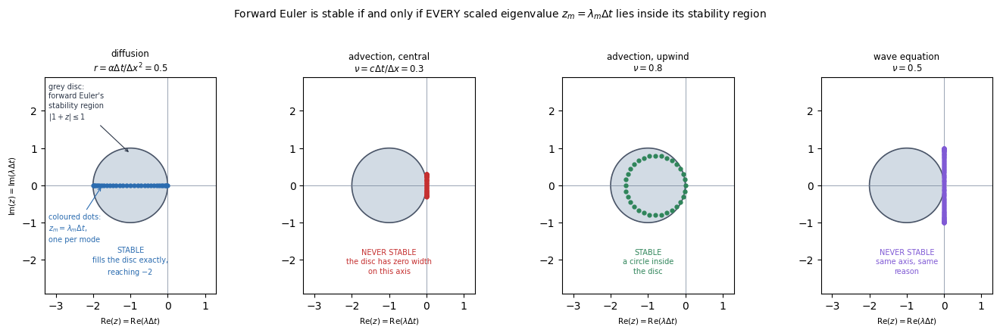

**What is in the picture.** Two objects, and they come from different places.

- **The grey disc** is **forward Euler's stability region** — the set of all complex $z$ with $|1+z| \le 1$, which is the disc of radius 1 centred at $-1$. It comes from the *scheme* and from nothing else: it is the same disc in all four panels, and it is the region already drawn in §0.6 for four different schemes. A different scheme would be a different shape.
- **The coloured dots** are the **scaled eigenvalues** $z_m = \lambda_m\Delta t$, one per mode. They come from the *equation, the mesh and the step*. Changing $\Delta t$ slides them all in or out along fixed rays from the origin; changing the mesh changes how far apart they spread; changing the equation changes the direction they point.

**The test is whether every dot is inside the grey.** Read left to right:

| | $\Delta t\lambda$ is | and so |
|---|---|---|
| **diffusion** at $r=0.5$ | a segment along $[-2,\,0]$ | it fits **exactly**, filling the region's full diameter — which is where $r\le1/2$ comes from |
| **advection, central** | a segment on the **imaginary axis** | the region touches that axis only at the origin, so it never fits **at any $\Delta t$** |
| **advection, upwind** at $\nu=0.8$ | a circle of radius $\nu$ centred at $-\nu$ | a circle inside a circle; it fits precisely while $\nu\le1$ |
| **wave** at $\nu=0.5$ | a segment on the imaginary axis | never fits, for the same reason as central advection |

Measured, at $n_x = 32$:

| operator | parameter | $\max\vert 1+z\vert$ | |
|---|---|---|---|
| diffusion | $r = 0.50$ | 0.995185 | stable |
| diffusion | $r = 0.51$ | 1.035088 | unstable |
| advection, central | $\nu = 0.30$ | 1.044031 | unstable |
| **advection, central** | $\nu = 0.01$ | **1.000050** | **unstable** |
| advection, upwind | $\nu = 0.80$ | 1.000000 | stable |
| advection, upwind | $\nu = 1.05$ | 1.100000 | unstable |
| wave | $\nu = 0.50$ | 1.413362 | unstable |

**Look at the $\nu = 0.01$ row.** Central advection with forward Euler fails at a hundredth of the usual step as surely as at a third of it. This is the FTCS result of §3.1 explained rather than merely observed: it is not a step size that is wrong, it is a **geometry** that is wrong. A segment on the imaginary axis cannot be scaled into a region that meets that axis at one point.

**Panels 2 and 4 fail in the same way, and it is worth naming the shared cause.** A set of points lying *on* the imaginary axis away from the origin cannot be scaled into a region that meets that axis only at the origin. No value of $\Delta t$ helps, because $\Delta t$ scales distance and the problem is direction. Panels 1 and 3, by contrast, point into the disc's interior and merely have to be scaled until they fit.

**And it tells you what to do about it.** Two options, and both appear later: change the scheme so its region covers part of the imaginary axis — RK3 reaches $|\mathrm{Im}\,z|\le1.73$ and RK4 reaches $2.83$ (§0.6), which is exactly why explicit advection and wave codes are built on them — or change the spatial discretization so the spectrum leaves the axis, which is what panel 3 shows upwinding doing. A third route for the wave equation is the leapfrog scheme of §4, whose stability region *is* a segment of the imaginary axis, matching panel 4's shape rather than fighting it. Not a smaller time step. **That is the practical value of thinking in modes: it distinguishes problems a smaller step will fix from problems it will not.**

### Reading a failed stability test correctly

A natural but wrong inference from the figure is "panels 2 and 4 fail, therefore they need implicit methods." **The figure shows one particular explicit scheme failing, not explicit methods failing**, and the distinction decides what you actually do next.

When the test fails there are **three** candidate fixes, and only one of them costs a solve:

| | fix | cost | example |
|---|---|---|---|
| 1 | **change the scheme** — pick one whose region covers where the spectrum points | still explicit, slightly more work per step | forward Euler $\to$ RK3 or RK4 for panels 2 and 4; $\to$ leapfrog for the wave equation, whose region *is* a segment of the imaginary axis |
| 2 | **change the spatial discretization** — move the spectrum instead of the region | free, but changes the spatial accuracy | central $\to$ upwind, which is panel 2 becoming panel 3 |
| 3 | **go implicit** | **a solve every step** | backward Euler, Crank–Nicolson |

**Option 3 is the last resort, not the first**, and it is reserved for genuine stiffness — a large gap between $\Delta t_{\text{stab}}$ and $\Delta t_{\text{acc}}$ (§0.9). Options 1 and 2 fix a *geometry* problem; option 3 buys its way out of a *cost* problem, and they are different problems.

Applying that to the four panels:

| | forward Euler | other explicit | implicit | used in practice |
|---|---|---|---|---|
| **diffusion** | works, $r\le\frac{1}{2}$ | works | works, no limit | **implicit** on fine meshes, explicit on coarse (§2.4) |
| **advection, central** | **never** | RK3, RK4 | works | upwind plus explicit RK |
| **advection, upwind** | works, $\nu\le1$ | works | works, but damps the pulse | **explicit** (§3.4) |
| **wave** | **never** | **leapfrog**, RK4 | works, but damps the wave away | **explicit** leapfrog or Newmark (§4.3) |

**Note the shape of that table, because it is the opposite of what the figure suggests at a glance.** The panel where forward Euler *succeeds* — diffusion — is the one where you are most likely to abandon explicit methods entirely. The two panels where it *fails* are ones you repair and stay explicit, because their physics is wave propagation, where implicit methods are stable and useless: §4.3 measures backward Euler retaining 0.04% of a wave's energy over a hundred periods.

**A failed stability test asks you to change something. It does not say which thing.**

### Which eigenvalues actually matter

A spectrum can hold thousands of eigenvalues. Four parts of it do the work, and they answer four different questions.

| part of the spectrum | what it decides | for diffusion at $n_x=32$ |
|---|---|---|
| the **binding** eigenvalue — the one that exits the stability region first | $\Delta t_{\text{stab}}$, the explicit ceiling | the sawtooth, $\phi = 0.969\pi$, $\lambda = -4086$ |
| the **smallest** $\vert\lambda\vert$ | the longest timescale present, hence how long you must integrate: $T \sim$ a few $\times\ 1/\vert\lambda_{\min}\vert$ | $\lambda \to -\pi^2 = -9.87$, the domain's fundamental |
| the **ratio** of the two | the stiffness, which is literally the explicit step count: $T/\Delta t \sim \vert\lambda_{\max}\vert/\vert\lambda_{\min}\vert$ | $\approx 414$ |
| the modes **carrying the answer** | $\Delta t_{\text{acc}}$ — roughly 20 steps per period of the fastest mode you actually care about | usually the smooth end here; in a wave problem, mid-spectrum |

**So your instinct that the extremes matter is right — but "largest" is the wrong word**, and getting it wrong is the whole of the FTCS puzzle.

### It is position, not magnitude

Compare the three operators under **forward Euler**, whose stability region is the disc $\vert 1+z\vert \le 1$:

| operator | $\vert\lambda\vert_{\max}$ | largest stable $\Delta t$ **(forward Euler)** | $\vert z\vert$ at that step |
|---|---|---|---|
| diffusion | **4086** | $4.89\times10^{-4}$ | 2.0 |
| advection, upwind | 64 | $3.13\times10^{-2}$ | 2.0 |
| advection, central | **32** | **$0$** | 0.0 |

**Central advection has the smallest $\vert\lambda\vert_{\max}$ of the three and admits no step at all**, while diffusion has an eigenvalue 128 times larger and is perfectly comfortable. Magnitude alone predicts the opposite of what happens.

**The binding eigenvalue, defined.** Start with $\Delta t = 0$, where every $z_m = 0$ and everything is trivially inside the region. Now increase $\Delta t$. Each $z_m = \lambda_m\Delta t$ moves **outward along the fixed ray from the origin through $\lambda_m$** — the direction never changes, only the distance. So each mode has its own personal ceiling:

$$\Delta t_m \;=\; \frac{R\!\left(\arg\lambda_m\right)}{|\lambda_m|}$$

where $R(\text{angle})$ is **how far the stability region reaches from the origin in that direction**. Mode $m$ is inside for $\Delta t < \Delta t_m$ and outside beyond it. The scheme is stable only while *every* mode is inside, so

$$\Delta t_{\max} = \min_m \Delta t_m, \qquad \lambda_{\text{binding}} = \lambda_{m^\ast} \ \text{ where } \ m^\ast = \arg\min_m \Delta t_m$$

**The binding eigenvalue is the one with the smallest personal ceiling** — the first to leave as the step grows. Note that $\Delta t_m$ balances two things: a large $|\lambda_m|$ shrinks it, but so does a small $R(\arg\lambda_m)$, and the second effect is what the table above is about. For forward Euler, $R = 2$ along the negative real axis and $R = 0$ along the imaginary axis, so a modest eigenvalue pointing the wrong way beats a huge one pointing the right way.

**Which mode binds depends on the scheme**, since $R$ is a property of the region. Under forward Euler the imaginary-axis modes bind everything; under RK4, which reaches $|\mathrm{Im}\,z| \le 2.83$ (§0.6), they may not bind at all.

**Where the numbers come from.** Applying $\Delta t_{\max} = R(\arg\lambda_{\text{binding}})/|\lambda_{\text{binding}}|$ to each operator:

- **Diffusion.** Eigenvalues are real and negative, and the disc extends to $-2$ along that direction. So $\Delta t_{\max} = 2/|\lambda|_{\max} = 2/4086.1 = 4.89\times10^{-4}$. Substituting $|\lambda|_{\max} = 4\alpha/\Delta x^2$ recovers the familiar $\Delta t \le \Delta x^2/2\alpha$.
- **Upwind advection.** The spectrum is a circle of radius $c/\Delta x$ centred at $-c/\Delta x$; scaled by $\Delta t$ it is a circle of radius $\nu$ centred at $-\nu$. A circle of radius $\nu$ at $-\nu$ sits inside the unit circle at $-1$ exactly when $\nu \le 1$, giving $\Delta t \le \Delta x/c = 1/32 = 3.13\times10^{-2}$. Equivalently $2/|\lambda|_{\max} = 2/(2c/\Delta x)$ — the same number, since the binding point is the far side of the circle on the real axis.
- **Central advection.** Eigenvalues lie on the imaginary axis. **The disc extends zero distance along that axis**, so the numerator is $0$ and no positive $\Delta t$ works. That is not a small ceiling; it is no ceiling to be under.

**The correct general statement**, then: the binding eigenvalue is not the largest, but the one whose $|z|$ can grow *least* before leaving the region — a ratio of magnitude to the region's reach in that direction. Which is why §1.1's four-panel figure is the useful object and a list of $|\lambda|$ values is not.

### Courant number, Fourier number, and the CFL condition

Three things get called "the CFL" and they are not the same. Since $\nu$ is about to appear everywhere, it is worth separating them.

| | what it is | kind of thing |
|---|---|---|
| $\Delta t$ | the time step | a **quantity**, in seconds |
| $\nu = \dfrac{c\,\Delta t}{\Delta x}$ | the **Courant number** — how many cells a signal crosses in one step | a **dimensionless number**. "Running at CFL 0.8" means $\nu = 0.8$ |
| the **CFL condition** | the stability requirement $\nu \le \nu_{\max}$ | a **constraint** |

**$\nu$ is just $\Delta t$ in mesh units.** Given $\nu$, the step follows as $\Delta t = \nu\Delta x/c$. The reason to work in $\nu$ rather than $\Delta t$ is that $\nu$ is the combination the stability condition cares about, so one number covers every mesh.

**The parabolic counterpart is a different number with a different scaling.** For diffusion the relevant group is the **Fourier number**

$$r = \frac{\alpha\,\Delta t}{\Delta x^{2}}, \qquad\text{limit } r \le \tfrac{1}{2} \ \text{ for forward Euler}$$

Note $\Delta x^{2}$, not $\Delta x$. That is the $1/\Delta x^2$ versus $1/\Delta x$ difference of §1.1 reappearing, and it is why calling $r$ "the CFL number" — common, and wrong — hides the very thing that makes diffusion stiff and advection not.

**Both are the same object in disguise.** Each is $\Delta t$ divided by the largest stable step:

$$\nu = \frac{\Delta t}{\Delta x/c} \quad\text{and}\quad r = \frac{\Delta t}{\Delta x^2/\alpha}$$

so "$\nu \le 1$" and "$r \le 1/2$" are both the general rule $\Delta t \le \min_m R(\arg\lambda_m)/|\lambda_m|$, written in units that make the limit a pure number.

#### A reminder, since both keep appearing: central and upwind

**These are properties of the *method*, not of the equation.** Both approximate the same term $\partial u/\partial x$ in the same PDE, and choosing between them is a modelling decision:

| | stencil | order | what its eigenvalues do |
|---|---|---|---|
| **central** | $\dfrac{u_{j+1}-u_{j-1}}{2\Delta x}$ — looks symmetrically both ways | 2 | stay **on the imaginary axis** |
| **upwind** | $\dfrac{u_{j}-u_{j-1}}{\Delta x}$ — looks only where the flow comes *from* (for $c>0$, backwards) | 1 | move **into the left half-plane** |

The less accurate one is the one that makes explicit stepping possible, which is the trade §3 is about.

#### The limit belongs to the scheme, not to the number 1

Largest stable $\nu$ for advection, measured:

| scheme | with central | with upwind |
|---|---|---|
| forward Euler | **0.000** | 1.000 |
| RK2 | 0.001 | 1.000 |
| RK3 | **1.732** | 1.256 |
| RK4 | **2.828** | 1.393 |

**RK4 with central differencing runs stably at nearly three cells per step; forward Euler with the same spatial scheme runs at zero.** "The CFL condition is $\nu\le1$" is true only of particular pairings, and the number 1 is a coincidence of the common ones.

#### The classical CFL condition is necessary, not sufficient

Courant, Friedrichs and Lewy's original argument is about **domains of dependence**, and it is worth knowing separately from the algebra. An explicit stencil reaches one cell per step, so after $n$ steps it has seen $n$ cells. A physical signal has travelled $cn\Delta t$. If the signal outruns the stencil, the scheme is computing an answer from data that cannot contain it, and no amount of refinement helps:

$$c\,\Delta t \le \Delta x \qquad\Longleftrightarrow\qquad \nu \le 1$$

**This is a lower bound on what can possibly work, not a guarantee.** FTCS at $\nu = 0.5$ satisfies it and has $\max|g| = 1.118$ — unstable. §3.1's FTCS result is exactly this: the classical condition is met and the scheme still fails, because the domain-of-dependence argument is blind to the direction the eigenvalues point.

#### So what do you actually use to pick an explicit step?

**Both criteria, with the stability one usually binding.**

$$\Delta t \;=\; \underbrace{S}_{\text{safety}}\times\min\Big(\underbrace{\Delta t_{\text{adv}},\ \Delta t_{\text{diff}},\ \Delta t_{\text{reac}},\ \dots}_{\text{one per physical term}},\ \underbrace{\Delta t_{\text{acc}}}_{\text{accuracy}}\Big)$$

- **One stability limit per term**, and the smallest wins. §5.1 does exactly this and finds diffusion binding by a factor of 16 over advection.
- **A safety factor** $S \approx 0.8$–$0.9$, because coefficients vary over the domain, the flow speed changes during the run, and a nonlinear problem's eigenvalues move as the solution evolves. Running at exactly $\nu = 1$ is for demonstrations.
- **The accuracy term is in the $\min$ and usually does not bind.** That is *why* explicit practitioners talk only about CFL: satisfying stability normally over-satisfies accuracy, so the accuracy term is invisible. It is not absent — and when a problem has slow physics on a fine mesh it can become the binding one.

**One case inverts even this.** For upwind advection, accuracy is *best* at the stability limit — $\nu = 1$ is exact (§3.1) — so the two criteria point the same way and the safety factor costs accuracy rather than buying it. That is peculiar to this scheme and is the opposite of every implicit method in this document.

### What fixes the position of the eigenvalues

The toolset below is a list of levers. This is why they work.

**The structural rule: the symmetry of $\mathbf{L}$ decides the direction of its spectrum.** No computation is needed to predict it.

| $\mathbf{L}$ is | eigenvalues are | underlying operator |
|---|---|---|
| **symmetric**, $\mathbf{L} = \mathbf{L}^{\mathsf T}$ | **real** — self-adjoint operators have real spectra | $\partial_{xx}$, diffusion |
| **antisymmetric**, $\mathbf{L} = -\mathbf{L}^{\mathsf T}$ | **purely imaginary** — skew-adjoint operators have imaginary spectra | $\partial_x$ centrally differenced, advection |
| neither | complex | upwind advection |

Checked on the three discrete operators:

| operator | $\mathbf{L}=\mathbf{L}^{\mathsf T}$ | $\mathbf{L}=-\mathbf{L}^{\mathsf T}$ | normal | eigenvalues |
|---|---|---|---|---|
| diffusion, periodic | **yes** | no | yes | **real** |
| advection, central | no | **yes** | yes | **purely imaginary** |
| advection, upwind | no | no | yes | complex |

**So the real-versus-imaginary split that drives this entire document is the self-adjoint-versus-skew-adjoint split of the underlying derivative.** The second derivative is self-adjoint; the first derivative is skew-adjoint. Everything else — which scheme works, whether damping is a virtue or a defect, whether implicit is worth paying for — descends from that one algebraic fact.

### The full hierarchy, most fundamental first

| | what | what it controls |
|---|---|---|
| **1** | **the continuous operator** | the **direction**, by the symmetry rule above |
| **2** | **the boundary conditions** | they can destroy that symmetry. $\partial_x$ is skew-adjoint *with periodic boundaries*; with inflow and outflow it is not, the spectrum acquires a real part, and the operator stops being normal. A Neumann diffusion problem has $\lambda = 0$ from the constant mode; a Dirichlet one does not |
| **3** | **the spatial discretization** | the **extent** — and it can rotate the direction. Upwind against central is the same PDE on the same mesh with a spectrum that moves off the imaginary axis. This is the strongest lever routinely available |
| **4** | **the coefficients** | scale: $\alpha$, $c$, $K$. If they vary in space the spectrum smears rather than lying on a clean curve |
| **5** | **dimension and cell shape** | in 2D the contributions add, $\lambda = \lambda_x + \lambda_y$, which is where the $1/2d$ in the multidimensional diffusion limit comes from. Anisotropic cells let one direction dominate entirely |
| **6** | **reformulating the physics** | the most powerful of all, because it changes the operator rather than its discretization — see below |

**Reformulation deserves its own note**, because it is the one people forget is available. The wave equation as a second-order equation and as a first-order system have different spectra and admit different schemes. A change of variables $u = e^{-Kt}v$ deletes a reaction eigenvalue exactly. Hyperbolic relaxation replaces $1/\Delta x^2$ stiffness with finite wave speeds. And the extreme case: **incompressible Navier–Stokes removes the acoustic modes from the spectrum entirely**, sending them to infinity and replacing them with a constraint (`COMPUTATIONAL.md` §3.3) — the stiffest modes of the compressible system are not tamed but abolished, at the price of an elliptic solve.

**One caveat covering all six.** The mode picture is exact when $\mathbf{L}$ is **normal** ($\mathbf{L}\mathbf{L}^{\mathsf T} = \mathbf{L}^{\mathsf T}\mathbf{L}$), which all three model operators are — that is why the figure above is so clean. Real problems with inflow and outflow boundaries and variable coefficients frequently are not, and then, as §0.5 showed, eigenvalues answer the asymptotic question correctly and the transient question wrongly.

### Moving the spectrum — the toolset

The spectrum looks like something handed to you by the equation. It is not, quite. It is handed to you by the equation **and** every modelling choice made on the way to a matrix, and several of those choices are deliberately available as levers.

| lever | what it does to the spectrum |
|---|---|
| **the mesh** | sets the scale of everything. And on a non-uniform mesh, the **single smallest cell** fixes $\vert\lambda\vert_{\max}$ for the whole domain — one bad cell can dominate an otherwise benign problem |
| **upwind instead of central** | pulls advection's modes off the imaginary axis into the left half-plane, trading dispersion for dissipation (§3.2) and making explicit stepping possible at all |
| **lumping the mass matrix** | changes $\mathbf{M}^{-1}\mathbf{K}$ to $\mathbf{M}_{\text{lumped}}^{-1}\mathbf{K}$, which moves $\lambda_{\max}$ and is what makes explicit finite elements matrix-free (`DISCRETIZATION.md` §3.1) |
| **splitting and IMEX** | does not move the spectrum but **partitions** it, so that each cluster gets the treatment it needs rather than the whole operator getting one compromise (§5) |
| **exponential integrators** | factor the stiff linear part out *exactly*, via $e^{\mathbf{L}\Delta t}$, so those modes impose no step restriction whatever. The cost moves into evaluating a matrix exponential |
| **low-Mach preconditioning** | rescales the acoustic modes of a compressible system so they stop being the fastest thing present (`COMPUTATIONAL.md` §4.4) |
| **semi-Lagrangian advection** | follows the characteristics instead of differencing across them, removing the advective step restriction rather than satisfying it |

**So when an equation is handed to you, the spectrum is not a verdict — it is the current state of a negotiation.** The first question is where the modes sit; the second is whether any of these levers moves the ones causing trouble. Only if the answer is no does the choice come down to paying for implicitness.

## 1.2 One mode is one scalar equation

Since the modes are independent, drop the subscript and study one:

$$\frac{\mathrm{d}y}{\mathrm{d}t} = \lambda y, \qquad y(0) = 1, \qquad \text{exact solution } y(t) = e^{\lambda t}$$

This is the **Dahlquist test equation**. The reduction is exact: a linear scheme applied to the PDE *is* this scalar scheme, applied once per eigenvalue.

Over one step of size $\Delta t$ the exact solution is multiplied by $e^{\lambda\Delta t} = e^{z}$, with $z = \lambda\Delta t$ the scaled eigenvalue defined in §1.1. Any linear scheme also multiplies by a single number:

$$y^{n+1} = g(z)\,y^{n}$$

and $g$ is the **amplification factor**: what one step does to one mode. Substituting $\mathbf{L}\to\lambda$ in the $\theta$-method of §0.4 gives it for all three schemes at once,

$$g(z) = \frac{1 + (1-\theta)z}{1 - \theta z}$$

| scheme | $\theta$ | $g(z)$ |
|---|---|---|
| forward Euler | 0 | $1 + z$ |
| Crank–Nicolson | $1/2$ | $\dfrac{1 + z/2}{1 - z/2}$ |
| backward Euler | 1 | $\dfrac{1}{1 - z}$ |

**Everything in this document is a comparison between $g(z)$ and $e^{z}$.** Two complex numbers. Note that $z$ bundles the physics ($\lambda$) and the step size ($\Delta t$) into one quantity — which is why all the results below are stated in terms of $z$ rather than $\Delta t$ alone.

## 1.3 Stability — does the error stay bounded?

`code/time_stability.py`. Applying the scheme $n$ times multiplies a mode by $g^n$. If $|g| > 1$ for any mode present, that mode grows without bound no matter how small it started — including one seeded purely by roundoff. So:

$$\textbf{stability:} \qquad |g(z)| \le 1 \ \text{ for every } \lambda \text{ in the spectrum of } \mathbf{L}$$

**Forward Euler, applied to diffusion.** Here $z$ is real and negative, so $|1+z|\le1$ requires $-2 \le z \le 0$. The binding mode is the fastest one, $\lambda_{\max} \approx -4\alpha/\Delta x^2$ from §1.1, giving

$$|\lambda_{\max}|\,\Delta t \le 2 \qquad\Longrightarrow\qquad \Delta t \le \frac{\Delta x^{2}}{2\alpha}$$

**That is the familiar diffusion step limit, and it is nothing but the eigenvalue bound rewritten.** §2.1 measures it.

**Backward Euler.** $|1/(1-z)| \le 1$ whenever $\mathrm{Re}\,z \le 0$ — that is, for *every* decaying mode, at *every* step size. There is no limit to find. A scheme with this property is called **A-stable**; by §0.7's table every $\theta \ge 1/2$ has it.

### Measured: a stiff pair

A $2\times2$ system with eigenvalues $-1$ and $-1000$, integrated to $t=5$. The predicted forward Euler limit is $\Delta t \le 2/1000 = 0.002$:

| scheme | $\Delta t$ | $\vert y\vert$ at $t=5$ | |
|---|---|---|---|
| Forward Euler | 0.0019 (inside) | $6.7\times10^{-3}$ | fine |
| Forward Euler | 0.0021 (outside) | $1.0\times10^{10}$ | **diverged** |
| Backward Euler | 0.05 | $7.6\times10^{-3}$ | fine |
| Backward Euler | 0.5 | $1.7\times10^{-2}$ | fine |

The prediction lands between the second and third significant figure of the step size. **This is what "conditionally stable" means concretely: not gradual degradation, but a cliff.**

## 1.4 Accuracy is a separate question

`code/time_accuracy.py`. Stability asks only whether $|g| \le 1$. **It says nothing about whether $g$ is the right number** — not its value, not its sign, not its phase. Accuracy is the other comparison:

| | asks | passes when |
|---|---|---|
| **stability** | does the error stay bounded as $n\to\infty$? | $\vert g\vert \le 1$ |
| **accuracy** | is $g$ close to $e^{z}$? | $g \approx e^{z}$ |

### They are genuinely independent

At $z = -2$, where the exact factor is $e^{-2} = 0.135335$:

| scheme | $g$ | $\vert g\vert$ | stable? | $\vert g - e^{z}\vert$ | |
|---|---|---|---|---|---|
| forward Euler | $-1.000000$ | 1.0000 | yes | 1.135 | **wrong sign** |
| backward Euler | $+0.333333$ | 0.3333 | yes | 0.198 | too large by 2.5× |
| Crank–Nicolson | $0.000000$ | 0.0000 | yes | 0.135 | annihilates it |

**All three pass the stability test. None is accurate.** And the order of accuracy, measured on $y'=-y$ to $t=1$, confirms §0.7's prediction:

| $\Delta t$ | forward Euler | backward Euler | Crank–Nicolson |
|---|---|---|---|
| 0.100 | 1.920e-02 | 1.766e-02 | 3.069e-04 |
| 0.050 | 9.394e-03 (p=1.03) | 9.010e-03 (p=0.97) | 7.666e-05 (p=2.00) |
| 0.025 | 4.647e-03 (p=1.02) | 4.551e-03 (p=0.99) | 1.916e-05 (p=2.00) |
| 0.0125 | 2.311e-03 (p=1.01) | 2.287e-03 (p=0.99) | 4.790e-06 (p=2.00) |

**Look at the first two columns: forward and backward Euler have almost identical error.** Implicitness bought stability and not one digit of accuracy — §0.7's trap, measured.

### The starkest case: a mode that should not decay at all

Take $z = i\Omega$, purely imaginary. This is the wave equation and central advection (§1.1's table), and here the exact factor satisfies $|e^{z}| = 1$ **exactly, forever**. So $|g| < 1$ is as wrong as $|g| > 1$ — merely wrong in the direction stability rewards.

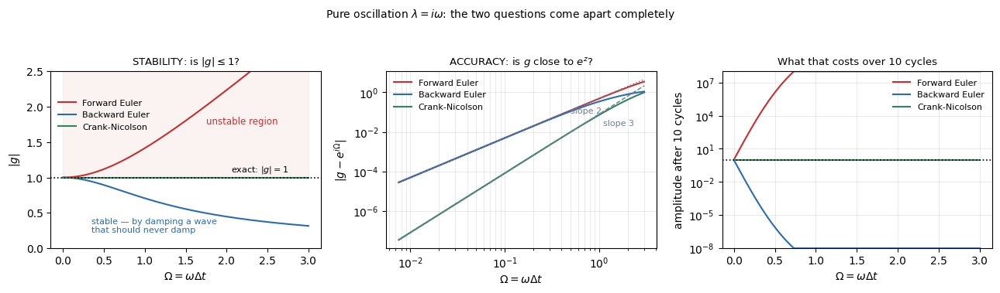

| $\Omega$ | forward Euler | backward Euler | Crank–Nicolson |
|---|---|---|---|
| 0.10 | 1.004988 grows | 0.995037 decays | **1.000000 exact** |
| 0.50 | 1.118034 grows | 0.894427 decays | **1.000000 exact** |
| 1.00 | 1.414214 grows | 0.707107 decays | **1.000000 exact** |
| 2.00 | 2.236068 grows | 0.447214 decays | **1.000000 exact** |

- **Forward Euler**: $|g| = \sqrt{1+\Omega^2} > 1$ at *every* step size. Unstable always — there is no step small enough, so no CFL condition exists to satisfy.
- **Backward Euler**: $|g| = 1/\sqrt{1+\Omega^2} < 1$ at every step size. Stable always, **and it achieves that by eating the oscillation it was asked to compute.**
- **Crank–Nicolson**: $|g| = 1$ identically. Amplitude exactly right at any step; all of its error is in the **phase**, at second order.

And the cost of backward Euler's stability, which never announces itself:

| $\Omega$ | steps per cycle | $\vert g\vert$ | amplitude left after 10 cycles |
|---|---|---|---|
| 0.05 | 125.7 | 0.998752 | **0.208** |
| 0.10 | 62.8 | 0.995037 | 0.044 |
| 0.25 | 25.1 | 0.970143 | 0.0005 |
| 0.50 | 12.6 | 0.894427 | $10^{-6}$ |

**At 126 steps per cycle — a step most people would call generous — backward Euler has lost 79% of the signal in ten cycles.** Every row is stable. §4.3 is this table happening inside a real wave equation.

## 1.5 A third property: what a scheme does to modes it cannot resolve

There is one more thing $g$ decides, and it is neither stability nor order. Consider a mode so fast that $|z|$ is enormous — the sawtooth of §1.1 on a fine mesh, whose lifetime is far below any step you would take. Physically it is gone within one step. What does each scheme do with it?

$$\text{as } z \to -\infty: \qquad g_{\text{BE}} = \frac{1}{1-z} \to 0, \qquad g_{\text{CN}} = \frac{1+z/2}{1-z/2} \to -1$$

At $z = -1000$:

| | $g(-1000)$ | after 50 steps |
|---|---|---|
| backward Euler | $+0.000999$ | $9.5\times10^{-151}$ |
| **Crank–Nicolson** | $\mathbf{-0.996008}$ | $\mathbf{+0.819}$ |

**Crank–Nicolson keeps 82% of a mode that should have vanished**, flipping its sign every step. Both schemes satisfy $|g| \le 1$. Only one gives the right answer.

### A-stable against L-stable

The two properties are both statements about $|g|$, and they differ in **where they look**.

| | definition | what it guarantees |
|---|---|---|
| **A-stable** | $\vert g(z)\vert \le 1$ **everywhere in the left half-plane** | every decaying mode stays **bounded**, at any step size |
| **L-stable** | A-stable, **and** $g(z) \to 0$ as $z \to -\infty$ | the unresolvable modes are **annihilated**, not merely bounded |

**A-stability bounds; L-stability annihilates.** Applied to the three schemes of this document:

| scheme | $g(z)$ | in the left half-plane | as $z\to-\infty$ | verdict |
|---|---|---|---|---|
| forward Euler | $1+z$ | $\vert g\vert > 1$ outside a disc | $\to\infty$ | neither |
| backward Euler | $\dfrac{1}{1-z}$ | $\vert g\vert\le1$ ✓ | $\to 0$ ✓ | **A-stable and L-stable** |
| Crank–Nicolson | $\dfrac{1+z/2}{1-z/2}$ | $\vert g\vert\le1$ ✓ | $\to -1$ ✗ | **A-stable, not L-stable** |

### Both are properties only implicit schemes can have

An explicit scheme's $g(z)$ is a **polynomial** — $1+z$ for forward Euler, a four-term truncation for RK4. Any non-constant polynomial grows without bound as $|z|\to\infty$, so $|g|\le1$ cannot hold on an unbounded region.

> **Every explicit scheme has a bounded stability region. No explicit scheme is A-stable, and none is L-stable.**

Implicit schemes give $g$ a **denominator**, and that is precisely what allows $|g|\le1$ out to infinity and $g \to 0$ there. This is the structural reason behind "explicit means conditionally stable" — with the caveat of §3.1, that an explicit scheme can also be stable under *no* condition, if its bounded region fails to cover the spectrum's direction at all.

**The converse fails.** Being implicit does not make a scheme A-stable: the $\theta$-method at $\theta = 0.25$ requires a solve and still has a finite limit, $r \le 1$ (§0.7), and BDF3 through BDF6 are implicit and not A-stable by the Dahlquist barrier of §0.6. So

$$\text{A-stable} \implies \text{implicit}, \qquad\text{but}\qquad \text{implicit} \nRightarrow \text{A-stable}$$

### L-stability is a virtue here and a defect in §4

This is the part most easily taken as a universal good. On the **negative real axis** — diffusion — the unresolved modes are grid artifacts, and killing them is exactly right; §2.5 shows what happens to a scheme that does not. On the **imaginary axis** — waves — the exact solution has $|g| = 1$ forever, so a scheme driving $g \to 0$ is destroying the answer. **Backward Euler's L-stability is precisely why §4.3 finds it retaining 0.04% of a wave's energy after a hundred periods.**

**So L-stability is desirable when the fast modes are artifacts and harmful when they are the physics** — which is §0.0's diffusion-against-waves split, seen from the scheme's side rather than the equation's.

## 1.6 Stiffness — the answer to "is implicit worth it?"

Now all the pieces are present. From §1.3, forward Euler's step is set by the **fastest** mode. From §1.1, on a fine mesh that mode is a grid artifact with a microscopic lifetime. From §1.4, implicitness buys no accuracy. Putting those together:

> A problem is **stiff** when the step size that stability forces on an explicit scheme is far smaller than the step size the answer actually needs.

The $2\times2$ system of §1.3 again, now read for cost:

| | |
|---|---|
| slow timescale — the one of interest | $1$ s |
| fast timescale | $0.001$ s, **dead after about 5 ms** |
| forward Euler limit | $0.002$ s |
| steps to reach $t=5$, explicit | **2,500** |
| steps to reach $t=5$, backward Euler at $\Delta t=0.05$ | **100** |

**A mode that is stable, decaying, and physically irrelevant after five milliseconds dictates the step size for five full seconds.** Paying for 2,500 solves would be absurd; paying for 100 is not. That is when implicit wins, and it is the only time it does.

### What "willing to get wrong" means, in numbers

Backward Euler at $\Delta t = 0.05$ on the stiff pair, tracking each mode separately:

| after | fast mode, true | BE computes | relative error | slow mode, true | BE computes | relative error |
|---|---|---|---|---|---|---|
| 1 step | $1.9\times10^{-22}$ | $2.0\times10^{-2}$ | $10^{20}$ | 0.951229 | 0.952381 | **0.12%** |
| 5 steps | $2.7\times10^{-109}$ | $2.9\times10^{-9}$ | $10^{100}$ | 0.778801 | 0.783526 | **0.61%** |
| 100 steps | $0$ | $1.8\times10^{-171}$ | — | 0.006738 | 0.007604 | **12.9%** |

**The fast mode is computed wrongly by twenty orders of magnitude, and it does not matter.** In absolute terms both the true value and the computed one are negligible beside the slow mode, so the error never reaches the answer. Meanwhile the mode you actually care about is tracked to better than 1% over the interval where it is large.

**But there is a condition attached, and it is exactly why §1.5 matters: the wrong answer has to be *small*.** Crank–Nicolson computes that same fast mode as $-0.9231$ after one step and $-0.6702$ after five — wrong *and* large. That error does reach the answer, and §2.3 is what it looks like when it does.

**Three consequences worth stating plainly.**

**Stiffness is not a property of the equations alone.** It depends on the equations, the grid, *and the question*. §1.1's refinement table creates it out of nothing — same physics, finer mesh, 250× more stiffness. And deciding you *do* want to see the fast mode removes it, because nothing is being wasted any more.

**Implicit pays off only when there is a fast mode you are willing to get wrong.** §1.4 established that the implicit answer for that mode is inaccurate; §1.6 says that is acceptable because the mode does not matter. If every mode in the problem matters to the answer, implicitness buys nothing but a larger matrix. §3.4 and §4.3 are what happens when that condition fails.

**"Unconditionally stable" is a promise about divergence, not about the answer.** §1.4's last table is the proof.

### The three conditions, together

The pieces are scattered across §0 and §1, and they only mean something jointly. **An implicit method is worth its cost when all three of these hold — and each can fail independently.**

| | condition | fails when | measured in |
|---|---|---|---|
| **1** | **the fast mode is not the physics of interest** | the fast mode *is* the answer — waves, advection | §3.4, §4.3 |
| **2** | **the scheme gets it wrong by sending it toward zero**, not by keeping it | the scheme is A-stable but not L-stable (§1.5) | §2.5 |
| **3** | **the gap is large enough to pay for the solve**, $\rho < \Delta t_{\text{acc}}/\Delta t_{\text{stab}}$ | the gap is near 1, so the step was available for free | §0.9, §2.4, §3.4 |

**Condition 1 is about the problem, condition 2 about the scheme, condition 3 about the cost.** They are independent, and all three must hold:

- **§2 satisfies all three** — grid-artifact fast modes, backward Euler to damp them, and a gap of 40 growing as $n_x^2$. Implicit wins.
- **§3 and §4 fail on condition 1**, and that is fatal regardless of the rest. The fast mode *is* the wave, so no choice of scheme and no cost argument rescues them — §4.3 measures an unconditionally stable method retaining 0.04% of the energy it was asked to propagate.
- **§2 with Crank–Nicolson fails on condition 2** while satisfying 1 and 3. The result is stable, second order, convergent, and 56% negative where the exact solution is strictly positive.
- **§2 at $n_x = 50$ fails on condition 3** while satisfying 1 and 2. Nothing is wrong with the answer; you have simply paid for a step you were entitled to for free.

**Condition 2 is the one most easily dropped from the summary**, so it is worth isolating. Being wrong about an unresolved mode is not sufficient — you must be wrong about it *in the direction of zero*:

| at $z \approx -147$ | the true value | the scheme returns | |
|---|---|---|---|
| backward Euler | $\approx 0$ | $+0.007$ | wrong by sixty orders, **harmless** |
| Crank–Nicolson | $\approx 0$ | $-0.97$ | wrong by sixty orders, **and it rings** |

**So the compact statement, which is what this whole chapter argues toward:**

> **An implicit method is worth its cost exactly when there is a fast mode you are willing to get wrong — and a scheme that gets it wrong by sending it to zero.**

### The principle, beyond one equation: named waves are branches of the spectrum

The four model equations each have one kind of mode. A real multiphysics system has several at once, and they are usually referred to by name rather than by eigenvalue — Alfvén waves, magnetosonic waves, whistlers, acoustic modes. **Naming a wave is naming a branch of the spectrum**, and everything above applies branch by branch.

A magnetized plasma is the standard example, and it shows every combination this document treats:

| branch | dispersion | direction of $\lambda$ | scaling of $\vert\lambda\vert_{\max}$ | resembles |
|---|---|---|---|---|
| **Alfvén** | $\omega = k v_A$ | **imaginary** | $v_A/\Delta x$ | §3, §4 |
| **magnetosonic / acoustic** | $\omega = k c_s$ | **imaginary** | $c_s/\Delta x$ | §3, §4 |
| **whistler** (Hall term) | $\omega \propto k^{2}$ | **imaginary** | $\mathbf{1/\Delta x^{2}}$ | **neither** |
| resistive diffusion | — | real negative | $\eta/\Delta x^{2}$ | §2 |

**The whistler branch is the awkward one, and the table says why**: imaginary like a wave, but scaling as $1/\Delta x^2$ like diffusion. That combination does not occur among the four equations here, and it is the worst of both — it refines like diffusion and resists damping like a wave.

**What each branch costs depends on the scheme, and for different reasons.**

| | why a fast branch matters |
|---|---|
| **explicit** | it sets $\Delta t_{\text{stab}}$. A whistler branch forces $\Delta t \propto \Delta x^{2}$, so doubling the mesh quadruples the step count — a **cost** problem |
| **implicit** | it decides whether a large step is **admissible**. An L-stable scheme annihilates whatever it cannot resolve (§1.5), so if that branch carries physics you need, the large step has destroyed it — a **correctness** problem |

**So the principle is exactly as you put it: fast waves may be got wrong, provided they are not the physics of interest.** And the corollary matters more than the principle:

> **The same branch can be junk in one problem and the entire answer in another.** The classification is a property of the question, not of the equation.

Alfvén waves in a simulation *of* Alfvénic dynamics are the answer — §3's verdict applies, $\Delta t_{\text{acc}} \approx \Delta t_{\text{stab}}$, and implicit buys nothing. The same Alfvén waves in a strongly magnetized or low-density region, where $v_A$ is enormous while the dynamics of interest is slow, are precisely §1.6's fast mode you are willing to get wrong — and treating them implicitly is worth paying for.

**Which is why real codes rarely choose one treatment for the whole operator.** Different branches get different handling in the same step: implicit on the branch that is stiff and uninteresting, explicit on the branch that is the physics. That is the IMEX idea of §5, arriving here as a necessity rather than an optimization.

**[unverified]** — the dispersion relations and scalings in the table above are stated from general familiarity with plasma models and have not been checked against a source or a run; the `fusion` repository's `notes/theory/pde_character.md` treats the whistler case and should be reconciled with this.

## 1.7 In practice, nobody computes eigenvalues

$\mathbf{L}$ is large and sparse, and its spectrum is never formed. Four things are done instead, and all four are the analysis above in disguise.

| approach | what it gives |
|---|---|
| **Known spectra** | for standard operators the answer is analytic: diffusion $[-4\alpha/\Delta x^2,\,0]$, central advection $\pm ic/\Delta x$. §1.1's table is this |
| **Von Neumann analysis** | substitute a Fourier mode $e^{ikx}$ and read $g$ off directly. It works *because* Fourier modes are the eigenvectors when the coefficients are constant and the grid uniform — the same information, without a matrix. This is the standard tool, and §2.1 and §3 use it |
| **CFL and Fourier-number rules** | $\Delta t \le \Delta x^2/2\alpha$ and $c\Delta t/\Delta x \le 1$ **are** the eigenvalue bound rewritten, as §1.3 derived |
| **Gershgorin discs** | a bound with no computation at all: every $\lambda$ lies within the largest absolute row sum of $\mathbf{L}$. Crude, but free and always valid |

For nonlinear or variable-coefficient problems, where none of these apply cleanly, the practical answers are a few **power iterations** on the Jacobian to estimate $|\lambda_{\max}|$, or **adaptive stepping** that finds the limit empirically by rejecting steps that fail an error test.

## 1.8 Choosing the step — and why implicit is harder

The two schemes differ not only in cost but in **who decides the step size.** Stated precisely, using $\Delta t_m = R(\arg\lambda_m)/|\lambda_m|$ from §1.1 — the personal ceiling of mode $m$:

$$\textbf{explicit:}\quad \Delta t \;=\; S\cdot\min\Big(\underbrace{\min_{m}\ \Delta t_m}_{\textstyle \Delta t_{\text{stab}}},\ \ \Delta t_{\text{acc}}\Big)$$

$$\textbf{implicit, A-stable:}\quad \Delta t \;=\; \Delta t_{\text{acc}} \qquad\text{since } \Delta t_m = \infty \ \text{ for every } m$$

with $S \approx 0.8$–$0.9$ a safety factor. **The two differ by one term, not two.** Implicit does not get an easier accuracy constraint — §2.6 measures forward and backward Euler wanting the *identical* step — it simply has nothing underneath it.

### Which modes each scheme has to respect

**Explicit must satisfy every mode; implicit only has to dispose of the ones it cannot resolve.**

| | requirement | over which modes |
|---|---|---|
| **explicit** | $\vert g(\lambda_m\Delta t)\vert \le 1$ | **all $M$ of them.** They share one $\Delta t$, so the single worst mode dictates it for all the rest — that is the $\min_m$ above |
| **implicit** | $\vert g(\lambda_m\Delta t)\vert \le 1$ | **automatic for all $M$** — that is what A-stability means |
| **implicit** | $\vert g \vert$ *small*, not merely $\le 1$ | only for the unresolved fast modes, and this is a **choice of scheme** (L-stability, §1.5) rather than a restriction on $\Delta t$ |

**That last row is the real asymmetry.** For explicit, the fast modes impose a *number* — a step you must stay under. For implicit they impose a *property* — pick a scheme that annihilates rather than preserves them. Backward Euler has it, Crank–Nicolson does not, and §2.5 measures what the difference costs.

**So "implicit ignores the fast modes" is not quite right.** It cannot obey them and does not try; but it must still damp them, and choosing a scheme that fails to is how Crank–Nicolson produces a stable, converged, oscillating, wrong answer.

**Explicit: the equations decide.** §1.3 gives a formula. Compute $|\lambda_{\max}|$ — usually from the known spectrum or the CFL rule of §1.7 — take $\Delta t$ a little under the limit, typically 80–90% for safety margin, and you are done. There is nothing to tune and no judgement involved. If the step is legal it is very likely also accurate, because it is small.

**Implicit: nothing decides, so you must.** Removing the ceiling removes the only thing that was telling you what $\Delta t$ to use. A step ten times too large runs perfectly happily and returns a wrong answer with no warning at all — §1.4's last table is that failure in miniature. Four practical answers, in increasing order of sophistication:

| approach | what you do |
|---|---|
| **Resolve the timescale you care about** | identify the fastest process you actually want to see, and take 20–50 steps per its period or decay time. Crude, but it is an honest statement of intent and it is what §4.3 does with $\Delta t/T$ |
| **Step doubling** | take one step of $\Delta t$ and two of $\Delta t/2$; the difference estimates the local error. If it exceeds tolerance, halve and retry |
| **Embedded error estimate** | run two schemes of different order on the same step — BDF1 against BDF2, or an embedded Runge–Kutta pair — and take their difference as the error estimate. One step, both answers, almost no extra cost |
| **Newton as a governor** | for nonlinear problems, let the nonlinear solver vote: converged in two iterations, grow the step; failed to converge, cut it and retry. Cheap, and it tracks the difficulty of the problem rather than a fixed rule |

The last two combine into the **adaptive step controller** that every production implicit code uses:

$$\Delta t_{\text{new}} = \Delta t \left(\frac{\text{tol}}{\text{err}}\right)^{1/(p+1)}$$

with $p$ the order of the scheme. This is what CVODE, IDA and DASSL do, and it is the real answer to "how do I choose the implicit step": **you do not — you state a tolerance and let the controller find the step that meets it.** The exponent is $1/(p+1)$ because the local error per step scales as $\Delta t^{p+1}$.

**One limit on how large is worth taking.** The implicit matrix $(\mathbf{I} - \Delta t\,\mathbf{L})$ tends to the identity as $\Delta t \to 0$ and to $-\Delta t\mathbf{L}$ as $\Delta t$ grows, so **its condition number degrades as the step grows**. Very large implicit steps are expensive in the linear solver, not only inaccurate. §7 returns to this.


# 2. Parabolic — diffusion

`code/time_diffusion.py`. The first of the four, and the one where **implicit wins decisively**. Everything below follows the five questions of §0.0, in that order.

## 2.0 The problem, discretized step by step

$$u_t = \alpha\,u_{xx} \quad\text{on } [0,1], \qquad u(0,t) = u(1,t) = 0$$

Heat spreading through a bar held at zero temperature at both ends. $u(x,t)$ is the temperature and $\alpha > 0$ is the **diffusivity** — units of length$^2$/time, set to $1$ throughout this section, so that a disturbance of width $\ell$ smooths out over a time of order $\ell^2/\alpha$. That $\ell^2$ is worth noticing now: it is the same square that will make the explicit step scale as $\Delta x^2$ rather than $\Delta x$.

Two derivatives appear, and each is replaced separately.

### The grid

$$x_j = j\,\Delta x, \quad j = 0,1,\dots,n_x, \qquad \Delta x = \frac{1}{n_x}, \qquad t_n = n\,\Delta t$$

so there are $n_x+1$ nodes, of which $x_0$ and $x_{n_x}$ are fixed by the boundary conditions, leaving $M = n_x - 1$ unknowns — the mode count of §1.1. Write $u_j^{\,n} \approx u(x_j, t_n)$.

### The space derivative: $u_{xx}$

Taylor expansion about $x_j$, both ways:

$$u_{j+1} = u_j + \Delta x\,u_x + \frac{\Delta x^2}{2}u_{xx} + \frac{\Delta x^3}{6}u_{xxx} + O(\Delta x^4)$$

$$u_{j-1} = u_j - \Delta x\,u_x + \frac{\Delta x^2}{2}u_{xx} - \frac{\Delta x^3}{6}u_{xxx} + O(\Delta x^4)$$

**Adding them cancels every odd derivative** — the first and third — leaving

$$u_{j+1} + u_{j-1} = 2u_j + \Delta x^{2}u_{xx} + O(\Delta x^{4})$$

and therefore

$$\boxed{\;u_{xx}\Big|_{x_j} \;=\; \frac{u_{j+1} - 2u_j + u_{j-1}}{\Delta x^{2}} \;+\; O(\Delta x^{2})\;}$$

the **central second difference**. The cancellation of odd terms is what makes it second order; it requires a symmetric stencil and uniform spacing, and `DISCRETIZATION.md` §2.1 derives the same result there.

### After the space derivative only: the semi-discrete system

Substituting, and leaving time continuous — the method of lines of §0.1 — gives one ODE per interior node.

**"Semi-discrete" means discrete in space, continuous in time.** It is the intermediate object, and naming the three stages makes clear why it is worth having:

| stage | $x$ | $t$ | what you are holding |
|---|---|---|---|
| the PDE | continuous | continuous | $u_t = \alpha u_{xx}$ |
| **semi-discrete** | **discrete** | **continuous** | $\mathrm{d}\mathbf{u}/\mathrm{d}t = \mathbf{L}\mathbf{u}$ — a system of $M$ coupled ODEs |
| fully discrete | discrete | discrete | the $\theta$-method update, one algebraic step |

**That middle stage is what makes a clean measurement possible.** It has an exact solution of its own, so subtracting it removes the spatial error entirely and leaves only what the time stepper did — which is the whole argument of the "two exact solutions" subsection below.

One ODE per interior node:

$$\frac{\mathrm{d}u_j}{\mathrm{d}t} = \frac{\alpha}{\Delta x^{2}}\left(u_{j-1} - 2u_j + u_{j+1}\right), \qquad j = 1,\dots,n_x-1$$

with $u_0 = u_{n_x} = 0$, so at $j=1$ and $j=n_x-1$ one term simply drops. In matrix form this is $\mathrm{d}\mathbf{u}/\mathrm{d}t = \mathbf{L}\mathbf{u}$ with

$$\mathbf{L} = \frac{\alpha}{\Delta x^{2}}\begin{pmatrix} -2 & 1 & & \\ 1 & -2 & 1 & \\ & \ddots & \ddots & \ddots \\ & & 1 & -2 \end{pmatrix}$$

**This matrix is $\mathbf{L}$, and its eigenvalues are the subject of Q1.** Note it is symmetric — which by §1.1's rule already guarantees the spectrum is real, before any of it is computed.

### The time derivative: $u_t$

$$u_t\Big|_{t_n} \approx \frac{u^{\,n+1} - u^{\,n}}{\Delta t}$$

and then the one decision of §0.2: at which time is the right-hand side evaluated? The $\theta$-method of §0.4 takes a weighted average, giving the **fully discrete scheme** at node $j$:

$$\frac{u_j^{\,n+1} - u_j^{\,n}}{\Delta t} = \frac{\alpha}{\Delta x^{2}}\Big[(1-\theta)\big(u_{j-1}^{\,n} - 2u_j^{\,n} + u_{j+1}^{\,n}\big) + \theta\big(u_{j-1}^{\,n+1} - 2u_j^{\,n+1} + u_{j+1}^{\,n+1}\big)\Big]$$

Multiplying through by $\Delta t$ and collecting the unknowns on the left, with

$$r = \frac{\alpha\,\Delta t}{\Delta x^{2}}$$

$$-\theta r\,u_{j-1}^{\,n+1} + (1+2\theta r)\,u_j^{\,n+1} - \theta r\,u_{j+1}^{\,n+1} \;=\; u_j^{\,n} + (1-\theta)\,r\left(u_{j-1}^{\,n} - 2u_j^{\,n} + u_{j+1}^{\,n}\right)$$

### The three schemes, written out

| $\theta$ | the update at node $j$ | what it requires |
|---|---|---|
| **0** — forward Euler | $u_j^{\,n+1} = u_j^{\,n} + r\left(u_{j-1}^{\,n} - 2u_j^{\,n} + u_{j+1}^{\,n}\right)$ | nothing: read three old values, write one new one |
| **1** — backward Euler | $-r\,u_{j-1}^{\,n+1} + (1+2r)\,u_j^{\,n+1} - r\,u_{j+1}^{\,n+1} = u_j^{\,n}$ | a **tridiagonal solve**, all nodes at once |
| **$\frac{1}{2}$** — Crank–Nicolson | $-\frac{r}{2}u_{j-1}^{\,n+1} + (1{+}r)u_j^{\,n+1} - \frac{r}{2}u_{j+1}^{\,n+1} = u_j^{\,n} + \frac{r}{2}\left(u_{j-1}^{\,n} - 2u_j^{\,n} + u_{j+1}^{\,n}\right)$ | the same tridiagonal solve, plus a cheap right-hand side |

**The cost difference of §0.3 is visible here.** Forward Euler's line is an assignment; the other two are systems. And Crank–Nicolson's extra right-hand-side work is negligible beside the solve both implicit schemes share — which is §0.4's point that $\theta > 0$ all costs the same.

In matrix form the three collapse to one line, which is what the code implements:

$$(\mathbf{I} - \theta r\mathbf{L}_0)\,\mathbf{u}^{n+1} = (\mathbf{I} + (1-\theta)r\mathbf{L}_0)\,\mathbf{u}^n$$

where $\mathbf{L}_0$ is $\mathbf{L}$ with the physical factor stripped out:

$$\mathbf{L} = \frac{\alpha}{\Delta x^{2}}\,\mathbf{L}_0, \qquad \mathbf{L}_0 = \begin{pmatrix} -2 & 1 & & \\ 1 & -2 & 1 & \\ & \ddots & \ddots & \ddots \\ & & 1 & -2 \end{pmatrix}$$

$\mathbf{L}_0$ is pure integers; $\alpha$ and $\Delta x$ live outside it. The two forms agree because

$$r\,\mathbf{L}_0 = \frac{\alpha\Delta t}{\Delta x^{2}}\,\mathbf{L}_0 = \Delta t\cdot\frac{\alpha}{\Delta x^{2}}\mathbf{L}_0 = \Delta t\,\mathbf{L}$$

so $r\mathbf{L}_0$ is exactly what §0.4 wrote as $\Delta t\,\mathbf{L}$. Splitting it this way is deliberate: it puts every physical quantity into the single number $r$, which is the Fourier number of §1.1 and the only thing stability depends on — so the experiments below can sweep $r$ directly instead of juggling $\alpha$, $\Delta x$ and $\Delta t$ separately.

### Two exact solutions, and which one to measure against

Two exact solutions exist for this problem. They solve **different equations**, and picking the wrong one silently corrupts an order study.

#### The PDE solution

Try $u(x,t) = \sin(\pi x)\,f(t)$, which satisfies both boundary conditions for any $f$. Substituting into $u_t = \alpha u_{xx}$:

$$\sin(\pi x)\,f'(t) = \alpha\left(-\pi^{2}\right)\sin(\pi x)\,f(t) \qquad\Longrightarrow\qquad f' = -\alpha\pi^{2} f$$

The spatial factor cancels, leaving a scalar ODE — **this is the Dahlquist equation of §1.2, with $\lambda = -\alpha\pi^2$** — so $f(t) = e^{-\alpha\pi^2 t}$ and

$$\boxed{\;u(x,t) = \sin(\pi x)\,e^{-\alpha\pi^{2} t}\;}$$

#### The semi-discrete solution

Now the same question for $\mathrm{d}\mathbf{u}/\mathrm{d}t = \mathbf{L}\mathbf{u}$. Take the **sampled** version of the same shape, $v_j = \sin(\pi x_j) = \sin(j\pi\Delta x)$, and apply $\mathbf{L}$:

$$(\mathbf{L}v)_j = \frac{\alpha}{\Delta x^{2}}\Big[\sin\big((j-1)\pi\Delta x\big) - 2\sin\big(j\pi\Delta x\big) + \sin\big((j+1)\pi\Delta x\big)\Big]$$

The two outer terms combine by $\sin(A-B) + \sin(A+B) = 2\sin A\cos B$, with $A = j\pi\Delta x$ and $B = \pi\Delta x$:

$$= \frac{\alpha}{\Delta x^{2}}\Big[2\sin(j\pi\Delta x)\cos(\pi\Delta x) - 2\sin(j\pi\Delta x)\Big] = \frac{2\alpha}{\Delta x^{2}}\sin(j\pi\Delta x)\big[\cos(\pi\Delta x) - 1\big]$$

and $\cos\beta - 1 = -2\sin^{2}(\beta/2)$ gives

$$(\mathbf{L}v)_j = \underbrace{-\frac{4\alpha}{\Delta x^{2}}\sin^{2}\frac{\pi\Delta x}{2}}_{\textstyle \lambda_h}\;\cdot\;\sin(j\pi\Delta x) = \lambda_h\,v_j$$

**So $v$ is an exact eigenvector of $\mathbf{L}$**, with eigenvalue $\lambda_h$ — and the boundary values work out exactly too, since $v_0 = \sin 0 = 0$ and $v_{n_x} = \sin\pi = 0$. The system therefore reduces to one scalar ODE again, now with $\lambda = \lambda_h$:

$$\boxed{\;u_j(t) = \sin(\pi x_j)\,e^{\lambda_h t}, \qquad \lambda_h = -\frac{4\alpha}{\Delta x^{2}}\sin^{2}\frac{\pi\Delta x}{2}\;}$$

This is the $m = 1$ entry of Q1's spectrum, which is no coincidence: the two derivations are the same calculation.

#### The gap between them is the spatial error

$\lambda_h$ and $-\alpha\pi^2$ are not equal. Expanding $\sin^2(\pi\Delta x/2)$ for small $\Delta x$:

$$\lambda_h = -\alpha\pi^{2}\left(1 - \frac{(\pi\Delta x)^{2}}{12} + O(\Delta x^{4})\right)$$

so the discrete problem decays slightly **too slowly**, by a relative amount $O(\Delta x^2)$ — which is precisely the second-order spatial accuracy of the stencil. Measured:

| $n_x$ | $\lambda_h$ | $-\alpha\pi^2$ | ratio | $1 - (\pi\Delta x)^2/12$ |
|---|---|---|---|---|
| 10 | $-9.788697$ | $-9.869604$ | 0.991802 | 0.991775 |
| 20 | $-9.849328$ | $-9.869604$ | 0.997946 | 0.997944 |
| 50 | $-9.866358$ | $-9.869604$ | 0.999671 | 0.999671 |
| 200 | $-9.869401$ | $-9.869604$ | 0.999979 | 0.999979 |

The prediction and the measurement agree to six digits.

#### Which to use, and why it matters

**Everything in §2 is measured against the semi-discrete solution**, so that every reported error is purely a time-integration error.

Measuring against the PDE solution instead would add the $O(\Delta x^2)$ gap above to every number. On a fixed mesh that gap is a **constant floor**: shrink $\Delta t$ and the error stops falling once it reaches the floor, and an order study run into that floor reports an order of zero. §2.3's first attempt did exactly that, which is how the trap was found.

## 2.1 Q1 — Where are the modes?

Specializing §1.1's table to this operator, with $\phi$ the phase per cell:

$$\lambda_m = -\frac{4\alpha}{\Delta x^{2}}\sin^{2}\frac{\phi_m}{2}, \qquad \phi_m = \frac{m\pi}{n_x}, \qquad m = 1,\dots,n_x-1$$

**All real, all negative, and contained in $[-4\alpha/\Delta x^2,\ 0]$ — with both ends open.**

### Which mode sits where

$\phi_m/2 = m\pi\Delta x/2$ runs from just above $0$ to just below $\pi/2$, so $\sin^2(\phi_m/2)$ runs from just above $0$ to just below $1$. The two extreme modes are therefore

$$\lambda_1 = -\frac{4\alpha}{\Delta x^{2}}\sin^{2}\frac{\pi}{2n_x} \quad (\text{right end, nearest } 0), \qquad \lambda_{n_x-1} = -\frac{4\alpha}{\Delta x^{2}}\cos^{2}\frac{\pi}{2n_x} \quad (\text{left end, most negative})$$

the same angle appearing as $\sin^2$ at one end and $\cos^2$ at the other, since $\sin^{2}(\pi/2 - \epsilon) = \cos^{2}\epsilon$.

| | mode | shape | position |
|---|---|---|---|
| $m = 1$ | slowest | one smooth half-sine | **right** end, just left of $0$ |
| $m = n_x - 1$ | fastest | the sawtooth | **left** end, just right of $-4\alpha/\Delta x^2$ |

**Neither endpoint is attained.** $\lambda = 0$ would be a mode that never decays, and $\lambda = -4\alpha/\Delta x^2$ would need $\phi = \pi$ exactly — a perfect sign flip at every node, which the Dirichlet conditions forbid (§1.1's vertex count). Measured:

| $n_x$ | $-4\alpha/\Delta x^2$ | $\lambda_1$ | $\lambda_{n_x-1}$ | fraction of the interval reached |
|---|---|---|---|---|
| 12 | $-576.0$ | $-9.8134$ | $-566.19$ | 0.98296 |
| 24 | $-2304.0$ | $-9.8555$ | $-2294.14$ | 0.99572 |
| 192 | $-147456.0$ | $-9.8694$ | $-147446.13$ | 0.99993 |

**This is where the $2294$ against $2304$ of §1.1 comes from** — it is $\cos^2(\pi/48) = 0.99572$ exactly, not roundoff and not an approximation.

**And the two ends behave oppositely under refinement**, which is the point of the whole question: $\lambda_1 \to -\alpha\pi^2 = -9.8696$ and stops, while $\lambda_{n_x-1} \to -4\alpha/\Delta x^2$ and runs away.

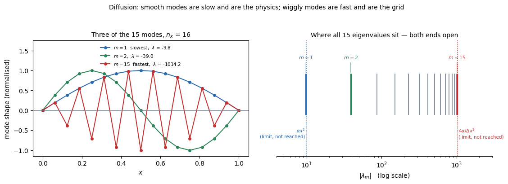

At $n_x = 16$ there are $M = 15$ modes. The left panel shows three of them; the right shows where all fifteen eigenvalues fall.

| $m$ | $\phi_m$ | $\lambda_m$ | lifetime $1/\vert\lambda_m\vert$ | shape |
|---|---|---|---|---|
| **1** | 0.196 | $-9.84$ | $1.0\times10^{-1}$ | one smooth half-sine — the **slowest** |
| 2 | 0.393 | $-38.97$ | $2.6\times10^{-2}$ | two half-sines |
| 3 | 0.589 | $-86.29$ | $1.2\times10^{-2}$ | three half-sines |
| 14 | 2.749 | $-985.03$ | $1.0\times10^{-3}$ | fourteen half-sines |
| **15** | 2.945 | $-1014.16$ | $9.9\times10^{-4}$ | **sawtooth** — the fastest |

**Three things the picture makes obvious.**

**Going from $m=1$ to $m=2$ costs a factor of 4 in speed** — $-9.84$ to $-38.97$ — because $\lambda \propto \sin^2(\phi/2) \approx \phi^2/4$ for small $\phi$, so the slow end is quadratic in the mode number. The right panel shows that as even spacing on the log axis at the left.

**The fast end is crowded.** Modes 14 and 15 differ by 3%, and the last several eigenvalues pile up against $-4\alpha/\Delta x^2$ — visible as the bunching on the right. Refining the mesh adds modes *there*, not in the physics.

**The two dotted lines are the open ends.** $\alpha\pi^2$ on the left and $4\alpha/\Delta x^2$ on the right, both approached and neither attained. The whole spectrum lives strictly between them, spanning a factor of $103$ here — and that factor is the stiffness, which grows as $n_x^2$.

**There are $M = n_x - 1$ of them, one per unknown, and all are simple.** Two reasons, and the second is the general one:

- $\sin^2$ is **strictly increasing** on $(0,\pi/2)$, which is exactly the range $\phi_m/2 = m\pi\Delta x/2$ covers as $m$ runs from $1$ to $n_x-1$. So the $\lambda_m$ are strictly ordered and no two can coincide.
- More generally, a **symmetric tridiagonal matrix with non-zero off-diagonals always has distinct real eigenvalues** — and $\mathbf{L}$ is one. No multiplicity is possible here at all.

Multiplicity appears as soon as the problem leaves one dimension: on a square, the 2D Laplacian has $\lambda_{m_1,m_2} = \lambda_{m_1} + \lambda_{m_2}$, so $(1,2)$ and $(2,1)$ share an eigenvalue exactly. That is the case §1.1 warned about, and it is a symmetry of the domain rather than anything about the discretization.

Three facts follow from the spectrum, and they determine the whole section:

| | |
|---|---|
| **the direction** | real negative, because the second derivative is self-adjoint (§1.1). Every mode **decays**; none oscillates. So $g$ is real, there is no phase to get wrong, and the only question about any scheme here is what it does to *amplitudes* |
| **the slow end** | $\lambda_1 \to -\alpha\pi^2 = -9.87$ as the mesh refines — the domain's fundamental, and the physics you are computing. **It does not move with $\Delta x$** |
| **the fast end** | $\lambda_{\max} \to -4\alpha/\Delta x^2$, the sawtooth. **A property of the grid, and it grows as $1/\Delta x^2$** |

**That last pair is the entire reason this section ends where it does.** Refining the mesh improves the answer a little and worsens the arithmetic a lot:

| $n_x$ | $\vert\lambda_{\min}\vert$ | $\vert\lambda_{\max}\vert$ | ratio |
|---|---|---|---|
| 12 | 9.81 | 566 | 58 |
| 48 | 9.87 | 9,206 | 933 |
| 192 | 9.87 | 147,446 | **14,940** |

### What that ratio costs — worked at $n_x = 192$

The lifetime of a mode is $1/|\lambda_m|$, the time over which its amplitude falls by a factor $e$. From the table above:

$$\tau_{\text{fast}} = \frac{1}{147446} = 6.8\times10^{-6}, \qquad \tau_{\text{slow}} = \frac{1}{9.8694} = 0.101$$

**The fast mode is gone almost immediately.** It is down to a millionth of its initial size at

$$t = \frac{\ln 10^{6}}{147446} = 9.4\times10^{-5}$$

and at that instant the slow mode — the one carrying the answer — has decayed to $0.999076$. **It has lost 0.09% of its amplitude.** So on any timescale over which the solution visibly evolves, the fast mode is not a small contribution; it is *nothing*.

**And yet it sets the step for the entire run.** Forward Euler needs $\Delta t \le 2/|\lambda_{\text{fast}}| = 1.36\times10^{-5}$, and that constraint does not relax once the mode dies — it is a property of the operator, not of the current solution. Integrating for one slow lifetime, $T = 0.101$:

| | |
|---|---|
| steps required | **7,470** |
| steps taken while the fast mode still exists | **7** |
| steps restricted by a mode that is already gone | **7,463 — 99.9%** |

**That is stiffness (§1.6), stated as concretely as it can be.** Seven steps of useful restriction, seven thousand of pure waste — and the waste grows as $n_x^2$ while the answer improves as $n_x^{-2}$.

### The two schemes treat the fastest mode completely differently

**Explicit obeys it. Implicit overrules it — but has to check first that it may.**

| | what fixes $\Delta t$ | what the fastest mode is used for |
|---|---|---|
| **explicit** | the fastest mode, directly: $\Delta t \le 2/\vert\lambda_{\max}\vert$ | **it is the constraint** |
| **implicit** | the modes you want resolved — $\Delta t_{\text{acc}}$, measured in Q3 | **checking that a large step will damp it rather than keep it** |

So the fast mode does not stop mattering under an implicit scheme; it changes job. You still have to look at it, for two reasons, and neither is optional.

**First: is it actually junk?** Here, yes — a grid artifact with a lifetime of $6.8\times10^{-6}$, contributing nothing after the first instant. **This is §1.6's "fast mode you are willing to get wrong."** At $\Delta t = 10^{-3}$ an implicit scheme computes its amplitude as roughly $1/147$ instead of the correct $e^{-147} \approx 10^{-64}$ — wrong by sixty orders of magnitude and entirely harmless, since both numbers are indistinguishable from zero beside a slow mode of order 1.

But that classification is a property of the *problem*, not of the scheme. In §4 the fastest mode **is** the wave, the same reasoning runs in reverse, and implicit destroys the answer. **Inspecting the fast mode is how you find out which case you are in, and that is the whole verdict.**

**Second: will the scheme dispose of it, or keep it?** At $\Delta t = 10^{-3}$ the sawtooth has $z = \lambda\Delta t \approx -147$, far past resolution for any scheme. What each returns for it:

| | $g(-147)$ | wrong by | and |
|---|---|---|---|
| backward Euler | $\approx +0.007$ | sixty orders of magnitude | **harmlessly small** |
| Crank–Nicolson | $\approx -0.97$ | the same sixty orders | **not small — it rings** |

Same step, same mode, opposite outcomes — and the only way to know which you will get is to look at $\lambda_{\max}$. §2.5 measures what that does to a real solution.

**The replacement constraint comes from elsewhere entirely.** With the fast mode overruled, $\Delta t$ is fixed by the modes carrying the answer, which is what Q3 measures — and that step turns out to be **independent of $n_x$**, precisely because it has nothing to do with the grid's fast end. Q4 is then just the ratio of the two.

## 2.2 Q2 — Where is the stability ceiling?

**Predicted, from §2.1's spectrum.** Forward Euler requires $|1 + \lambda_m\Delta t| \le 1$ for every mode. Substituting $\lambda_m$ from Q1,

$$g_m = 1 + \lambda_m\Delta t = 1 - 4r\sin^{2}\frac{\phi_m}{2}$$

The binding mode (§1.1) is the one with the largest $|\lambda|$ — the **sawtooth**, $\phi = \pi$ — for which $g = 1 - 4r$. Then $|g| \le 1$ requires exactly

$$r \le \tfrac{1}{2} \qquad\Longleftrightarrow\qquad \Delta t \le \frac{\Delta x^{2}}{2\alpha}$$

This is §1.1's general rule $\Delta t_{\max} = R(\arg\lambda)/|\lambda|$ with $R = 2$ along the negative real axis and $|\lambda|_{\max} = 4\alpha/\Delta x^2$. Nothing new — the same argument, specialized.

**And the threshold is only visible if that mode is present in the data** — which is why an instability can hide for a long time and then appear when someone changes an initial condition. Seeding the sawtooth explicitly and running 100 steps:

| $r$ | $g = 1-4r$ | $\vert g\vert^{100}$ predicted | measured $\max\vert u\vert$ | |
|---|---|---|---|---|
| 0.4500 | $-0.8000$ | 2.037e-10 | 1.338e-03 | decays |
| 0.4900 | $-0.9600$ | 1.687e-02 | 1.685e-02 | decays |
| 0.5000 | $-1.0000$ | 1.000e+00 | 9.759e-01 | neutral |
| **0.5005** | $-1.0020$ | **1.221e+00** | **1.192e+00** | **grows** |
| 0.5100 | $-1.0400$ | 5.050e+01 | 4.935e+01 | grows |
| 0.5500 | $-1.2000$ | 8.282e+07 | 8.135e+07 | grows |

**Prediction and measurement agree to three digits on both sides, and the transition is located to within 0.1%.** At $r=0.4500$ the measurement is larger than the prediction only because the smooth modes have not yet decayed.

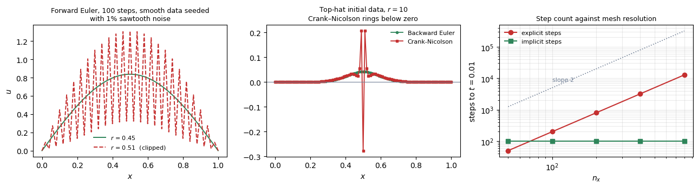

## 2.3 Q3 — What step does accuracy need?

Comparing against the PDE solution would mix spatial and temporal error and hide the result. The semi-discrete ODE system has a closed-form solution for sinusoidal data, $u_j(t) = \sin(\pi x_j)e^{-\lambda_h t}$ with $\lambda_h = (4\alpha/\Delta x^2)\sin^2(\pi\Delta x/2)$, so the temporal error can be isolated exactly:

| $\Delta t$ | $r$ | Backward Euler | Crank–Nicolson |
|---|---|---|---|
| 4.00e-04 | 16.00 | 3.191e-04 | 2.104e-07 |
| 2.00e-04 | 8.00 | 1.597e-04 (p=1.00) | 5.261e-08 (p=2.00) |
| 1.00e-04 | 4.00 | 7.991e-05 (p=1.00) | 1.315e-08 (p=2.00) |
| 5.00e-05 | 2.00 | 3.997e-05 (p=1.00) | 3.288e-09 (p=2.00) |
| 2.50e-05 | 1.00 | 1.999e-05 (p=1.00) | 8.220e-10 (p=2.00) |

**Crank–Nicolson at the largest step here is 100 times more accurate than backward Euler at the smallest.** That is the entire case for using it — when the data are smooth.

### From order to a step size

An order is not yet an answer. Fixing a tolerance and asking for the **largest step that meets it** turns it into one:

| tolerance | $n_x$ | $\Delta t_{\text{stab}}$ ($r=\frac{1}{2}$) | $\Delta t_{\text{acc}}$, BE | $\Delta t_{\text{acc}}$, CN |
|---|---|---|---|---|
| $10^{-3}$ | 50 | 2.00e-04 | 1.29e-03 | $\ge$ 2.0e-02 |
| $10^{-3}$ | 400 | 3.13e-06 | 1.29e-03 | $\ge$ 2.0e-02 |
| $10^{-4}$ | 50 | 2.00e-04 | 1.25e-04 | 8.00e-03 |
| $10^{-4}$ | 400 | 3.13e-06 | 1.25e-04 | 8.00e-03 |

**Look at the middle column: $\Delta t_{\text{acc}}$ does not depend on $n_x$ at all.** It is a purely temporal quantity, fixed by the tolerance and the scheme, and refining the mesh does not change it. Meanwhile $\Delta t_{\text{stab}}$ falls as $1/n_x^2$.

**Those two facts together are the entire diffusion verdict**, and §2.4 is just their ratio.

Crank–Nicolson's step is 6 to 60 times larger than backward Euler's for the same tolerance, which is second order earning its keep: the same solve, a much bigger stride.

### Choosing the tolerance, and turning it into a step

The tables above report errors at chosen step sizes. In practice the question runs the other way: **you have a tolerance and want the step.** Two stages, and the first is a modelling decision rather than a numerical one.

#### Stage 1 — what tolerance is worth asking for

A tolerance is a statement about how much error the *answer* can carry, so it comes from outside the numerics: the precision your measurement or design margin needs, expressed relative to the size of the solution. Here $u = O(1)$, so $10^{-4}$ means 0.01%.

But there is a hard numerical constraint on top of that, and it is the one most often missed. **The total error is spatial plus temporal, so driving the temporal part far below the spatial part is pure waste.** For this problem the spatial error is the gap between the two exact solutions of §2.0 — $\left|e^{\lambda_h T} - e^{-\alpha\pi^2 T}\right|$ — and it is fixed by the mesh:

| $n_x$ | spatial error at $T$ | temporal tolerance worth asking for |
|---|---|---|
| 25 | 2.13e-04 | $\sim 2\times10^{-4}$ |
| 50 | 5.33e-05 | $\sim 5\times10^{-5}$ |
| 100 | 1.33e-05 | $\sim 1\times10^{-5}$ |
| 200 | 3.33e-06 | $\sim 3\times10^{-6}$ |
| 800 | 2.08e-07 | $\sim 2\times10^{-7}$ |

**Balance the two.** Asking for $10^{-8}$ in time on a mesh whose spatial error is $10^{-5}$ buys nothing — the answer is wrong at $10^{-5}$ either way, and you have paid a thousandfold in steps for it. Asking for $10^{-2}$ in time on that same mesh wastes the mesh. The sensible choice is the same order as the spatial error, and it **tightens as the mesh refines** — so the $10^{-4}$ used throughout §2.6 is the right order at $n_x = 25$ and much too loose at $n_x = 800$.

#### But how is the error known at all?

Every table in this document reports an error against a known exact solution — which exists here because the problem was chosen so that it would. **On a real problem there is no exact solution, so the error has to be computed rather than looked up.** Three routes, and only the second works in production.

| route | what it gives | good for |
|---|---|---|
| **theory (a priori)** | the **order** $p$, from the scheme's construction | knowing how fast the error falls. **Not** how large it is — the constant $C$ is unknown |
| **comparison (a posteriori)** | the **size**, estimated from two runs | everything real |
| **manufactured solution** | the exact error | verification and this document. Impossible on a real problem |

**So the theory tells you $p$ and the code tells you $C$.** Neither alone answers "is this step small enough".

##### Richardson extrapolation — the estimate that does the work

Run the same problem twice, at $\Delta t$ and at $\Delta t/2$. If $\text{error} \approx C\Delta t^{\,p}$, then

$$u(\Delta t) - u_{\text{exact}} = C\Delta t^{\,p}, \qquad u(\Delta t/2) - u_{\text{exact}} = C\left(\tfrac{\Delta t}{2}\right)^{p}$$

Subtracting eliminates the unknown $u_{\text{exact}}$, and rearranging eliminates the unknown $C$:

$$\boxed{\;\text{error at } \Delta t/2 \;\approx\; \frac{u(\Delta t/2) - u(\Delta t)}{2^{\,p} - 1}\;}$$

**Nothing on the right-hand side requires knowing the answer.** Checked against the true error, which is available here only because this is a test problem:

| scheme | $\Delta t$ | **estimated** | **true** | est/true | extrapolated |
|---|---|---|---|---|---|
| backward Euler, $p=1$ | 4.00e-04 | 3.1747e-04 | 3.1902e-04 | 0.9952 | 1.55e-06 |
| | 1.00e-04 | 7.9802e-05 | 7.9900e-05 | 0.9988 | 9.72e-08 |
| | 5.00e-05 | 3.9938e-05 | 3.9962e-05 | **0.9994** | 2.43e-08 |
| Crank–Nicolson, $p=2$ | 4.00e-04 | 2.1040e-07 | 2.1040e-07 | **1.0000** | 1.86e-12 |
| | 1.00e-04 | 1.3150e-08 | 1.3150e-08 | **1.0000** | 1.26e-14 |

**The estimate matches the true error to better than 1%, and for Crank–Nicolson to four digits** — without the exact solution ever being used. That is how an implicit solver, or any solver, knows its own error.

**And the same two runs give a better answer for free.** Adding the correction instead of just measuring it,

$$u_{\text{extrapolated}} = u(\Delta t/2) + \frac{u(\Delta t/2) - u(\Delta t)}{2^{\,p}-1}$$

cancels the leading error term and produces a solution of order $p+1$ — the last column, where backward Euler's $4\times10^{-5}$ becomes $2\times10^{-8}$ and Crank–Nicolson reaches the roundoff floor.

**The cheaper variants used in practice** avoid running the whole problem twice: **embedded pairs** evaluate two schemes of different order on the same step and take their difference (BDF1 against BDF2, or an embedded Runge–Kutta pair), giving the same estimate for a fraction of the cost. That is what feeds §1.8's adaptive controller.

**One caveat specific to implicit schemes.** This estimates the *time discretization* error and assumes the linear system was solved exactly. With a direct tridiagonal solve that assumption holds to roundoff. With an **iterative** solver it does not: the algebraic error of §0.5's hierarchy enters too, and if the iterative tolerance is looser than the time-discretization error, the estimate above measures the solver rather than the scheme. The rule is the same as always — keep level 3 comfortably below level 2.

#### What you need to know about the linear solve

Every implicit step solves $\mathbf{A}\mathbf{u}^{n+1} = \mathbf{b}$ with $\mathbf{A} = \mathbf{I} - \theta r\mathbf{L}_0$, and everything above has assumed that solve is exact. Three things about it actually matter, and the first governs the other two.

##### The conditioning depends on the time step

The eigenvalues of $\mathbf{A}$ follow directly from $\mathbf{L}_0$'s: since $\mathbf{L}_0$ has eigenvalues $-4\sin^2(\phi_m/2)$ spanning $(-4, 0)$,

$$\text{eig}(\mathbf{A}) = 1 + 4\theta r\sin^{2}\frac{\phi_m}{2} \ \in \ (1,\ 1+4\theta r) \qquad\Longrightarrow\qquad \kappa(\mathbf{A}) \approx 1 + 4\theta r$$

**The condition number grows linearly with the step size.** Measured at $n_x = 400$:

| $r$ | $\theta$ | $\kappa(\mathbf{A})$ measured | $1+4\theta r$ | CG iterations | direct-solve residual |
|---|---|---|---|---|---|
| 0.5 | 1 | 3.00 | 3.00 | 18 | 1.7e-16 |
| 5 | 1 | 20.99 | 21.00 | 52 | 8.5e-16 |
| 50 | 1 | 200.38 | 201.00 | 165 | 8.1e-15 |
| 500 | 1 | 1941.10 | 2001.00 | 398 | 7.2e-14 |
| 0.5 | 0.5 | 2.00 | 2.00 | 13 | 1.6e-16 |
| 500 | 0.5 | 985.78 | 1001.00 | 339 | 4.0e-14 |

**At the explicit stability limit, $r = 1/2$, the implicit matrix has $\kappa \approx 3$** — nearly the identity, trivially solvable. That is §0.9's point that a small implicit step is cheap in the solver and pointless in every other respect.

##### Consequence 1: with a direct solver, there is nothing to worry about

A direct solve gives a residual of order $\kappa\,\epsilon_{\text{mach}}$. Even at $r = 500$ that is $7\times10^{-14}$ — eight orders of magnitude below the time-discretization error of $10^{-5}$ or so. **The algebraic error (§0.5, level 3) is negligible and the Richardson estimate above measures purely the time scheme.** This is the case throughout this document, since every solve here is a banded direct factorization.

##### Consequence 2: with an iterative solver, $\rho$ is not a constant

CG converges in roughly $\sqrt{\kappa}$ iterations, so

$$\text{iterations} \ \sim\ \sqrt{1 + 4\theta r} \ \sim\ 2\sqrt{\theta r} \ \propto\ \sqrt{\Delta t}$$

and the measured counts follow it: 18, 52, 165, 398 as $r$ goes 0.5, 5, 50, 500 — each fourfold jump in $r$ roughly doubling the iterations.

**So the cost per implicit step rises as $\sqrt{\Delta t}$.** Doubling the step halves the number of steps but makes each $\sqrt{2}$ times dearer, for a **net saving of $\sqrt{2}$ rather than 2.** §0.9's inequality still holds, but with $\rho$ a function of $\Delta t$ rather than a constant, and the returns from a larger step diminish. A good preconditioner is what flattens this — §2.6's constant $\rho = 4.5$ is honest only because a tridiagonal direct solve has no such dependence.

##### Consequence 3: set the iterative tolerance against the discretization error

If you do solve iteratively, the tolerance is a third quantity to choose, and the rule is §0.5's hierarchy: **keep the algebraic error comfortably below the discretization error, and no lower.** Solving to $10^{-12}$ when the time error is $10^{-5}$ wastes most of the iterations; solving to $10^{-4}$ corrupts the Richardson estimate, which would then be measuring the solver. A factor of $10$–$100$ below the target discretization error is the usual choice, and `COMPUTATIONAL.md` §4.6's inexact-Newton argument is the same reasoning applied one level up.

#### Stage 2 — invert the error model

With a tolerance in hand, one row of the §2.3 table gives the step. Since $\text{error} \approx C\,\Delta t^{\,p}$, two errors at two steps eliminate $C$:

$$\boxed{\;\Delta t_{\text{needed}} \;=\; \Delta t_{\text{known}}\left(\frac{\text{tol}}{\text{err}_{\text{known}}}\right)^{1/p}\;}$$

**Worked, from the §2.3 table.** That table has backward Euler at $\Delta t = 10^{-4}$ with error $7.991\times10^{-5}$, and $p = 1$; and Crank–Nicolson at the same step with error $1.315\times10^{-8}$, and $p = 2$.

| scheme | tolerance | arithmetic | $\Delta t$ |
|---|---|---|---|
| backward Euler | $10^{-4}$ | $10^{-4}\times(10^{-4}/7.991\times10^{-5})^{1/1}$ | **1.25e-04** |
| backward Euler | $10^{-5}$ | $10^{-4}\times(10^{-5}/7.991\times10^{-5})^{1/1}$ | 1.25e-05 |
| Crank–Nicolson | $10^{-4}$ | $10^{-4}\times(10^{-4}/1.315\times10^{-8})^{1/2}$ | **8.72e-03** |
| Crank–Nicolson | $10^{-5}$ | $10^{-4}\times(10^{-5}/1.315\times10^{-8})^{1/2}$ | 2.76e-03 |

Against the bisection search that produced §2.6's table: backward Euler **1.25e-04 predicted, 1.25e-04 measured**; Crank–Nicolson **8.72e-03 predicted, 8.00e-03 measured**. The first is exact; the second overestimates by 9% because $8.7\times10^{-3}$ is large enough that the higher-order terms dropped from $C\Delta t^p$ are no longer negligible.

**The exponent is where the schemes separate.** Tightening the tolerance by $10\times$ costs backward Euler a $10\times$ smaller step and Crank–Nicolson only $\sqrt{10} \approx 3.2\times$. That is the compounding of §0.5's order table, and it is why the gap between them widens as the tolerance tightens — the opposite of the mesh dependence, which affects neither.

**And this is what an adaptive controller automates.** §1.8's formula $\Delta t_{\text{new}} = \Delta t(\text{tol}/\text{err})^{1/(p+1)}$ is the same inversion applied per step, with $p+1$ rather than $p$ because it works on the *local* error (§0.5) rather than the accumulated one.

## 2.4 Q4 — How big is the gap, and what is the verdict?

**The gap** is $\Delta t_{\text{acc}}/\Delta t_{\text{stab}}$, and §2.1 and §2.3 have already supplied both. Since $\Delta t_{\text{acc}}$ is fixed and $\Delta t_{\text{stab}} \propto \Delta x^{2}$, the gap grows as $n_x^{2}$:

| $n_x$ | gap, backward Euler | gap, Crank–Nicolson |
|---|---|---|
| 50 | **0.6×** | 40× |
| 100 | 2.5× | 160× |
| 200 | 10× | 640× |
| 400 | **40×** | **2560×** |

*(tolerance $10^{-4}$; the gap at tolerance $10^{-3}$ is larger still.)*

**Read the first row.** At $n_x = 50$ the gap for backward Euler is **less than one** — accuracy demands a *smaller* step than stability does, so implicitness has nothing to sell. §0.9's inequality $\rho < \Delta t_{\text{acc}}/\Delta t_{\text{stab}}$ fails for any $\rho \ge 1$, and explicit wins outright.

**Read the last row.** At $n_x = 400$ the same scheme has a gap of 40, and Crank–Nicolson's is 2560. With a solve costing $\rho \approx 4.5$ here, both clear the bar comfortably.

**So the verdict is not a property of the equation. It is a property of the mesh**, and it flips somewhere around $n_x \approx 100$. The wall-clock measurements confirm it:

Reaching $t = 0.01$, explicit at $r = 0.5$ against implicit at a fixed accuracy-chosen $\Delta t = 10^{-4}$:

| $n_x$ | explicit steps | implicit steps | explicit wall | implicit wall | ratio |
|---|---|---|---|---|---|
| 50 | 50 | 100 | 0.001 s | 0.003 s | **0.2× — explicit wins** |
| 100 | 200 | 100 | 0.002 s | 0.003 s | 0.6× |
| 200 | 800 | 100 | 0.008 s | 0.004 s | 2.2× |
| 400 | 3,200 | 100 | 0.036 s | 0.004 s | 8.2× |
| 800 | 12,800 | 100 | 0.159 s | 0.006 s | **28.5×** |

**The crossover is around $n_x \approx 150$, and below it explicit is faster.** Doubling the mesh quadruples the explicit step count and leaves the implicit one untouched — the $\Delta t \propto \Delta x^2$ penalty of `COMPUTATIONAL.md` §0.3, measured.

**This particular table is not quite a fair fight** — it holds the implicit step fixed at an accuracy-chosen value and the explicit one at its stability limit, which are different criteria. The gap table above *is* the fair comparison, and it says the same thing: crossover near $n_x \approx 100$, implicit winning by orders of magnitude beyond it. §5.2b shows a case where the unfair version reverses the verdict entirely.

**Verdict for diffusion: implicit, on any mesh fine enough to matter** — and the reason is Q1. The modes forcing the small step are grid artifacts with microsecond lifetimes, contributing nothing to the answer. They are exactly the "fast modes you are willing to get wrong" of §1.6.

---

## 2.5 Q5 — What happens to the modes it is not resolving?

Q4 said implicit. It did not say *which* implicit, and §2.3 seems to settle that too: Crank–Nicolson is second order and takes a step 6 to 60 times larger for the same tolerance. This question is where that conclusion breaks.

At $\Delta t_{\text{acc}}$, the fast modes of Q1 have $|z| = |\lambda\Delta t|$ in the hundreds or thousands. They are far beyond resolution; the scheme cannot track them and should not try. **The only question is whether it disposes of them or keeps them** — §1.5's L-stability, and here is what it costs.

A single-node spike, $r=10$, five steps. The sawtooth mode sees $\lambda\Delta t = -4r = -40$, so over five steps it is multiplied by

| | amplification over 5 steps |
|---|---|
| Backward Euler | $8.6\times10^{-9}$ |
| **Crank–Nicolson** | $\mathbf{-0.6063}$ |

and the computed solutions behave accordingly:

| scheme | min $u$ over all steps | min $u$ at $T$ | total variation at $T$ |
|---|---|---|---|
| Backward Euler | $0.000000$ | $0.000000$ | 0.0866 |
| **Crank–Nicolson** | $\mathbf{-0.563564}$ | $\mathbf{-0.276409}$ | **1.4158** |
| $\theta=0.75$ | $-0.093860$ | $0.000000$ | 0.0859 |

**The exact solution of the heat equation is strictly positive for $t>0$.** Crank–Nicolson produces a solution that is 56% negative. It is stable, second order, and wrong in a way that no amount of watching the residual would reveal.

**This is the practical content of L-stability**, and it is why production codes so often use backward Euler or BDF2 rather than the higher-order Crank–Nicolson: near a sharp front or at start-up from discontinuous data, second-order accuracy on smooth modes is worth less than clean annihilation of the sharp ones. $\theta = 0.75$ is the standard compromise — L-stable, first order, but with a much smaller error constant than $\theta=1$.


### Do the modes still matter once you go implicit?

Yes — in five ways, and the only thing that changes is **what you consult them for.** Under an explicit scheme the spectrum hands you a number you must obey. Under an implicit one it hands you five judgements.

| | what the modes tell you | where |
|---|---|---|
| 1 | **which modes carry the answer**, and therefore $\Delta t_{\text{acc}}$ — roughly 20 steps per lifetime of the fastest mode you care about | §2.3 |
| 2 | **whether the fast ones are junk or physics**, which decides whether implicit is applicable at all | §2.1, and reversed in §4 |
| 3 | **whether the scheme damps or keeps** the unresolved ones — L-stability, checked at $z = \lambda_{\max}\Delta t$ | §1.5, §2.5 |
| 4 | **the conditioning of the implicit matrix**, $\kappa \approx 1+4\theta r$, straight from $\mathbf{L}_0$'s spectrum — so solver cost is a spectrum question too | §2.3 |
| 5 | **how accurate each resolved mode is**, since the error is $g(z_m)^n$ against $e^{z_m n}$, mode by mode | below |

**The fifth is worth seeing, because it is where "ignoring the fast modes" gets its licence.** Backward Euler at $\Delta t = 1.25\times10^{-4}$, $n_x = 100$, 160 steps:

| $m$ | $\lambda_m$ | $z = \lambda_m\Delta t$ | true $e^{\lambda_m T}$ | BE gives | absolute error | relative error |
|---|---|---|---|---|---|---|
| 1 | $-9.9$ | $-0.001$ | 8.209e-01 | 8.210e-01 | 1.0e-04 | **1.2e-04** |
| 2 | $-39.5$ | $-0.005$ | 4.542e-01 | 4.550e-01 | 8.8e-04 | 1.9e-03 |
| 5 | $-246$ | $-0.031$ | 7.265e-03 | 7.825e-03 | 5.6e-04 | 7.7e-02 |
| 25 | $-5858$ | $-0.732$ | 1.3e-51 | 6.7e-39 | **6.7e-39** | **5.1e+12** |
| 99 | $-39990$ | $-4.999$ | $\approx 0$ | 3.2e-125 | **3.2e-125** | **3.2e+175** |

**Read the last two columns together.** For the unresolved modes the *relative* error is astronomical — $10^{175}$ for the sawtooth — and the *absolute* error is $10^{-125}$. Both the true value and the computed one are zero to any precision that exists. **That is what "ignoring the fast modes" actually means: not that they are excluded from the calculation, but that being catastrophically wrong about a quantity of size $10^{-125}$ costs nothing.**

**And one more thing the modes decide: which of them are even present.** The total error is a sum over modes weighted by how much the initial data excites each one:

| initial data | amplitude in mode 1 | mode 25 | mode 99 |
|---|---|---|---|
| smooth, $\sin(\pi x)$ | 1.010 | 6.1e-17 | 2.0e-15 |
| single-node spike | 0.0202 | 0.0202 | 0.0202 |

**Smooth data excites essentially nothing above mode 1**, so a scheme's behaviour on modes 25 and 99 is irrelevant no matter how bad it is. A spike excites every mode equally. That is why §2.1's stability threshold was invisible until the sawtooth was deliberately seeded, and why §2.5's ringing test needed a spike to show anything — **Crank–Nicolson's defect is real at every step size and only becomes visible when the data reach the modes it mishandles.**

## 2.6 What step should each scheme actually take?

Everything above is a measurement; this is the recommendation the measurements add up to. Tolerance $10^{-4}$ on the max error, $T = 0.02$, safety factor $0.9$ on the stability limit.

**How each column is computed.**

| column | how |
|---|---|
| $\Delta t$, **forward Euler** | $\min\big(0.9\,\Delta t_{\text{stab}},\ \Delta t_{\text{acc}}\big)$ — both constraints apply |
| $\Delta t$, **backward Euler and Crank–Nicolson** | $\Delta t_{\text{acc}}$ **only**. Both are unconditionally stable ($\theta \ge \frac{1}{2}$, §0.7), so no stability term exists to take a minimum with |
| steps | $T/\Delta t$ |
| **work** | steps $\times$ the cost of one step, with **one explicit step $=1$** and one implicit step $=\rho = 4.5$ |

**"Limited by" describes forward Euler only** — it is the only scheme here with two constraints to choose between. For the two implicit schemes the answer is always accuracy.

**On $\rho$ being a single number, independent of $n_x$.** You are right that both costs grow with the mesh, and the reason one constant suffices is that in 1D they grow **at the same rate**: an explicit step is a stencil sweep touching each unknown a fixed number of times, and a tridiagonal solve with a prefactored matrix is a forward and back substitution doing the same. Both are $O(M)$, so the *ratio* is mesh-independent even though neither cost is. Measured:

| $M$ | explicit step | tridiagonal solve | $\rho$ |
|---|---|---|---|
| 99 | 1.15e-05 s | 2.39e-05 s | 2.07 |
| 1,599 | 1.05e-05 s | 6.00e-05 s | 5.70 |
| 25,599 | 9.99e-05 s | 6.62e-04 s | 6.62 |

By flop count both are about $5M$ operations, so the honest $\rho$ for this problem is **1 to 3**; the measured $4$–$7$ is Python call overhead rather than arithmetic (§10). Either way the conclusions below are unaffected, because they turn on factors of hundreds.

**Two things this simplification hides**, and both matter outside this section. In **two and three dimensions** the two costs stop growing at the same rate — an explicit step stays $O(M)$ while a direct solve is $O(M^{1.5})$ or worse, and even multigrid carries a larger constant — so $\rho$ grows with the mesh and can reach 100 (§0.8, factor C1). And **the work column is comparable within a row, not across rows**: a step at $n_x = 800$ costs 32 times more than one at $n_x = 25$, so the $160$ and the $28{,}444$ below are not the same units. Compare schemes across a row; do not read the column downwards.

| $n_x$ | $\Delta t_{\text{stab}}$ | **FE** $\Delta t$ | steps | work | limited by | **BE** $\Delta t$ | steps | work | **CN** $\Delta t$ | steps | work | best |
|---|---|---|---|---|---|---|---|---|---|---|---|---|
| 25 | 8.0e-04 | 1.25e-04 | 160 | **160** | **accuracy** | 1.25e-04 | 160 | 718 | 8.0e-03 | 3 | **11** | CN |
| 50 | 2.0e-04 | 1.25e-04 | 160 | **160** | **accuracy** | 1.25e-04 | 160 | 718 | 8.0e-03 | 3 | **11** | CN |
| 100 | 5.0e-05 | 4.50e-05 | 444 | 444 | stability | 1.25e-04 | 160 | 718 | 8.0e-03 | 3 | **11** | CN |
| 200 | 1.25e-05 | 1.13e-05 | 1,778 | 1,778 | stability | 1.25e-04 | 160 | 718 | 8.0e-03 | 3 | **11** | CN |
| 400 | 3.13e-06 | 2.81e-06 | 7,111 | 7,111 | stability | 1.25e-04 | 160 | 718 | 8.0e-03 | 3 | **11** | CN |
| 800 | 7.81e-07 | 7.03e-07 | 28,444 | 28,444 | stability | 1.25e-04 | 160 | 718 | 8.0e-03 | 3 | **11** | CN |

**Four readings, and two of them are not what the earlier sections suggest.**

**Forward Euler is accuracy-limited on coarse meshes.** At $n_x = 25$ and $50$ the binding constraint is the $10^{-4}$ tolerance, not stability — the CFL condition is satisfied automatically and plays no part at all. The crossover to stability-limited sits near $n_x \approx 90$. This is the case §1.7 named and never demonstrated: the accuracy term is *in* the $\min$, and sometimes it wins.

**The two first-order schemes want the identical step**, $1.25\times10^{-4}$. That is §0.5's result made concrete: their leading errors are $+\frac{1}{2}z^2$ and $-\frac{1}{2}z^2$, equal in magnitude and opposite in sign, so they need the same $\Delta t$ to hit the same tolerance. **Backward Euler's unconditional stability buys no larger step — only a solve.**

**So backward Euler is never the best choice on this problem.** Worse than forward Euler on coarse meshes (718 against 160, since it pays $\rho$ for a step it could have had free) and worse than Crank–Nicolson on every mesh (718 against 11). Its case rests entirely on Q5.

**Crank–Nicolson wins everywhere, by a margin that grows.** Second order buys a $64\times$ larger step for the same tolerance, so three steps cover the interval regardless of mesh.

**One distortion worth flagging.** At $\Delta t = 8\times10^{-3}$ and $T = 0.02$, Crank–Nicolson takes *three steps* — a short integration and a loose tolerance both flatter it. At tolerance $10^{-6}$, or over a longer interval, the margin narrows. And at Q5's sharp initial data it loses outright.

## 2.7 Summary — diffusion

| question | answer |
|---|---|
| **Q1 — the modes** | real, negative, $[-4\alpha/\Delta x^2,\,0]$. Slow end is physics and fixed; fast end is the grid and grows as $1/\Delta x^2$ |
| **Q2 — stability ceiling** | $r \le \frac{1}{2}$, i.e. $\Delta t \le \Delta x^2/2\alpha$, for forward Euler. None at all for $\theta \ge \frac{1}{2}$. Predicted and measured agree to three digits |
| **Q3 — what accuracy needs** | a step **independent of the mesh**. BE first order, CN second, confirmed at $p = 1.00$ and $2.00$ |
| **Q4 — the gap, and the verdict** | grows as $n_x^2$; below 1 at $n_x = 50$ and 40× at $n_x = 400$. **Explicit on coarse meshes, implicit on fine ones**, crossing over near $n_x \approx 100$ |
| **Q5 — the unresolved modes** | must be **damped**, not merely bounded. Crank–Nicolson keeps them with a flipped sign and rings; backward Euler annihilates them. **L-stability, not order, decides which implicit scheme to use on sharp data** |

**Recommended in one line:** Crank–Nicolson on smooth data, backward Euler on sharp data or at start-up, forward Euler only when the mesh is coarse enough that stability is not binding.

**The one sentence.** Diffusion is the case implicit methods exist for: the modes that force a tiny explicit step are grid artifacts with microsecond lifetimes, so getting them wrong costs nothing — provided the scheme gets them wrong in the direction of zero.

**What §3 changes.** Exactly one thing: the operator becomes skew-adjoint instead of self-adjoint, so the spectrum rotates from the real axis onto the imaginary one. Every conclusion above reverses.

# 3. Hyperbolic, first order — advection

`code/time_advection.py`. The second of the four, and **every verdict from §2 reverses.** Same five questions, in the same order.

## 3.0 The problem, discretized step by step

$$u_t + c\,u_x = 0 \quad\text{on } [0,1], \qquad \text{periodic}$$

A pulse carried downstream at speed $c$ — units of length/time, set to $c=1$. The exact solution translates the initial profile rigidly and unchanged:

$$u(x,t) = u_0(x - ct)$$

so after one full period it is **back where it started, identical**. That makes the measurement unusually clean: **anything a scheme does other than translate is error**, and there is no decay to hide behind.

### Boundary conditions — and advection needs fewer than diffusion

§2 prescribed $u$ at **both** ends. Advection cannot: it is **first order in space**, and by the characteristic-counting rule of `COMPUTATIONAL.md` §0.3, a hyperbolic problem takes **as many boundary conditions at a point as there are characteristics entering there**. For $u_t + cu_x = 0$ with $c>0$ the single characteristic family travels rightward, so

| boundary | characteristics entering | conditions to impose |
|---|---|---|
| $x=0$, **inflow** | 1 | **exactly one** — prescribe $u$ |
| $x=1$, **outflow** | 0 | **none** — $u$ there is whatever arrives |

Prescribing a value at the outflow **over-determines** the problem, and a scheme that does it anyway produces reflections. This is the sharpest practical difference between the two equations, and it follows from the order of the spatial derivative rather than from anything numerical.

**This document uses periodic boundaries instead**, for one reason: it makes the measurement exact. A pulse leaving at $x=1$ re-enters at $x=0$, so after one full revolution **the exact answer is the initial condition, bit for bit** — no analytic solution needs evaluating and no boundary treatment contaminates the result. Every error reported in §3 is the scheme's alone.

**The grid.** Periodic fixes no node, so $M = n_x$ — one more unknown than §2's Dirichlet case — and $\phi_m = 2\pi m/n_x$ rather than $m\pi/n_x$.

### The choice of boundary condition is not cosmetic: it changes the spectrum

Periodicity is what puts the wrap-around corners into the matrices below, and those corners are load-bearing. Removing them — using a real inflow boundary instead — changes the operators structurally:

| scheme | boundaries | $\mathbf{L}=-\mathbf{L}^{\mathsf T}$ | normal | eigenvalues |
|---|---|---|---|---|
| central | periodic | yes | yes | purely imaginary, $M$ distinct |
| central | inflow/outflow | yes | yes | purely imaginary |
| upwind | periodic | no | **yes** | complex, $M$ distinct |
| **upwind** | **inflow/outflow** | no | **no** | **all equal to $-c/\Delta x$** |

**That last row is worth dwelling on.** Without the periodic wrap the upwind matrix is lower bidiagonal, and a bidiagonal matrix with a constant diagonal has that diagonal entry as its *only* eigenvalue. At $n_x = 24$: one distinct eigenvalue, $-24$, with multiplicity 23 — and the matrix has **exactly one eigenvector**, so it is **defective** and has no eigenbasis at all.

**Every mode argument in §1 assumed an eigenbasis exists.** Here it does not. The spectrum is a single point and tells you almost nothing: it cannot distinguish smooth from wiggly, it offers no $\lambda_{\min}$, and the decomposition $\mathbf{u} = \sum_m c_m\mathbf{v}_m$ is unavailable. This is the non-normal case §0.5 warned about, in its most extreme form, and it arises from **a boundary condition** — not from the equation, the mesh, or the scheme.

**So the clean spectra of §3.1 are a property of the periodic problem**, and they are used here because they make the mechanism visible. A real inflow–outflow advection problem is analysed by other means; `COMPUTATIONAL.md` §0.3's characteristic argument survives, the eigenvalue picture largely does not.

### The space derivative: $u_x$ — and here there is a choice

§2's second derivative had one natural stencil. A *first* derivative has two, and they are not equivalent.

**Central**, from subtracting the two Taylor expansions of §2.0 instead of adding them, which cancels the even terms:

$$u_{j+1} - u_{j-1} = 2\Delta x\,u_x + \frac{\Delta x^3}{3}u_{xxx} + O(\Delta x^5) \quad\Longrightarrow\quad u_x = \frac{u_{j+1}-u_{j-1}}{2\Delta x} + O(\Delta x^{2})$$

**Upwind**, using only the side the flow comes from — for $c>0$, the left:

$$u_x = \frac{u_j - u_{j-1}}{\Delta x} + O(\Delta x)$$

**Central is second order and upwind is first**, so on accuracy grounds alone central wins and the question would be closed. §3.1 is where that reasoning fails.

### The semi-discrete system

$$\text{central:}\quad \frac{\mathrm{d}u_j}{\mathrm{d}t} = -\frac{c}{2\Delta x}\left(u_{j+1}-u_{j-1}\right), \qquad \text{upwind:}\quad \frac{\mathrm{d}u_j}{\mathrm{d}t} = -\frac{c}{\Delta x}\left(u_{j}-u_{j-1}\right)$$

with matrices

$$\mathbf{L}_{\text{central}} = -\frac{c}{2\Delta x}\begin{pmatrix} 0 & 1 & & -1 \\ -1 & 0 & 1 & \\ & \ddots & \ddots & \ddots \\ 1 & & -1 & 0\end{pmatrix}, \qquad \mathbf{L}_{\text{upwind}} = -\frac{c}{\Delta x}\begin{pmatrix} 1 & & & -1 \\ -1 & 1 & & \\ & \ddots & \ddots & \\ & & -1 & 1\end{pmatrix}$$

the corner entries being the periodic wrap-around. **Look at the first matrix: it is antisymmetric**, $\mathbf{L} = -\mathbf{L}^{\mathsf T}$. By §1.1's rule its eigenvalues must be purely imaginary, and that single observation determines most of this section. The second is neither symmetric nor antisymmetric.

### The time derivative, and the schemes

Same $\theta$-method. With the **Courant number** of §1.1,

$$\nu = \frac{c\,\Delta t}{\Delta x}$$

playing the role $r$ played in §2, the fully discrete upwind schemes are:

| scheme | the update at node $j$ |
|---|---|
| **forward Euler, upwind** | $u_j^{\,n+1} = u_j^{\,n} - \nu\left(u_j^{\,n} - u_{j-1}^{\,n}\right)$ |
| **forward Euler, central** (FTCS) | $u_j^{\,n+1} = u_j^{\,n} - \frac{\nu}{2}\left(u_{j+1}^{\,n} - u_{j-1}^{\,n}\right)$ |
| **backward Euler, upwind** | $(1+\nu)\,u_j^{\,n+1} - \nu\,u_{j-1}^{\,n+1} = u_j^{\,n}$ |
| **Lax–Wendroff** | $u_j^{\,n+1} = u_j^{\,n} - \frac{\nu}{2}(u_{j+1}^{\,n}-u_{j-1}^{\,n}) + \frac{\nu^{2}}{2}(u_{j+1}^{\,n}-2u_j^{\,n}+u_{j-1}^{\,n})$ |

**Lax–Wendroff is the exception flagged in §0.1**: it is not a method-of-lines scheme at all. It comes from a Taylor expansion in *time*, with $u_{tt} = c^2u_{xx}$ substituted from the PDE itself, so space and time are discretized together and it has no separate $\mathbf{L}$.

### Which exact solution to measure against — and here §2's answer fails

§2 measured against the semi-discrete solution, to isolate the temporal error. **That does not work here**, and the reason is worth seeing:

| $\nu$ | steps | error vs the **PDE** solution | error vs the **semi-discrete** solution |
|---|---|---|---|
| 0.25 | 800 | 4.294e-01 | 5.500e-02 |
| 0.50 | 400 | 3.519e-01 | 1.325e-01 |
| 0.90 | 222 | 1.152e-01 | 3.696e-01 |
| **1.00** | 200 | **1.3e-26** | **4.844e-01** |

**At $\nu=1$ the scheme is exact for the PDE and maximally wrong against the semi-discrete solution.** The two references do not merely differ — they rank the step sizes in opposite orders.

The cause: the upwind *spatial* operator is itself diffusive (its eigenvalues have negative real parts, §3.1), and the forward Euler *temporal* error at $\nu=1$ **exactly cancels that diffusion**. The two errors are not independent contributions to be separated; they annihilate each other at one particular step.

**So for advection the spatial and temporal errors are not separable, and the PDE solution is the reference that matters.** Every error below is measured against it.

## 3.1 Q1 — Where are the modes?

Substituting $v_j = e^{\mathrm{i}\phi_m j}$ into each operator, with $\phi_m = 2\pi m/n_x$:

$$\lambda^{\text{central}}_m = -\mathrm{i}\,\frac{c}{\Delta x}\sin\phi_m, \qquad \lambda^{\text{upwind}}_m = -\frac{c}{\Delta x}\left(1 - e^{-\mathrm{i}\phi_m}\right)$$

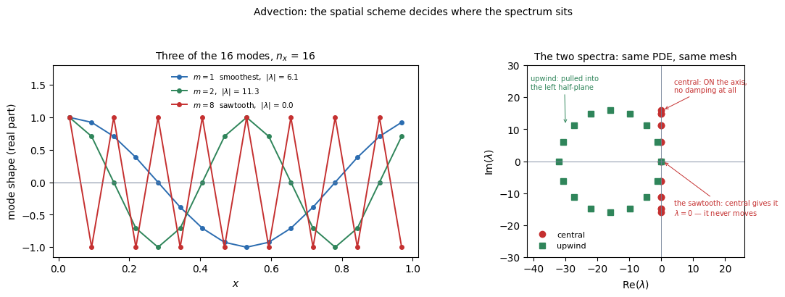

At $n_x = 16$, $c = 1$, so $c/\Delta x = 16$:

| $m$ | $\phi_m$ | central $\lambda_m$ | upwind $\lambda_m$ |
|---|---|---|---|
| 1 | 0.393 | $-6.12\mathrm{i}$ | $-1.22 - 6.12\mathrm{i}$ |
| 2 | 0.785 | $-11.31\mathrm{i}$ | $-4.69 - 11.31\mathrm{i}$ |
| 4 | 1.571 | $-16\mathrm{i}$ | $-16 - 16\mathrm{i}$ |
| **8** | $\pi$ | $\mathbf{0}$ | $-32$ |
| 15 | 5.890 | $+6.12\mathrm{i}$ | $-1.22 + 6.12\mathrm{i}$ |

**Four things, and each overturns something from §2.**

**Central is purely imaginary — every mode oscillates and none decays.** This is §1.1's symmetry rule: $\mathbf{L}_{\text{central}}$ is antisymmetric, so its spectrum must be imaginary. In §2 every mode decayed and $g$ was real; here $g$ is complex and there are **two** ways to be wrong — amplitude and phase. That is why §3.5 finds two distinct kinds of error where §2 had one.

**Upwind sits on a circle in the left half-plane**, radius $c/\Delta x$ centred at $-c/\Delta x$. The negative real part is numerical diffusion, introduced by the *spatial* scheme. **The same PDE and the same mesh give two completely different spectra** — the strongest illustration of §1.1's point that the discretization chooses where the modes go.

**The central scheme cannot see the sawtooth at all.** At $\phi = \pi$ its eigenvalue is **exactly zero**, because the central difference of an alternating $\pm1$ pattern is $u_{j+1} - u_{j-1} = 0$. That mode neither advects nor decays — it sits there forever, invisible to the operator. It is the same odd–even decoupling that produces checkerboard pressure fields in `DISCRETIZATION.md` §4.3, arriving here as a null eigenvalue. Upwind gives that mode $\lambda = -32$, the most damped of all.

**And the scaling is $1/\Delta x$, not $1/\Delta x^2$:**

$$|\lambda|_{\max} = \frac{c}{\Delta x} \ \text{(central)}, \qquad \frac{2c}{\Delta x} \ \text{(upwind)}$$

**This is the whole reason advection does not become stiff.** Halving $\Delta x$ doubles $|\lambda|_{\max}$ — but it also halves the time a wave takes to cross a cell, which is the timescale you are trying to resolve. **The fast end and the interesting end move together**, so the ratio between them stays put and no gap opens. §2's gap grew as $n_x^2$ because only one end moved.

## 3.2 Q2 — Where is the stability ceiling?

**Predicted, from §3.1's spectra**, using §1.1's rule $\Delta t_{\max} = R(\arg\lambda)/|\lambda|$ with forward Euler's $R$:

| spatial scheme | where the spectrum points | $R$ there | $\Delta t_{\max}$ |
|---|---|---|---|
| **central** | straight up and down the **imaginary axis** | $R = 0$ | $\mathbf{0}$ — no step works |
| **upwind** | a circle of radius $c/\Delta x$ at $-c/\Delta x$ | scales into the unit disc while $\nu \le 1$ | $\Delta t \le \Delta x/c$, i.e. $\nu \le 1$ |

**The central result is not a small ceiling — it is the absence of one.** §1.1's figure is this exact statement: a segment on the imaginary axis cannot be scaled into a disc that meets that axis only at the origin. And it is why the second-order spatial scheme loses to the first-order one here, which is the reversal §3.0 promised.

### One revolution of a Gaussian

| scheme | $\nu = c\Delta t/\Delta x$ | peak | $L^2$ error | |
|---|---|---|---|---|
| FTCS | 0.50 | 9.1e+06 | 3.6e+06 | **blows up** |
| FTCS | 0.90, 1.00 | — | — | **blows up** |
| upwind | 0.50 | 0.6464 | 9.122e-02 | |
| upwind | 0.90 | 0.8841 | 2.832e-02 | |
| **upwind** | **1.00** | 0.9983 | **9.1e-28** | **exact** |
| Lax–Friedrichs | 0.50 | 0.4398 | 1.505e-01 | |
| Lax–Wendroff | 0.50 | 0.9892 | 1.503e-02 | undershoots to $-0.0011$ |
| implicit upwind | 0.50 | 0.4403 | 1.505e-01 | stable, and wrong |
| implicit upwind | 5.00 | 0.2403 | 2.098e-01 | stable, and wrong |

**Two results worth pausing on.**

**FTCS is unconditionally unstable**, not CFL-limited: $|g|^2 = 1 + \nu^2\sin^2(k\Delta x) > 1$ for every $\nu>0$ and every mode. No time step saves it. This is the single most useful counterexample to "explicit means conditionally stable" — some explicit schemes are stable under no condition at all.

**Upwind at $\nu=1$ is exact**, to $10^{-28}$. At Courant number exactly one the update reduces to $u_j^{n+1} = u_{j-1}^n$, a pure one-cell shift, so after $n_x$ steps the array is bit-for-bit the initial one. The peak reads 0.9983 rather than 1.0000 only because no grid point sits exactly at the Gaussian's centre. **The best possible time step for this scheme is its stability limit** — accuracy improves as $\nu\to1$, the opposite of every implicit scheme in this document.

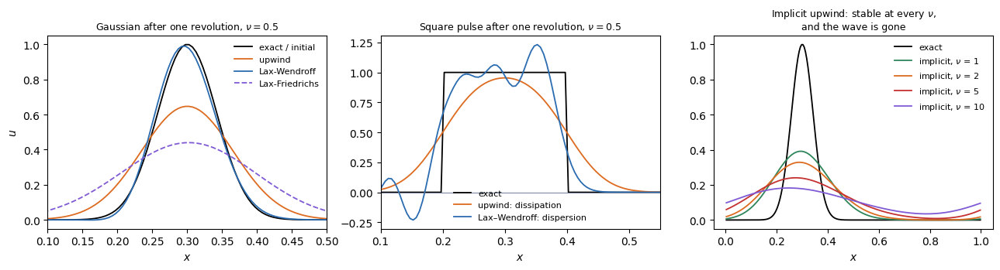

## 3.3 Q3 — What step does accuracy need?

**The largest one stability allows — and this is the inversion of §2.** There, accuracy wanted a smaller step than stability and the two constraints pulled the same way. Here they pull in opposite directions: from §3.2's measurements, the error *falls* as $\nu$ rises, and at $\nu = 1$ it vanishes.

| $\nu$ | upwind, error after one revolution |
|---|---|
| 0.25 | 4.29e-01 |
| 0.50 | 3.52e-01 |
| 0.90 | 1.15e-01 |
| **1.00** | **1.3e-26** |

So $\Delta t_{\text{acc}} = \Delta t_{\text{stab}} = \Delta x/c$, and **the safety factor of §1.7 costs accuracy here rather than buying it** — running at $\nu = 0.9$ instead of $1.0$ is what produces that $1.15\times10^{-1}$. The modified equation explains why.

### The modified equation

Taylor expanding the upwind update shows it is not solving the advection equation at all:

$$u_t + cu_x = \alpha_{\text{num}}u_{xx}, \qquad \alpha_{\text{num}} = \frac{c\,\Delta x\,(1-\nu)}{2}$$

| $\nu$ | $\alpha_{\text{num}}$ predicted | measured peak after one revolution |
|---|---|---|
| 0.25 | 1.875e-03 | 0.5693 |
| 0.50 | 1.250e-03 | 0.6464 |
| 0.75 | 6.250e-04 | 0.7679 |
| 0.90 | 2.500e-04 | 0.8841 |
| **1.00** | **0** | **0.9983** |

**First-order upwinding is exact advection plus an artificial diffusivity that the user did not ask for**, and which vanishes precisely at the stability limit. `COMPUTATIONAL.md` §4.2 makes the same point from the spatial side; this is the temporal half of it, and Godunov's theorem is why there is no linear escape.

## 3.4 Q4 — How big is the gap, and what is the verdict?

**The gap is 1, and that settles it before any measurement.** From Q2, $\Delta t_{\text{stab}} = \Delta x/c$. From Q3, accuracy is *best* at $\nu = 1$ — the same step. So

$$\frac{\Delta t_{\text{acc}}}{\Delta t_{\text{stab}}} = 1$$

and §0.9's condition $\rho < \Delta t_{\text{acc}}/\Delta t_{\text{stab}}$ requires $\rho < 1$: **a solve that costs less than a multiply.** No implementation achieves that, so implicit cannot win on this problem at any mesh, with any solver.

**Contrast §2**, where the same ratio was 40 at $n_x=400$ and grew as $n_x^2$. Nothing about the schemes changed — only where the eigenvalues sit.

### Implicit advection: stable, and that is not the point

| $\nu$ | steps | peak | centroid | exact centroid | phase lag |
|---|---|---|---|---|---|
| 0.5 | 400 | 0.4403 | 0.3006 | 0.3000 | 0.0006 |
| 1.0 | 200 | 0.3912 | 0.3018 | 0.3000 | 0.0018 |
| 2.0 | 100 | 0.3285 | 0.3070 | 0.3000 | 0.0070 |
| 5.0 | 40 | 0.2403 | 0.3361 | 0.3000 | 0.0361 |
| **10.0** | **20** | **0.1823** | **0.3878** | 0.3000 | **0.0878** |

**Nothing diverges at any step size. The wave is simply destroyed.** At $\nu = 10$ the pulse retains 18% of its peak and has drifted almost 1.5 of its own widths downstream after one revolution.

**Compare this with §2.4.** In the diffusion problem a large implicit step cost accuracy but left the answer recognisable, because diffusion *is* a decay process and over-damping it is a quantitative error. Here over-damping deletes the phenomenon. **This is the measured form of `COMPUTATIONAL.md` §4.4's claim** that fluids go explicit: not because implicit is unavailable, but because the timescale you must resolve for accuracy is already the timescale stability would have forced on you, so the implicit solve buys nothing.

---

## 3.5 Q5 — What happens to the modes it is not resolving?

### The two kinds of error

A square pulse, one revolution at $\nu = 0.5$:

| scheme | max $u$ | min $u$ | total variation | failure |
|---|---|---|---|---|
| exact | 1.0000 | 0.0000 | 2.0000 | — |
| upwind | 0.9544 | 0.0000 | 1.9087 | **dissipation** |
| Lax–Wendroff | 1.2321 | $\mathbf{-0.2313}$ | 3.8470 | **dispersion** |
| Lax–Friedrichs | 0.7516 | 0.0000 | 1.5031 | dissipation, worse |

**These are different failures and neither implies the other.** Upwind loses amplitude and stays monotone. Lax–Wendroff keeps amplitude — it even overshoots to 1.23 — and generates oscillations that nearly double the total variation. A scheme can be accurate in the $L^2$ sense and produce negative concentrations, which in a reacting flow means a crash rather than an inaccuracy.

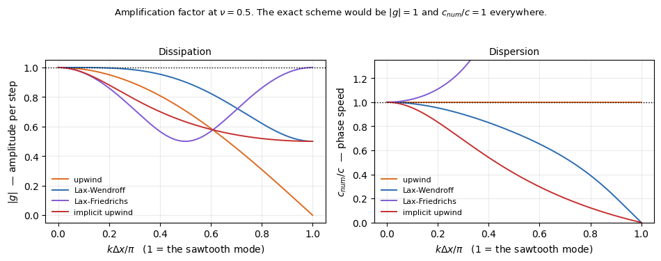

The amplification factor separates them cleanly: $|g|$ against wavenumber is the **dissipation**, and the phase-speed ratio $c_{\text{num}}/c$ is the **dispersion**. The exact scheme would be flat at 1 in both panels. Every scheme here fails at the short-wavelength end, which is why the resolution of a feature — points per wavelength — matters more than the formal order.

## 3.6 What step should each scheme actually take?

One revolution, $T=1$, $\rho = 4.5$, explicit schemes at $\nu = 0.9$ (safety factor on a limit of 1):

| $n_x$ | scheme | $\nu$ | steps | work | max error |
|---|---|---|---|---|---|
| **100** | upwind, forward Euler | 0.9 | 111 | **111** | 0.1950 |
| | Lax–Wendroff | 0.9 | 111 | **111** | **0.0687** |
| | upwind, implicit | 0.9 | 111 | 500 | 0.7002 |
| | upwind, implicit | 5.0 | 20 | 90 | 0.8232 |
| **200** | upwind, forward Euler | 0.9 | 222 | **222** | 0.1152 |
| | Lax–Wendroff | 0.9 | 222 | **222** | **0.0284** |
| | upwind, implicit | 0.9 | 222 | 999 | 0.5999 |
| | upwind, implicit | 5.0 | 40 | 180 | 0.7611 |
| **400** | upwind, forward Euler | 0.9 | 444 | **444** | 0.0639 |
| | Lax–Wendroff | 0.9 | 444 | **444** | **0.0177** |
| | upwind, implicit | 0.9 | 444 | 1,998 | 0.4757 |
| | upwind, implicit | 5.0 | 80 | 360 | 0.6725 |
| **800** | upwind, forward Euler | 0.9 | 889 | **889** | 0.0331 |
| | Lax–Wendroff | 0.9 | 889 | **889** | **0.0012** |
| | upwind, implicit | 0.9 | 889 | 4,000 | 0.3433 |
| | upwind, implicit | 5.0 | 160 | 720 | 0.5600 |

**Compare with §2.6's table row by row — the structure is inverted.**

**Implicit at the same step is strictly worse.** At $\nu = 0.9$ the implicit scheme takes *exactly* the same number of steps as the explicit one, costs $\rho$ times more, and is five times less accurate (0.60 against 0.115 at $n_x=200$). It pays for a solve and receives nothing — because the step it could have taken for free was already the one it wanted.

**Implicit at a larger step is worse still.** At $\nu = 5$ it saves 80% of the steps and the error reaches 0.76 — the pulse is essentially gone. **The one thing implicit has to sell, a bigger step, is the one thing this problem cannot use.**

**Refining the mesh is what improves the answer here**, not changing the time scheme. Upwind's error halves from 0.195 to 0.033 as $n_x$ goes from 100 to 800 — first-order spatial convergence — while its step count merely doubles each time. That is the $1/\Delta x$ scaling of Q1: refinement costs linearly and pays linearly.

**And the spatial order matters far more than the temporal.** Lax–Wendroff, at identical cost to upwind, is 3× more accurate at $n_x=100$ and **28× more accurate at $n_x=800$**. Second-order spatial accuracy compounds where first-order does not. **On this problem the useful question is not explicit against implicit — it is which spatial scheme**, which is `DISCRETIZATION.md` §4.4's subject.

## 3.7 Summary — advection

| question | answer | compared with §2 |
|---|---|---|
| **Q1 — the modes** | central: **purely imaginary**, and the sawtooth has $\lambda = 0$. upwind: a circle in the left half-plane. Both scale as $1/\Delta x$ | §2 was real and scaled as $1/\Delta x^2$ |
| **Q2 — stability ceiling** | central: **none exists** at any $\Delta t$. upwind: $\nu \le 1$ | §2's ceiling existed and was generous relative to the mesh |
| **Q3 — what accuracy needs** | the **largest** step stability permits; the error vanishes at $\nu=1$ | §2 wanted a *smaller* step than stability |
| **Q4 — the gap, and the verdict** | **gap $=1$**, so implicit needs $\rho<1$ and can never win | §2's gap was 40 and grew as $n_x^2$ |
| **Q5 — the unresolved modes** | must **not** be damped: damping *is* the error. Two failure modes now, dissipation and dispersion | §2's unresolved modes had to be damped hard |

**The one sentence.** Advection is the case implicit methods are useless for: the fastest mode is the physics, so the step that stability forces is the step accuracy wanted anyway, and buying permission to exceed it buys permission to be wrong.

**What §4 changes.** Almost nothing in the spectrum — the wave equation is also purely imaginary, and for the same reason. What changes is the *duration*: §3 ran one revolution, §4 runs a hundred thousand steps, and over that long a run a defect of $10^{-6}$ per step is no longer negligible. Conservation replaces per-step accuracy as the criterion.

---

# 4. Hyperbolic, second order — waves

`code/time_wave.py`. **The same spectrum as §3, run a hundred thousand steps.** This is the structural dynamics problem of `COMPUTATIONAL.md` §2.3, and it is where a per-step error measurement stops being the right question.

## 4.0 The problem, discretized step by step

$$u_{tt} = c^{2}u_{xx} \quad\text{on } [0,1]$$

A string plucked and released. **Second order in time**, which is the one structural difference from §2 and §3 and the source of everything below.

### Boundary conditions — two kinds, and they behave differently

Second order in space, so like §2 it takes **two** conditions, one at each end — unlike §3's single inflow condition. Two choices appear here:

| | condition | physically | what the reflected wave does |
|---|---|---|---|
| **fixed** | $u = 0$ | the end is clamped | **inverts** |
| **free** | $u_x = 0$ | the end is unconstrained | does **not** invert |

§4.4 measures both. The inversion is not a numerical artifact: a clamped end must exert a force cancelling the incoming displacement, and that force launches an inverted pulse back.

### The space derivative, and the first-order system

$u_{xx}$ is the same central second difference as §2.0, giving

$$\frac{\mathrm{d}^{2}u_j}{\mathrm{d}t^{2}} = \frac{c^{2}}{\Delta x^{2}}\left(u_{j-1} - 2u_j + u_{j+1}\right)$$

— a system of $M = n_x-1$ **second-order** ODEs. Everything in §1 was built for first-order systems, so introduce the velocity $v = \mathrm{d}u/\mathrm{d}t$ as an independent unknown:

$$\frac{\mathrm{d}}{\mathrm{d}t}\begin{pmatrix}\mathbf{u}\\ \mathbf{v}\end{pmatrix} = \underbrace{\begin{pmatrix}\mathbf{0} & \mathbf{I}\\ c^{2}\mathbf{L}_0/\Delta x^{2} & \mathbf{0}\end{pmatrix}}_{\textstyle \mathbf{A}}\begin{pmatrix}\mathbf{u}\\ \mathbf{v}\end{pmatrix}$$

**The system is now $2M \times 2M$** — displacement and velocity at every node — which is why §1.1 noted that this equation carries two eigenvalues per spatial shape. It is not multiplicity; it is one pair per shape, one travelling each way.

### The time derivative: Newmark, not $\theta$

A second-order equation needs an integrator that advances $u$, $v$ and $a = \mathrm{d}v/\mathrm{d}t$ together. The **Newmark family** does it with two parameters:

$$\mathbf{u}^{n+1} = \mathbf{u}^{n} + \Delta t\,\mathbf{v}^{n} + \Delta t^{2}\left[\left(\tfrac{1}{2}-\beta\right)\mathbf{a}^{n} + \beta\,\mathbf{a}^{n+1}\right]$$

$$\mathbf{v}^{n+1} = \mathbf{v}^{n} + \Delta t\left[(1-\gamma)\mathbf{a}^{n} + \gamma\,\mathbf{a}^{n+1}\right]$$

$\beta$ plays the role $\theta$ played in §2 — it weights the new acceleration, so $\beta = 0$ is explicit and $\beta > 0$ requires a solve:

| $\gamma$, $\beta$ | name | explicit? |
|---|---|---|
| $\tfrac{1}{2}$, $0$ | **central difference** | **yes** — with a lumped mass matrix there is nothing to invert |
| $\tfrac{1}{2}$, $\tfrac{1}{6}$ | linear acceleration | no |
| $\tfrac{1}{2}$, $\tfrac{1}{4}$ | **trapezoidal** (average acceleration) | no |
| $0.6$, $0.3025$ | a damped member | no |

**$\gamma$ controls damping and $\beta$ controls stability**, and §4.1 measures both. Backward Euler on the first-order system above is included for comparison, as the scheme §2 recommended.

### What to measure against

The standing wave $u = \sin(\pi x)\cos(\pi c t)$ is exact for the PDE, and the corresponding semi-discrete solution replaces $\pi c$ by $\omega_1$ from §4.1. But **neither is the right diagnostic here**, and that is the point of the section: over $10^5$ steps what matters is not where the wave is at one instant but whether it still has its amplitude. §4.3 uses **energy**.

## 4.1 Q1 — Where are the modes?

Substituting the same $\sin(m\pi x_j)$ shapes into $\mathbf{A}$ gives, for each shape, a **pair**:

$$\lambda^{\pm}_m = \pm\,\mathrm{i}\,\omega_m, \qquad \omega_m = \frac{2c}{\Delta x}\sin\frac{\phi_m}{2}, \qquad \phi_m = \frac{m\pi}{n_x}$$

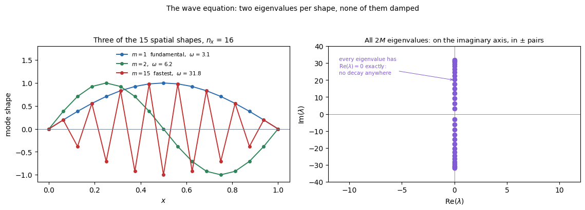

At $n_x = 16$: 15 spatial shapes, **30 eigenvalues**.

| $m$ | $\phi_m$ | $\omega_m$ | $\lambda_m$ | period $2\pi/\omega_m$ |
|---|---|---|---|---|
| 1 | 0.196 | 3.14 | $\pm 3.14\mathrm{i}$ | 2.003 |
| 2 | 0.393 | 6.24 | $\pm 6.24\mathrm{i}$ | 1.007 |
| 4 | 0.785 | 12.25 | $\pm 12.25\mathrm{i}$ | 0.513 |
| 15 | 2.945 | 31.85 | $\pm 31.85\mathrm{i}$ | 0.197 |

**Purely imaginary, every one of them** — $\mathrm{Re}\,\lambda = 0$ exactly. Four consequences, and they set up the rest of the section:

**Nothing decays, ever.** The exact amplification satisfies $|e^{z}| = 1$ for every mode at every step size. **So any amplitude error at all is a defect** — there is no decay to hide it in. §2's unresolved modes had to be damped; here nothing may be.

**The scaling is $1/\Delta x$**, like §3 and unlike §2: $|\lambda|_{\max} = 2c/\Delta x$ against a fundamental fixed at $\omega_1 \to \pi c$. The ratio at $n_x=16$ is only 10, and it grows linearly rather than quadratically — **so waves do not become stiff under refinement either.**

**The two eigenvalues per shape are the two directions of travel**, and they are what make the standing wave of §4.0 a superposition rather than a single mode.

**And the fast modes are still grid artifacts**, exactly as in §2 — $\omega_{15} = 31.85$ against a physical $\omega$ of $15\pi = 47$ for the continuum, so the mesh is already misrepresenting them. But unlike §2, **they cannot be damped away without damping everything else too**, because damping on the imaginary axis is indiscriminate unless the scheme is built to be selective. That is what §4.5 is about.

## 4.2 Q2 — Where is the stability ceiling?

### What each scheme does to a single oscillator

Measured from the eigenvalues of each scheme's amplification matrix, so these are exact properties of the scheme rather than the outcome of one run. At $\Delta t/T = 0.10$:

| scheme | $\vert\lambda\vert$ | period error | amplitude decay per cycle |
|---|---|---|---|
| central difference (explicit) | **1.000000** | $-1.693\%$ | $0.000\%$ |
| Newmark trapezoidal $(\frac{1}{2},\frac{1}{4})$ | **1.000000** | $+3.207\%$ | $0.000\%$ |
| Newmark linear acceleration $(\frac{1}{2},\frac{1}{6})$ | **1.000000** | $+1.600\%$ | $0.000\%$ |
| Newmark damped $(0.6,\,0.3025)$ | 0.982208 | $+3.295\%$ | $16.9\%$ |
| **backward Euler** | **0.846733** | $+12.0\%$ | $\mathbf{84.5\%}$ |

**$|\lambda| = 1$ exactly means the scheme neither adds nor removes energy.** Only the three $\gamma=1/2$ members have it. Backward Euler loses 84% of the amplitude per cycle — applied to a vibration problem it does not solve it, it deletes it.

**Note the sign of the period error.** The explicit central difference *shortens* the period; every implicit Newmark member *lengthens* it. They err in opposite directions, which is not something order of accuracy would tell you.

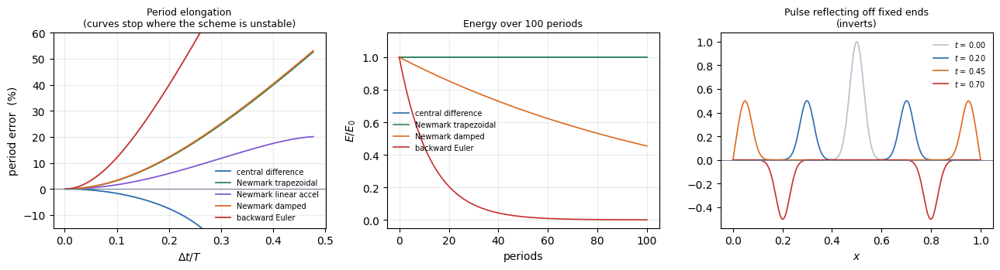

### The explicit limit is $\Omega \le 2$, which is the CFL condition

| $\Omega = \omega\Delta t$ | $\vert\lambda\vert$, central difference | |
|---|---|---|
| 1.990 | 1.000000 | stable |
| **2.000** | **1.000000** | **stable** |
| 2.010 | 1.221301 | unstable |
| 2.100 | 1.877328 | unstable |

With $\omega_{\max} = 2c/\Delta x$ from the discrete Laplacian, $\omega_{\max}\Delta t\le2$ is exactly $c\Delta t/\Delta x \le 1$. **The structural-dynamics stability limit and the CFL condition are the same statement**, which is the algebraic version of the equivalence `COMPUTATIONAL.md` §2.3 and §4.4 describe from opposite ends.

## 4.3 Q3 — What step does accuracy need?

**Here the answer depends on something that never appeared in §2 or §3: how long you intend to run.**

§4.2 measured period error per cycle. That error **accumulates**: a scheme that is $\varepsilon$ short per cycle is $N\varepsilon$ out of phase after $N$ cycles, and once $N\varepsilon$ approaches 1 the computed wave is in antiphase with the true one — the amplitude is right and the answer is inverted.

Requiring the accumulated phase error to stay under 10% of a period:

| scheme | $\Delta t/T$ after **1** cycle | after **10** | after **100** |
|---|---|---|---|
| central difference (explicit) | 0.2254 | 0.0773 | **0.0246** |
| Newmark trapezoidal $(\frac{1}{2},\frac{1}{4})$ | 0.1812 | 0.0554 | **0.0174** |
| Newmark linear acceleration | 0.2713 | 0.0786 | 0.0247 |
| **backward Euler** | 0.0906 | 0.0277 | **0.0087** |

**Running 100 times longer forces a step about 10 times smaller** — $\sqrt{100}$, because these are second-order schemes and the phase error falls as $\Delta t^2$. **Nothing like this happens in §2.** There the solution decays, so early errors decay with it and the requirement does not tighten with $T$. Here nothing decays, so nothing forgets.

**This is why §4 needs a different diagnostic from §2 and §3.** A scheme can look excellent over one period and be useless over a hundred, and a single-instant error measurement cannot tell the difference. Energy can — §4.4.

**And note where backward Euler sits**: it needs a step 2–3× smaller than the explicit scheme for the same phase accuracy, on top of paying for a solve. It is first order in phase where the others are second.

## 4.4 Q4 — How big is the gap, and what is the verdict?

**The gap is close to 1, and it is worse than that for implicit.** From §4.2, $\Delta t_{\text{stab}}$ corresponds to $\Omega \le 2$. From §4.3, a hundred-cycle run needs $\Delta t/T \approx 0.025$, which is $\Omega \approx 0.155$ — **about thirteen times smaller than the stability limit.**

So $\Delta t_{\text{acc}} < \Delta t_{\text{stab}}$: **accuracy binds before stability does**, and the explicit scheme never reaches its own ceiling. §0.9's inequality does not merely fail, it is the wrong question — there is no ceiling being removed, because the ceiling was never the constraint.

**Which makes implicit strictly worse than pointless here.** It pays $\rho$ per step for permission it does not need, and by §4.3's table it needs a *smaller* step than the explicit scheme to hit the same phase accuracy. The energy measurement shows why.

### Energy over 100 periods

$n_x=200$, Courant 0.8, **50,000 steps**:

| scheme | $E_{\text{end}}/E_0$ | drift | oscillation band |
|---|---|---|---|
| central difference (explicit) | 0.999998 | $-2.3\times10^{-6}$ | $3.9\times10^{-5}$ |
| **Newmark trapezoidal** | **1.000000** | $\mathbf{6.7\times10^{-15}}$ | $9.4\times10^{-15}$ |
| Newmark damped $(0.6, 0.3025)$ | 0.454060 | $-0.546$ | — |
| **backward Euler** | **0.000374** | $\mathbf{-1.000}$ | — |

**Trapezoidal Newmark holds energy to roundoff across fifty thousand steps.** The explicit central difference does not conserve the naive discrete energy exactly, but it does not *drift* either: the energy oscillates inside a band of $4\times10^{-5}$ and returns. That is the signature of a **symplectic** scheme — it conserves a slightly modified energy exactly, which is why leapfrog integrators dominate molecular dynamics and orbital mechanics.

**Backward Euler retains 0.04% of the initial energy.** It is unconditionally stable in the strict sense that nothing diverges, and it has destroyed the problem. If you want one sentence for why structural dynamics does not simply use backward Euler and large steps, this table is it — and it is also why generalized-$\alpha$ exists: **controllable** damping, applied to the high modes that are discretization artifacts, while the low modes stay undamped.

## 4.5 Q5 — What happens to the modes it is not resolving?

**This is the question §4 answers differently from both §2 and §3**, and it is the most useful distinction in the document.

The fast modes here are grid artifacts, exactly as in §2 — at $n_x=16$ the mesh gives $\omega_{15} = 31.85$ where the continuum says 47, so they are already misrepresented. **But they sit on the imaginary axis**, so §2's remedy is unavailable: a scheme that damps what it cannot resolve damps everything on that axis, including the fundamental. Three different requirements, one per section:

| | the unresolved modes | what the scheme must do | mechanism |
|---|---|---|---|
| **§2** diffusion | decay to nothing physically | **damp them hard** | L-stability |
| **§3** advection | are the physics | **damp nothing** | any dissipation is error |
| **§4** waves | are grid artifacts, but on the same axis as the physics | **damp them selectively** | $\gamma > \frac{1}{2}$, or generalized-$\alpha$ |

**Selective damping is what the Newmark $\gamma$ parameter is for.** §4.2's table shows $\gamma = \frac{1}{2}$ giving $|\lambda| = 1$ exactly — no damping of anything — and $\gamma = 0.6$ giving 16.9% decay per cycle. That damping is applied to *every* mode, which is why the naive damped member loses 55% of the total energy over 100 periods in §4.4's table.

**Generalized-$\alpha$ exists precisely to make it selective**: high-frequency dissipation that can be dialled in, with the low modes left untouched, while keeping second-order accuracy and unconditional stability. `COMPUTATIONAL.md` §2.3 records that as its design goal; this is the requirement it was designed against.

## 4.6 What step should each scheme actually take?

Ten periods of the fundamental, $\rho = 4.5$, explicit at 90% of its stability limit:

| $n_x$ | scheme | $\Delta t$ | steps | work | $E_{\text{end}}/E_0$ |
|---|---|---|---|---|---|
| **50** | central difference (explicit) | 1.80e-02 | 1,111 | **1,111** | 0.999769 |
| | Newmark trapezoidal | 1.80e-02 | 1,111 | 5,000 | 1.000000 |
| | Newmark trapezoidal, $4\times$ step | 7.19e-02 | 278 | 1,251 | 1.000000 |
| | backward Euler | 1.80e-02 | 1,111 | 5,000 | **0.029758** |
| **100** | central difference (explicit) | 9.00e-03 | 2,222 | **2,222** | 0.999937 |
| | Newmark trapezoidal | 9.00e-03 | 2,222 | 9,999 | 1.000000 |
| | Newmark trapezoidal, $4\times$ step | 3.60e-02 | 555 | 2,498 | 1.000000 |
| | backward Euler | 9.00e-03 | 2,222 | 9,999 | **0.172205** |
| **200** | central difference (explicit) | 4.50e-03 | 4,444 | **4,444** | 0.999984 |
| | Newmark trapezoidal, $4\times$ step | 1.80e-02 | 1,111 | 5,000 | 1.000000 |
| | backward Euler | 4.50e-03 | 4,444 | 19,998 | **0.414927** |
| **400** | central difference (explicit) | 2.25e-03 | 8,889 | **8,889** | 0.999999 |
| | Newmark trapezoidal, $4\times$ step | 9.00e-03 | 2,222 | 9,999 | 1.000000 |
| | backward Euler | 2.25e-03 | 8,889 | 40,000 | **0.642612** |

**Three readings.**

**Explicit is cheapest on every mesh**, and its energy drift is $10^{-4}$ or better without any effort — the symplectic property of §4.4, not an accident of the step size.

**Trapezoidal Newmark is the only implicit scheme worth considering, and it comes close.** At four times the explicit step it costs 1,251 work units against 1,111 at $n_x=50$ — within 13% — and conserves energy to machine precision. On a problem with a genuinely stiff element, such as a structure with one very small element (`COMPUTATIONAL.md` §2.4), that margin flips. **This is the one place in §3 or §4 where implicit is competitive**, and it is competitive because trapezoidal Newmark is the implicit scheme that does *not* damp.

**Backward Euler is a disaster that gets less obvious as the mesh refines.** At $n_x=50$ it retains 3% of the energy — impossible to miss. At $n_x=400$ it retains 64%, which looks like a slightly lossy but plausible answer. **The failure becomes harder to detect precisely as it becomes less severe**, and a convergence study would show it improving.

## 4.7 Reflection — how a wave meets a wall

A Gaussian pulse released from rest splits into two counter-propagating halves; each strikes an end and returns. At Courant number exactly 1 the leapfrog scheme is exact for this equation, so what the figure shows is the physics and not the scheme.

| $t$ | fixed ends: min, max | free ends: min, max |
|---|---|---|
| 0.000 | $+0.0000$, $+1.0000$ | $+0.0000$, $+1.0000$ |
| 0.200 | $+0.0000$, $+0.5000$ | $+0.0000$, $+0.5000$ |
| 0.450 | $-0.0000$, $+0.4989$ | $-0.0000$, $+0.5015$ |
| **0.700** | $\mathbf{-0.5000}$, $+0.0000$ | $-0.0000$, $\mathbf{+0.5000}$ |

**At a fixed end the reflected pulse is inverted; at a free end it is not.** The wall must exert a force that cancels the incoming displacement, and that force launches an inverted pulse back. A free end has no such constraint and the pulse returns upright.

**Both are captured exactly by an explicit scheme at Courant 1, and neither survives an implicit step large enough to be worth taking** — by §3.4, a scheme that damps a travelling pulse has nothing left to reflect. This is the clearest answer to "why is wave propagation done explicitly": the phenomenon *is* the propagation, so the timescale you must resolve is the transit time, which is the stability limit anyway. There is nothing to buy.

---

## 4.8 Summary — waves

| question | answer | compared with §2 and §3 |
|---|---|---|
| **Q1 — the modes** | $\pm\mathrm{i}\omega_m$, **purely imaginary**, two per spatial shape, scaling as $1/\Delta x$ | direction as §3, and unlike §2's real axis |
| **Q2 — stability ceiling** | $\Omega = \omega_{\max}\Delta t \le 2$ for the explicit central difference, which **is** the CFL condition $c\Delta t/\Delta x \le 1$ | §3's ceiling by another route |
| **Q3 — what accuracy needs** | a step that **tightens with run length**: $\times10$ smaller for $\times100$ longer. And it binds *before* stability | new — §2 and §3 had no dependence on $T$ |
| **Q4 — the gap, and the verdict** | $\Delta t_{\text{acc}} < \Delta t_{\text{stab}}$, so there is no ceiling to remove. **Explicit** | §3's verdict, for a stronger reason |
| **Q5 — the unresolved modes** | grid artifacts, but on the physics' own axis: they must be damped **selectively**, which is what generalized-$\alpha$ is for | §2 damps all, §3 damps none, §4 damps some |

**The one sentence.** Waves are where per-step accuracy stops being the criterion: over $10^5$ steps a scheme that conserves beats a scheme that is locally more accurate, and the only implicit method worth considering is the one that does not damp.

**What §5 changes.** All three sections so far had one kind of mode. §5 has three at once — advection, diffusion and reaction, with different directions and different scalings — and the question becomes whether the whole operator has to receive one treatment.

---

# 5. Mixed stiffness — IMEX and operator splitting

`code/time_imex.py`. The first three sections each had **one** kind of mode, and each reached a single verdict for the whole equation. **This one has three kinds at once**, and the question becomes whether the whole operator has to receive the same treatment.

## 5.0 The problem, discretized step by step

$$u_t + c\,u_x = \alpha\,u_{xx} + K\,u(1-u) \quad\text{on } [0,1], \qquad \text{periodic}$$

A chemical carried by a flow at speed $c$, spreading with diffusivity $\alpha$, and reacting at rate $K$. **Each of the three right-hand terms is one of the earlier sections**: the advection of §3, the diffusion of §2, and a reaction that is new.

Parameters: $n_x = 400$, $c = 1$, $\alpha = 0.02$, $K = 10$, $T = 0.2$.

### The reaction term, and the one thing genuinely new here

$R(u) = Ku(1-u)$ is the **Fisher–KPP** logistic source: growth at rate $K$ where $u$ is small, saturating at $u = 1$. It is the first **nonlinear** term in this document, which has two consequences.

**Its contribution to the spectrum depends on the solution.** Linearizing, $R'(u) = K(1-2u)$, so

$$R'(0) = +K \quad(\text{growth}), \qquad R'(1) = -K \quad(\text{decay})$$

**Note the sign.** Where $u$ is small the eigenvalue is **positive** — the true solution genuinely grows there. **This is the one place in the document where $|g| \le 1$ is the wrong stability requirement**, and §0.5's exact condition $|g| \le 1 + \mathcal{K}\Delta t$ is the one that applies: forbidding growth would forbid the physics.

**And it makes the implicit step a nonlinear solve.** Backward Euler on this equation gives an algebraic system that is quadratic in $\mathbf{u}^{n+1}$, so each step needs a **Newton iteration** rather than a single banded solve — several linear solves per step instead of one. That is §0.8's factor C1 in its unfavourable form, and §5.2's timings carry it.

### Space discretization

Upwind for advection, central for diffusion — the choices of §3.0 and §2.0, unchanged — so

$$\frac{\mathrm{d}u_j}{\mathrm{d}t} = -\frac{c}{\Delta x}\left(u_j - u_{j-1}\right) + \frac{\alpha}{\Delta x^{2}}\left(u_{j-1} - 2u_j + u_{j+1}\right) + K u_j(1-u_j)$$

Periodic boundaries again, for the same reason as §3: no boundary treatment to contaminate the comparison.

### What to measure against

No exact solution exists — the equation is nonlinear. **The reference is a fully explicit run at $\frac{1}{50}$ of the smallest stability limit**, which is 71,000 steps and converged far below every error being compared. §5.3 uses a different and better reference for the splitting test, where exact sub-solutions *are* available.

## 5.1 Q1 — Where are the modes?

**The spectrum of a sum of operators is not the sum of their spectra in general — but the clusters still separate visibly, because the three terms live in different places.**

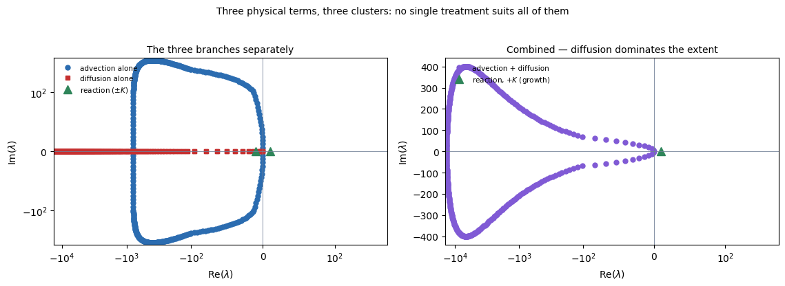

| branch | $\vert\lambda\vert_{\max}$ | direction | scaling | from |
|---|---|---|---|---|
| **advection**, upwind | 800 | a circle, $\mathrm{Re} < 0$ | $c/\Delta x$ | §3 |
| **diffusion**, central | **12,800** | negative real axis | $\alpha/\Delta x^{2}$ | §2 |
| **reaction**, linearized | 10 | real, $+K$ at $u=0$ to $-K$ at $u=1$ | **no $\Delta x$ at all** | new |

**Three different scalings in one problem**: $1/\Delta x$, $1/\Delta x^2$, and $1$. That is the entire content of this section. Refining the mesh moves two of the three clusters and leaves the third exactly where it is, so **the relative importance of the three terms changes with the mesh** — and any fixed judgement about which is "the stiff one" is a judgement about a particular resolution.

**At $n_x = 400$ diffusion dominates by a factor of 16 over advection**, and by 1,280 over reaction. It is the diffusion cluster that sets the explicit step, exactly as in §2 — but unlike §2, it is only one of three things present, and the other two are perfectly comfortable at a much larger step.

**Which is the observation the whole section rests on.** In §2, §3 and §4 the binding cluster *was* the spectrum, so one treatment for the operator was the only option. Here the binding cluster is a sixteenth of the spectrum, and treating **only** that cluster implicitly removes the entire penalty. That is IMEX.

## 5.2 Q2 — Where is the stability ceiling?

**One ceiling per cluster, and the smallest wins** — which is §1.7's $\min$ over terms, with the three terms now belonging to different physics rather than different modes of one operator.

### Three terms, three limits

| term | explicit limit on $\Delta t$ | steps to reach $T=0.2$ |
|---|---|---|
| advection, $\Delta x/c$ | 2.500e-03 | 80 |
| **diffusion, $\Delta x^2/2\alpha$** | **1.563e-04** | **1,280** |
| reaction, $2/K$ | 2.000e-01 | 1 |

**One term out of three is binding, by a factor of 16.** Treating that one implicitly and leaving the others alone removes the entire penalty — which is the whole idea of IMEX.

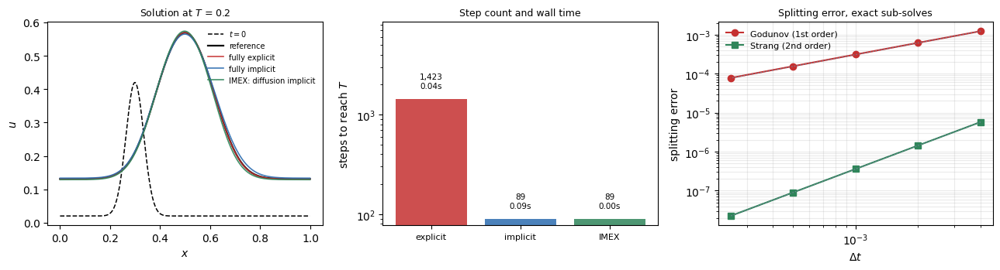

## 5.3 Q3 and Q4 — accuracy, the gap, and the verdict

### The comparison everyone makes

Each scheme at its own largest usable step:

| scheme | $\Delta t$ | steps | wall | max error |
|---|---|---|---|---|
| fully explicit | 1.41e-04 | 1,423 | 0.044 s | 9.473e-04 |
| fully implicit (Newton each step) | 2.25e-03 | 89 | 0.097 s | 1.501e-02 |
| **IMEX: diffusion implicit** | 2.25e-03 | **89** | **0.003 s** | 1.521e-02 |

IMEX takes the implicit scheme's step and pays for one banded solve instead of a Newton iteration — **32× faster than fully implicit and 15× faster than fully explicit.** This is where most treatments stop.

### The comparison that is fair

The three runs above do not have the same accuracy, so the comparison is meaningless. Fixing a target of $10^{-3}$ and finding the largest step that meets it:

| scheme | $\Delta t$ | steps | wall | error |
|---|---|---|---|---|
| fully explicit | 1.41e-04 | 1,423 | 0.053 s | 9.473e-04 |
| fully implicit | 1.41e-04 | 1,423 | **1.451 s** | 9.864e-04 |
| IMEX: diffusion implicit | 1.41e-04 | 1,423 | **0.038 s** | 9.229e-04 |

**The stability advantage evaporates completely.** All three schemes are first order, so a fixed error target forces all three to the same step — and the explicit scheme, which pays for no solve at all, is then competitive with IMEX and 27× faster than fully implicit.

**This is not an argument that IMEX is useless.** It is an argument that the stability-limited comparison flatters implicit methods, and that the real case for IMEX requires one of two things: a **higher-order IMEX pair** (IMEX-RK, so the accuracy per step justifies the larger step), or a problem in which **the stiff mode is genuinely uninteresting** so that the error it carries does not enter the target at all. The second condition is exactly §1.6's stiff system and exactly `COMPUTATIONAL.md` §2.4's structural case.

**The general form of the lesson:** *an implicit method pays off only when there is a fast mode you are willing to get wrong.* If every mode in the problem matters to the answer, implicitness buys nothing but a larger matrix.

## 5.4 Q5 — What happens to the modes it is not resolving?

**Three clusters means the question has three answers at once**, and this is where IMEX differs from simply choosing a scheme.

| cluster | at the IMEX step $\Delta t \approx 2\times10^{-3}$ | resolved? | what must happen to it |
|---|---|---|---|
| **reaction**, $\vert\lambda\vert = 10$ | $\vert z\vert \approx 0.02$ | **yes, easily** | integrate it accurately — it is the physics |
| **advection**, $\vert\lambda\vert = 800$ | $\vert z\vert \approx 1.8$ | **marginally** | it is being tracked, and it is also physics |
| **diffusion**, $\vert\lambda\vert = 12{,}800$ | $\vert z\vert \approx 29$ | **no** | damp it — §2's answer, and it must be **L-stable** |

**The treatments the three clusters want are mutually incompatible if one scheme must serve all of them.** Backward Euler on everything gives the diffusion cluster exactly what it needs and over-damps the advection cluster, which is §3's failure. An explicit scheme on everything treats advection correctly and is destroyed by the diffusion cluster's ceiling.

**IMEX is the observation that they need not be served by one scheme.** Diffusion implicit, advection and reaction explicit:

$$\underbrace{\left(\mathbf{I} - \Delta t\,\mathbf{L}_{\text{diff}}\right)}_{\text{implicit: the stiff cluster}}\mathbf{u}^{n+1} = \mathbf{u}^{n} + \Delta t\Big[\underbrace{\mathbf{L}_{\text{adv}}\mathbf{u}^{n} + R(\mathbf{u}^{n})}_{\text{explicit: the rest}}\Big]$$

**Each cluster gets the treatment §1.6's three conditions say it should**, and the solve is paid for only where stiffness actually lives. Note also what this does to the nonlinearity: $R$ is on the explicit side, so **there is no Newton iteration** — the implicit operator is the same constant banded matrix as §2's, factorable once.

## 5.5 Splitting: a second way to give each term its own treatment

### Splitting order, with both sub-solves exact

The linear part is solved exactly in Fourier space and the logistic reaction exactly in closed form, so the **only** remaining error is the splitting error itself:

| $\Delta t$ | Godunov | $p$ | Strang | $p$ |
|---|---|---|---|---|
| 4.00e-03 | 1.227e-03 | | 5.750e-06 | |
| 2.00e-03 | 6.175e-04 | 0.99 | 1.440e-06 | 2.00 |
| 1.00e-03 | 3.097e-04 | 1.00 | 3.602e-07 | 2.00 |
| 5.00e-04 | 1.551e-04 | 1.00 | 9.005e-08 | 2.00 |
| 2.50e-04 | 7.761e-05 | 1.00 | 2.251e-08 | 2.00 |

**Exactly first and second order, and Strang is 200–3400× more accurate at the same step.** The price is splitting the cheaper half-step in two — $L(\Delta t/2)\,R(\Delta t)\,L(\Delta t/2)$ instead of $R(\Delta t)\,L(\Delta t)$ — which over many steps costs almost nothing, since consecutive half-steps merge.

**Splitting error exists at all because the operators do not commute.** If they did, the split and unsplit solutions would be identical; the experiment only works because the reaction is nonlinear. **Splitting is not free accuracy** — but Strang makes it very cheap.

---

## 5.6 Summary — mixed stiffness

| question | answer |
|---|---|
| **Q1 — the modes** | **three clusters** with three scalings: advection $1/\Delta x$, diffusion $1/\Delta x^2$, reaction $1$. Refining moves two and leaves one, so which term is "the stiff one" is a statement about a resolution |
| **Q2 — stability ceiling** | one per cluster; diffusion binds by 16× over advection and 1,280× over reaction |
| **Q3 — what accuracy needs** | at tolerance $10^{-3}$, $\Delta t = 1.41\times10^{-4}$ — **the same for all three schemes**, because all three are first order |
| **Q4 — the gap, and the verdict** | at each scheme's own limit IMEX looks 32× better; **at equal accuracy the gap is 1** and explicit and IMEX tie, with fully implicit 27× worse |
| **Q5 — the unresolved modes** | different answers for different clusters, which is what makes a single scheme the wrong shape for the problem |

**The one sentence.** Nothing forces one treatment on the whole operator, and when the clusters want different things, splitting the operator beats choosing between them — but the benefit is real only for the stability-limited comparison, and a first-order IMEX pair loses most of it at equal accuracy.

**The honest caveat, restated.** §5.3's two tables give opposite verdicts, and the second is the correct one. The case for IMEX needs either a **higher-order IMEX pair**, so the larger step comes with the accuracy to justify it, or a problem where the stiff cluster is genuinely uninteresting — §1.6's three conditions, of which this problem satisfies only the first two.

---

# 6. Choosing

| If the problem is | Use | Because |
|---|---|---|
| **wave propagation, impact, shocks** | **explicit**, at the largest stable step | the physics *is* the fast mode. §3.4, §4.4 — accuracy demands the same step stability does, so the implicit solve buys nothing |
| **diffusion on a fine mesh** | **implicit**, $\theta\ge1/2$ | $\Delta t\propto\Delta x^2$ is brutal and the fast modes are decaying artifacts. §2.4 |
| diffusion on a **coarse** mesh | **explicit** | the crossover is real and mesh-dependent: below $n_x\approx150$ in §2.4, explicit was faster |
| **smooth data, accuracy-driven** | **Crank–Nicolson** or BDF2 | second order for the same solve. §2.2 |
| **discontinuous data or start-up transients** | **backward Euler** or $\theta\approx0.75$ | L-stability. §2.3 — Crank–Nicolson rings |
| **vibration over many cycles** | **Newmark $\gamma=1/2$**, or generalized-$\alpha$ | energy conservation, and damping you control rather than inherit. §4.1, §4.3 |
| **mixed stiff and non-stiff terms** | **IMEX** or Strang splitting | pay for a solve only where the stiffness is. §5.1 |
| **stiff chemistry, slow flow** | operator splitting, implicit ODE per cell | the sub-problems are local. §5.3 |
| **steady state wanted, transient not** | implicit, or pseudo-time with local stepping | time accuracy has no value, so trade all of it. §7 |

**And the test underneath every row:** is the fastest resolvable mode close to the physics you care about? Yes → explicit wastes nothing. No → the system is stiff and implicit becomes attractive.

---

# 7. Where elliptic problems are already in this document

They are not a fifth example, and they are not absent. They appear twice.

**Every implicit step is an elliptic solve.** Backward Euler on the heat equation is

$$(\mathbf{I} - \Delta t\,\alpha\mathbf{L})\,\mathbf{u}^{n+1} = \mathbf{u}^n$$

which is a **Helmholtz problem** — the elliptic operator of `DISCRETIZATION.md` §0, shifted by $\mathbf{I}$. Everything in `COMPUTATIONAL.md` §2.6 and §4.6 about direct against iterative, about SPD structure, about multigrid, applies to that solve. **The shift makes it easier**: as $\Delta t\to0$ the system tends to the identity, so the condition number of an implicit step is *better* than that of the corresponding steady problem, and it degrades as the step grows. Very large implicit steps are expensive in the solver, not just inaccurate.

**Pseudo-time marching runs the relation backwards.** A steady elliptic problem can be solved by attaching a fictitious time derivative and marching to convergence, which is how a great deal of steady CFD works (`COMPUTATIONAL.md` §4.4). Here time accuracy has no value at all, so every trick that trades it for convergence rate becomes available — **local time stepping**, where neighbouring cells sit at different times and the field is not a physical state at any instant, is the clearest example.

So the relationship is symmetric: **an implicit time step contains an elliptic solve, and an elliptic solve can be performed by fake time stepping.** A separate elliptic section would have nothing left to say that §2 and `DISCRETIZATION.md` do not already cover.

---

# 8. What the numbers actually say

Collected because each one is commonly believed backwards, and each has a measurement above.

- **Implicit does not mean accurate.** §1.4: forward and backward Euler have nearly identical error at the same step. Implicitness buys stability.
- **Unconditionally stable does not mean safe.** §4.3: backward Euler retained 0.04% of the energy of a wave and diverged from nothing.
- **Higher order does not mean better.** §2.3: Crank–Nicolson is second order and produced a solution 56% negative where first-order backward Euler stayed positive.
- **Explicit does not mean conditionally stable.** §3.1: FTCS on advection is unstable at every step size.
- **The stability limit is not always the worst step.** §3.1, §3.3: upwind advection is *exact* at $\nu=1$ and degrades as the step shrinks.
- **A-stability and L-stability are different.** §1.5: both backward Euler and Crank–Nicolson are A-stable; only one annihilates a mode at $\lambda\Delta t=-1000$.
- **Splitting is not free.** §5.3: Godunov splitting is first order no matter how accurate the sub-solves are.
- **The usual explicit-versus-implicit benchmark is rigged.** §5.2 against §5.2b: the same three schemes, compared at equal step-size-limit and then at equal accuracy, give opposite answers.

---

# 9. Runs

| Script | Sections | What it computes |
|---|---|---|
| `code/time_modes.py` | §1.1 | eigenmodes of the discrete Laplacian, their lifetimes, and how the stiffness ratio grows under refinement |
| `code/time_spectra.py` | §1.1 | closed-form spectra of the four model operators, checked against the assembled matrices; mesh scaling exponents; the symmetry-to-spectrum rule; the scaled spectrum against the forward Euler stability region |
| `code/time_stability.py` | §1.3, §1.4, §1.6 | the stability-region figure, order verification, and the stiff $2\times2$ system |
| `code/time_accuracy.py` | §1.4, §1.5 | stability against accuracy on a decaying mode and on a pure oscillation; the $z\to-\infty$ limit that separates A- from L-stability |
| `code/time_diffusion.py` | §2 | the modes of the diffusion operator and where their eigenvalues fall; $\theta$-method; the $r=1/2$ threshold against its von Neumann prediction; temporal order against the semi-discrete exact solution; the Crank–Nicolson ringing test; cost against $n_x$ |
| `code/time_advection.py` | §3 | the advection spectra for central and upwind, and the mode figure; the two-reference comparison; the across-grid recommendation; FTCS, upwind, Lax–Friedrichs, Lax–Wendroff, implicit upwind; exactness at $\nu=1$; dissipation and dispersion spectra; the modified equation |
| `code/time_wave.py` | §4 | the wave spectrum and mode figure; the phase budget against run length; the across-grid recommendation; Newmark amplification matrices, period error and decay; the $\Omega=2$ limit; energy over 50,000 steps; fixed- and free-end reflection |
| `code/time_imex.py` | §5 | the three mode clusters and their figure; the three stability limits; cost at equal step limit and at equal accuracy; Godunov against Strang splitting with exact sub-solves |

```bash
cd code
uv run time_modes.py && uv run time_spectra.py && uv run time_stability.py
uv run time_accuracy.py
uv run time_diffusion.py && uv run time_advection.py
uv run time_wave.py && uv run time_imex.py
```

Dependencies are NumPy, SciPy and Matplotlib, all already pinned in the repository's `pyproject.toml`. Each script prints its own tables and writes its own figures to `../figs`; there are no intermediate files. Total runtime is a few minutes, dominated by §5.2b's fully implicit Newton runs.

---

# 10. Caveats

**Only discretization error is addressed.** §0.5 lists four error sources — modelling, discretization, algebraic, roundoff. This document measures the second, holds the spatial half of it fixed, and drives the third and fourth far below both. **Whether any of the four model equations describes a real situation is outside its scope**, and no result here bears on that question. A converged, high-order, energy-conserving solution of the wrong equation is still wrong.

**Every experiment is one-dimensional.** Nothing here exercises multidimensional stability limits, which are stricter — the explicit diffusion limit in $d$ dimensions is $\Delta t \le \Delta x^2/(2d\alpha)$, and directional splitting changes the picture again. The qualitative conclusions carry; the constants do not.

**The wall-clock numbers are Python.** The §2.4 and §5.2 timings are dominated by interpreter overhead on small problems, and a banded solve in NumPy is much closer in cost to a stencil sweep than it would be in a compiled code. **Treat the step counts as the result and the timings as indicative.** The direction of the §5.2b conclusion is safe because it comes from step counts, not seconds.

**Nonlinear implicit solves are represented by one Newton iteration on one nonlinearity.** Real implicit codes spend their time in the linear solver inside Newton, and their per-step cost depends on preconditioning quality in ways no 1D banded problem can show. §5.2's "32× faster" is honest for this problem and should not be quoted as a general figure.

**The advection tests use a single upwind flux, with no limiter.** The dissipation/dispersion dichotomy of §3.2 is exactly what flux limiters exist to escape (`COMPUTATIONAL.md` §4.2), and a TVD scheme would sit between the two rows and belong to neither. That comparison is not made here.

**§4's energy diagnostic uses the standard discrete energy.** The explicit central difference conserves a *modified* energy exactly; the $4\times10^{-5}$ band in §4.3 is the difference between the two, not a defect. The modified energy was not computed.

**Only first-order IMEX was tested.** §5.2b's conclusion — that IMEX's advantage vanishes at equal accuracy — is a statement about IMEX-Euler specifically. A second-order IMEX-RK pair would change it, and testing that is the obvious next experiment.

---

# 11. Unverified claims

1. **§4.3** — that the explicit central-difference scheme is symplectic and conserves a modified energy exactly. The bounded, non-drifting energy band is measured and is consistent with it, but the modified energy itself was not constructed.
2. **§2.3** — that $\theta = 0.75$ is a "standard compromise" in production codes. It is L-stable and its error constant is measured here; the claim about common practice is recalled.
3. **§4.1** — the attribution of the generalized-$\alpha$ design goal (controllable high-frequency dissipation at second order) follows `COMPUTATIONAL.md` §2.3, which itself marks the surrounding practice claims as unverified.
4. **§1.6** — the plasma wave branches: the dispersion relations, the directions of their eigenvalues, and the $1/\Delta x^2$ scaling attributed to the whistler branch. Stated from general familiarity and not checked; `fusion`'s `notes/theory/pde_character.md` covers the whistler case and should be reconciled with it.
5. **§6** — the row recommending operator splitting with an implicit per-cell ODE solve for stiff chemistry describes standard combustion practice, not anything measured here.

**What would settle these:** one source each for 2–4; for 1, constructing the modified Hamiltonian for the leapfrog scheme and measuring its drift directly, which is a short experiment and worth doing.

---

# 12. Sources

**Time integration and stiffness**

- Hairer E., Nørsett S.P., Wanner G., *Solving Ordinary Differential Equations I: Nonstiff Problems*
- Hairer E., Wanner G., *Solving Ordinary Differential Equations II: Stiff and Differential-Algebraic Problems* — A- and L-stability, order stars, BDF
- Hairer E., Lubich C., Wanner G., *Geometric Numerical Integration* — symplectic integrators and the modified-energy argument of §4.3
- Ascher U.M., Petzold L.R., *Computer Methods for Ordinary Differential Equations and Differential-Algebraic Equations*
- Butcher J.C., *Numerical Methods for Ordinary Differential Equations*

**PDE time stepping**

- LeVeque R.J., *Finite Difference Methods for Ordinary and Partial Differential Equations* — von Neumann analysis, the modified equation, and most of §2 and §3
- Strikwerda J.C., *Finite Difference Schemes and Partial Differential Equations*
- Trefethen L.N., *Finite Difference and Spectral Methods for Ordinary and Partial Differential Equations* — the clearest treatment of dissipation against dispersion
- Ascher U.M., Ruuth S.J., Spiteri R.J., "Implicit-Explicit Runge-Kutta methods for time-dependent PDEs," *Applied Numerical Mathematics* **25**, 151 (1997) — the IMEX pairs §5.2b calls for
- Strang G., "On the construction and comparison of difference schemes," *SIAM J. Numer. Anal.* **5**, 506 (1968) — the splitting of §5.3

**Structural dynamics**

- Newmark N.M., "A method of computation for structural dynamics," *ASCE* (1959)
- Hilber H.M., Hughes T.J.R., Taylor R.L., "Improved numerical dissipation for time integration algorithms in structural dynamics," *Earthquake Eng. Struct. Dyn.* **5**, 283 (1977)
- Chung J., Hulbert G.M., "A time integration algorithm for structural dynamics with improved numerical dissipation: the generalized-$\alpha$ method," *J. Appl. Mech.* **60**, 371 (1993)
- Hughes T.J.R., *The Finite Element Method*, ch. 9 — the amplification-matrix analysis reproduced in §4.1

**Companion documents**

- `COMPUTATIONAL.md` §0.4–§0.5 — what forces an implicit method, and the multiply-against-solve trade. §1 above is the measured version
- `COMPUTATIONAL.md` §2.3–§2.4 — Newmark, generalized-$\alpha$, and why structural analysis goes implicit. §4 is the evidence
- `COMPUTATIONAL.md` §4.2, §4.4 — upwinding, Godunov's theorem, and where implicit returns in fluids. §3 is the evidence
- `DISCRETIZATION.md` §3.1 — the mass matrix, and why an "explicit" finite-element step still needs lumping
- `DISCRETIZATION.md` §4.4 — the spatial half of the advection problem, at cell Péclet number rather than Courant number
